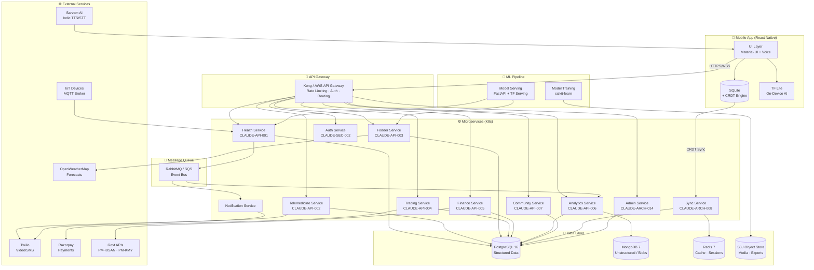
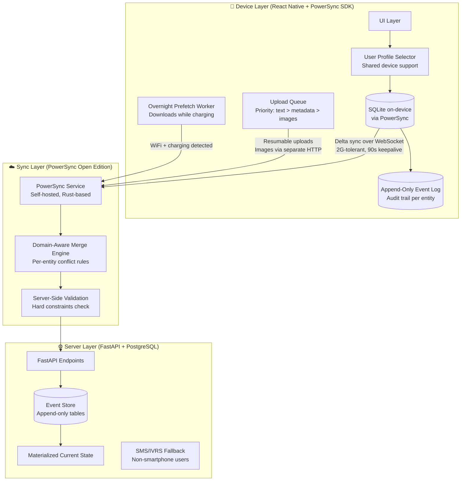
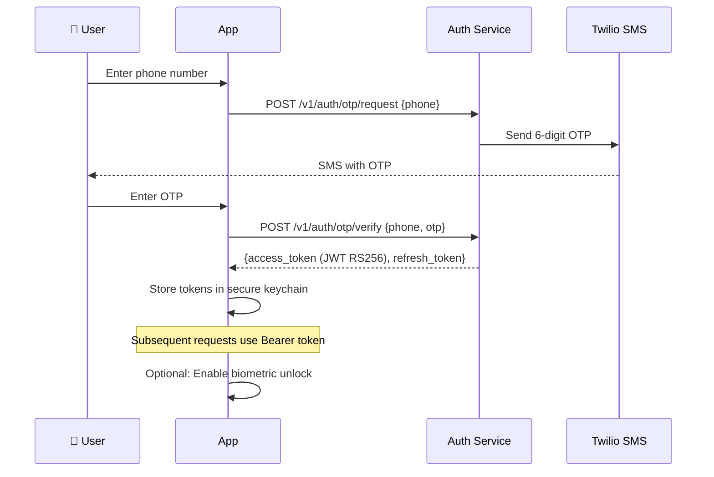
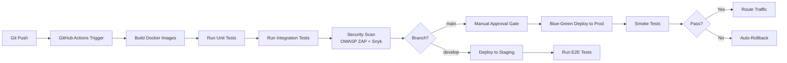
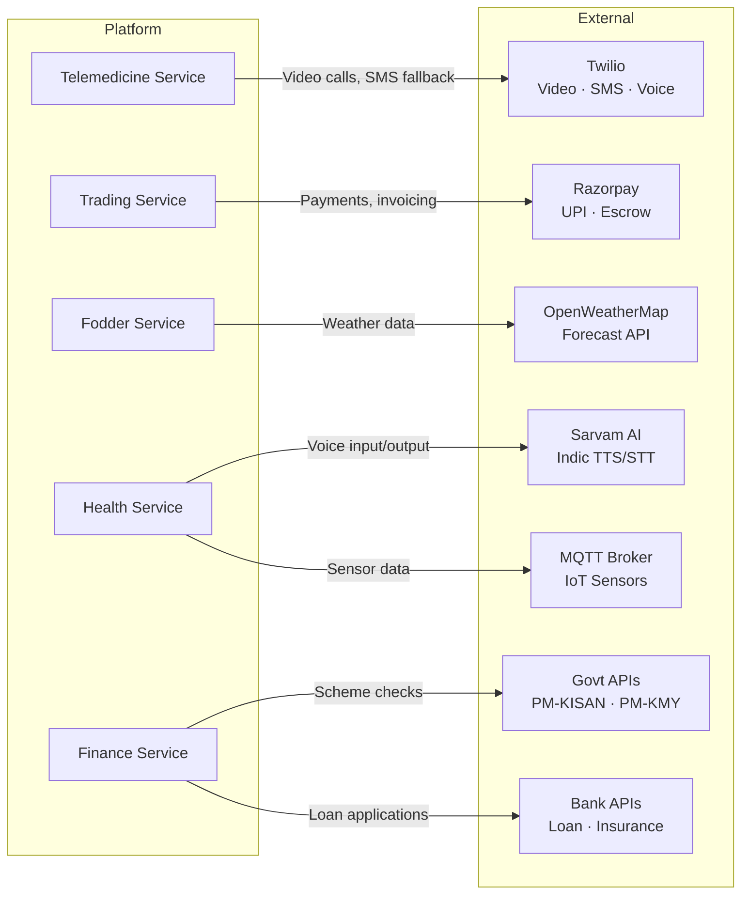
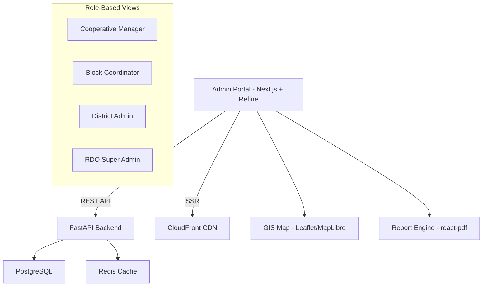
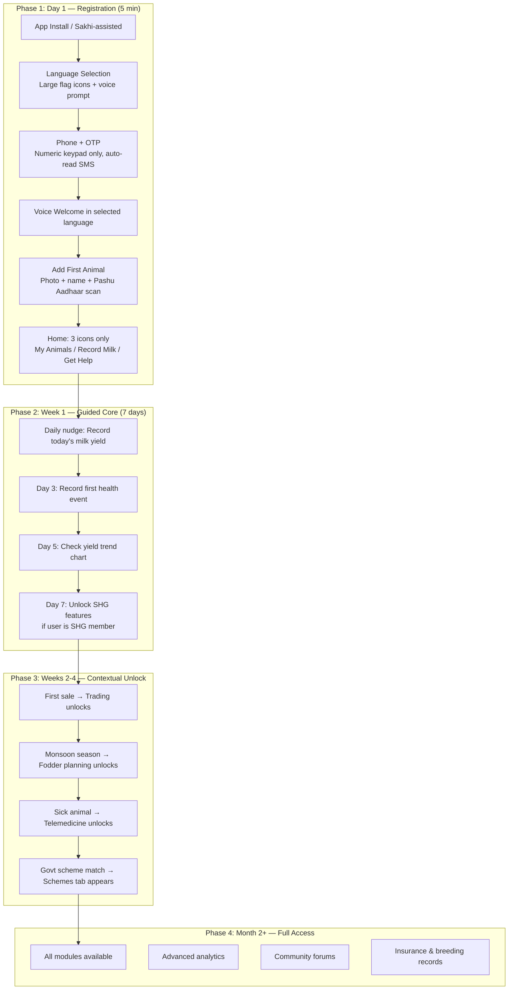
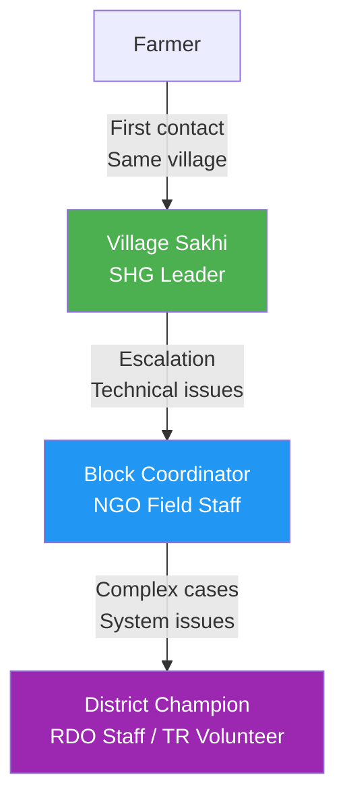

# High-Level System Architecture & Feature Map

> **CLAUDE-ARCH-001** | Farmer-Centric Integrated Animal Husbandry ERP & Telemedicine Platform
> Version: 1.0 | Sprint Date: April 27, 2026

---

## Table of Contents

1. [System Overview](#1-system-overview)
2. [Architecture Principles](#2-architecture-principles)
3. [System Architecture Diagram](#3-system-architecture-diagram)
4. [Module Decomposition](#4-module-decomposition)
5. [Technology Stack](#5-technology-stack)
6. [API Design & Endpoints](#6-api-design--endpoints)
7. [Data Models & Schemas](#7-data-models--schemas)
8. [Offline-First Architecture](#8-offline-first-architecture)
9. [AI/ML Pipeline](#9-aiml-pipeline)
10. [Security Architecture](#10-security-architecture)
11. [Infrastructure & DevOps](#11-infrastructure--devops)
12. [Integration Architecture](#12-integration-architecture)
13. [Testing Strategy](#13-testing-strategy)
14. [Admin Panel Specification](#14-admin-panel-specification)
15. [User Onboarding Flow](#15-user-onboarding-flow)
16. [Phased Rollout Plan](#16-phased-rollout-plan)
17. [Appendix: Spec Label Index](#17-appendix-spec-label-index)

---

## 1. System Overview

**CLAUDE-ARCH-001**

A microservices-based, mobile-first ERP platform serving smallholder livestock farmers in rural India. The system consolidates health management, telemedicine, fodder planning, trading, financial tracking, analytics, and community features into a single offline-capable application.

### 1.1 Design Goals

| Goal | Measure |
|------|---------|
| Offline-first | Full data entry without connectivity; sync within 30s of reconnect |
| Low-literacy accessible | Voice-driven flows; <3 taps for any core action |
| Low-tier device support | Runs on Android 8+ with 2GB RAM; APK < 50MB |
| Multilingual | Kannada (pilot), Telugu, Tamil, Hindi; extensible to 10+ languages |
| Scalable | 100K users at launch; architecture supports 1M+ |
| Secure | DPDP Act 2023 compliant; E2E encryption; biometric auth |

### 1.2 Deployment Model

- **Mobile app**: React Native (Android primary, iOS secondary)
- **Backend**: Containerized microservices on Kubernetes
- **Serverless**: AWS Lambda for non-critical async paths (notifications, report generation)
- **Edge**: TensorFlow Lite models on-device for offline AI predictions

---

## 2. Architecture Principles

| Principle | Implementation |
|-----------|---------------|
| **Modular** | Each domain is an independent microservice; swappable without system-wide impact |
| **Secure-by-Design** | Zero-trust networking; RBAC at API gateway; encrypted at rest and in transit |
| **Offline-First** | Local SQLite + CRDT-based sync; no feature degradation offline |
| **Event-Driven** | Async communication via message queues for decoupled modules |
| **Observable** | Structured logging, distributed tracing, real-time metrics |
| **Inclusive** | Voice-first UI; progressive disclosure; WCAG 2.1 AA compliance |

---

## 3. System Architecture Diagram

**CLAUDE-DIAG-001**



---

## 4. Module Decomposition

### 4.1 Health Records Module

**CLAUDE-API-001**

| Aspect | Detail |
|--------|--------|
| **Service** | `health-service` |
| **Responsibility** | Animal health logging, vaccination tracking, AI disease detection |
| **Database** | PostgreSQL (`animals`, `health_events`, `vaccinations`) |
| **AI** | TF Lite on-device for photo-based symptom triage; server-side RandomForest for prediction |
| **Inputs** | Voice/text symptoms, photos/videos, IoT sensor data (temp, activity) |
| **Outputs** | Health timeline, risk scores, vet referral triggers, exportable PDF/CSV reports |
| **Offline** | Full logging capability; predictions via on-device model; sync on reconnect |

Key workflows:
- **Daily logging**: Farmer voices "cow yield today 5 liters" → NLP parses → stored locally → synced
- **Disease alert**: Symptoms + weather data → prediction model → score > 0.7 triggers vet notification
- **Vaccination reminder**: Scheduled alerts based on animal age and regional disease calendar

### 4.2 Telemedicine Module

**CLAUDE-API-002**

| Aspect | Detail |
|--------|--------|
| **Service** | `telemedicine-service` |
| **Responsibility** | Video/audio consultations, vet matching, prescription management |
| **Dependencies** | Twilio (video/SMS), Auth Service (RBAC), Health Service (shared records) |
| **Real-time** | WebSocket for live sessions; TURN/STUN for NAT traversal |
| **Fallback** | SMS-based consultation for low-bandwidth; voice call via Twilio |
| **Compliance** | Session recording with explicit consent; prescription as signed PDF |

Key workflows:
- **Consultation flow**: Farmer inputs symptoms → AI triages (score > 0.7 = urgent) → matches nearest available vet → initiates video call → vet prescribes → system updates health records → schedules follow-up
- **Target**: Session under 10 minutes; prescription PDF generated automatically

### 4.3 Fodder Planning Module

**CLAUDE-API-003**

| Aspect | Detail |
|--------|--------|
| **Service** | `fodder-service` |
| **Responsibility** | Inventory tracking, demand forecasting, supplier recommendations |
| **AI** | Linear regression on animal count + historical yields + weather API data |
| **Integrations** | OpenWeatherMap (forecasts), supplier APIs (bulk ordering) |
| **Outputs** | Weekly demand forecast (kg), sourcing suggestions, cost estimates |

### 4.4 Trading & Sales Module

**CLAUDE-API-004**

| Aspect | Detail |
|--------|--------|
| **Service** | `trading-service` |
| **Responsibility** | Product listings, price negotiation, invoicing, quality certification |
| **Payments** | Razorpay (UPI integration); escrow for secure transactions |
| **Traceability** | QR codes linking product to animal health history and origin |
| **Fee** | Transaction fee < 1% |

### 4.5 Finance Module

**CLAUDE-API-005**

| Aspect | Detail |
|--------|--------|
| **Service** | `finance-service` |
| **Responsibility** | Income/expense tracking, loan simulation, govt scheme integration |
| **Integrations** | UPI payments, bank APIs, PM-KISAN, PM-KMY scheme endpoints |
| **Outputs** | Budget reports, loan eligibility scores, automated tax compliance |
| **Accuracy** | Financial projections within 5% of actuals |

### 4.6 Analytics & Predictions Module

**CLAUDE-API-006**

| Aspect | Detail |
|--------|--------|
| **Service** | `analytics-service` |
| **Responsibility** | Yield forecasting, risk alerts, sustainability metrics |
| **Data Sources** | All other modules via event bus; weather APIs; IoT sensors |
| **ML Models** | Yield prediction, heat stress alerts, GHG calculator |
| **Outputs** | Customizable dashboards, automated reports, push notifications |

### 4.7 Community & SHG Module

**CLAUDE-API-007**

| Aspect | Detail |
|--------|--------|
| **Service** | `community-service` |
| **Responsibility** | Forums, SHG group management, group loan tracking, peer advisories |
| **Features** | Moderated chat, shared analytics for NGO admins, knowledge base |
| **Offline** | Cached forum content; queued posts sync on reconnect |

---

## 5. Technology Stack

**CLAUDE-ARCH-002**

### 5.1 Frontend — CLAUDE-FE-001

| Component | Technology | Version | Purpose |
|-----------|-----------|---------|---------|
| Framework | React Native | 0.73+ | Cross-platform mobile (Android primary) |
| UI Kit | Material-UI (React Native Paper) | 5.x | Consistent, accessible components |
| Voice | react-native-voice | 0.3+ | Speech-to-text input |
| TTS | Sarvam AI SDK | Latest | Indic language text-to-speech |
| i18n | i18next | 23.x | Dynamic language pack loading |
| Local DB | SQLite (via PowerSync SDK) | - | Offline storage with delta sync + domain-aware merge |
| On-device ML | TensorFlow Lite | 2.15 | Offline disease prediction |
| Navigation | React Navigation | 6.x | Screen routing |
| State | Zustand | 4.x | Lightweight state management |

### 5.2 Backend — CLAUDE-BE-001

| Component | Technology | Version | Purpose |
|-----------|-----------|---------|---------|
| Language | Python | 3.12 | Primary backend language |
| Framework | FastAPI | 0.109+ | Async REST/WebSocket endpoints |
| Task Queue | Celery | 5.3 | Background jobs (alerts, reports, sync) |
| Message Broker | RabbitMQ / AWS SQS | - | Inter-service event bus |
| ORM | SQLAlchemy | 2.0+ | Database abstraction |
| Validation | Pydantic | 2.x | Input/output schema enforcement |
| WebSocket | FastAPI WebSockets | - | Telemedicine real-time streams |

### 5.3 Databases — CLAUDE-DB-001

| Store | Technology | Version | Use Case |
|-------|-----------|---------|----------|
| Primary | PostgreSQL | 16 | Structured data (users, animals, transactions) |
| Document | MongoDB | 7 | Unstructured blobs (images, vet notes, forum posts) |
| Cache | Redis | 7 | Session cache, rate limiting, hot data (TTL: 1 hour) |
| Object | AWS S3 | - | Media files, exports, ML model artifacts |
| Local | SQLite (PowerSync SDK) | - | On-device offline storage with bidirectional sync |

### 5.4 AI/ML — CLAUDE-AI-001

| Component | Technology | Purpose |
|-----------|-----------|---------|
| On-device inference | TensorFlow Lite 2.15 | Offline disease triage from photos |
| Server-side models | scikit-learn 1.4 | Disease prediction (RandomForest), fodder forecast (LinearRegression) |
| Indic NLP | Sarvam AI SDK | Speech-to-text, text-to-speech in Kannada, Hindi, etc. |
| Model serving | TF Serving / FastAPI | Low-latency prediction endpoints |
| Training data | ICAR/NDDB partnership (target) | Labeled disease/symptom datasets |

### 5.5 Integrations — CLAUDE-INT-001

| Service | Provider | Purpose |
|---------|----------|---------|
| Video/SMS | Twilio SDK v8 | Telemedicine sessions, SMS fallback, notifications |
| Payments | Razorpay API v2 | UPI integration, escrow, invoice generation |
| Weather | OpenWeatherMap API v3 | Fodder demand forecasting inputs |
| IoT | MQTT v2 (Mosquitto) | Sensor data ingestion (temperature, activity) |
| Govt schemes | PM-KISAN / PM-KMY APIs | Scheme eligibility checks, subsidy disbursement |

### 5.6 Security — CLAUDE-SEC-001

| Component | Technology | Detail |
|-----------|-----------|--------|
| Authentication | JWT (RS256) | Asymmetric key pair; key rotation every 90 days |
| Encryption at rest | AES-256 | Via `cryptography` library v41 |
| Encryption in transit | TLS 1.3 | Let's Encrypt certificates; HSTS enforced |
| Biometric | Device-native | Fingerprint/face unlock for app access |
| Secrets | AWS Secrets Manager | API keys, DB credentials, JWT private keys |

### 5.7 DevOps — CLAUDE-DEVOPS-001

| Component | Technology | Version |
|-----------|-----------|---------|
| Containers | Docker | 25 |
| Orchestration | Kubernetes (EKS) | 1.28 |
| CI/CD | GitHub Actions | - |
| IaC | Terraform | 1.7 |
| Monitoring | Prometheus + Grafana | 2.49 |
| Logging | ELK Stack (OpenSearch) | - |
| Error Tracking | Sentry | Latest |
| APM | OpenTelemetry | - |

### 5.8 Testing — CLAUDE-TEST-001

| Type | Tool | Target Coverage |
|------|------|----------------|
| Unit | pytest 8 (backend), Jest 29 (frontend) | 85% |
| Integration | pytest + TestClient | 70% |
| E2E | Appium 2 | 50% |
| Security | OWASP ZAP 2.14 | All endpoints |
| Load | Locust | 5,000 concurrent syncs |
| Accessibility | axe-core | WCAG 2.1 AA |

---

## 6. API Design & Endpoints

**CLAUDE-ARCH-003**

### 6.1 Standards

- RESTful with OpenAPI 3.1 specs (auto-generated via FastAPI)
- Versioned: `/v1/...`
- Rate limiting: 100 requests/min/user (429 on exceed)
- Standardized error response: `{"code": int, "message": str, "detail": str}`
- Pagination: cursor-based for list endpoints
- Auth: Bearer token (JWT RS256) on all endpoints except `/v1/auth/*`

### 6.2 Health Module — CLAUDE-API-001

| Method | Endpoint | Request Body | Response | Description |
|--------|----------|-------------|----------|-------------|
| POST | `/v1/health/log` | `{symptom: str, animal_id: int, media_ids?: str[]}` | `201 {id, status}` | Log health event |
| GET | `/v1/health/history/{animal_id}` | Query: `?from=&to=&limit=` | `200 {events[]}` | Health timeline |
| POST | `/v1/health/predict` | `{animal_id: int, symptoms: str[], weather: obj}` | `200 {score: float, alert: bool, recommendation: str}` | AI disease prediction |
| GET | `/v1/health/vaccinations/{animal_id}` | - | `200 {schedule[], completed[]}` | Vaccination tracker |
| POST | `/v1/health/media/upload` | Multipart: image/video | `201 {media_id, analysis?: obj}` | Upload photo/video for AI triage |

### 6.3 Telemedicine — CLAUDE-API-002

| Method | Endpoint | Request Body | Response | Description |
|--------|----------|-------------|----------|-------------|
| POST | `/v1/telemed/initiate` | `{user_id: int, vet_id?: int, urgency: str}` | `201 {session_id, vet_name, scheduled_at}` | Start consultation |
| WS | `/v1/telemed/stream/{session_id}` | WebSocket frames | Bidirectional | Real-time video/audio |
| POST | `/v1/telemed/prescribe` | `{session_id: int, prescription: obj}` | `201 {rx_id, pdf_url}` | Issue prescription |
| GET | `/v1/telemed/vets` | Query: `?location=&specialty=&available=` | `200 {vets[]}` | List available vets |

### 6.4 Fodder — CLAUDE-API-003

| Method | Endpoint | Request Body | Response | Description |
|--------|----------|-------------|----------|-------------|
| GET | `/v1/fodder/forecast` | Query: `?location=&animal_count=&weeks=` | `200 {demand_kg: float, suggestions[]}` | Demand forecast |
| POST | `/v1/fodder/inventory` | `{item: str, qty_kg: float, cost: float}` | `201 {id}` | Log inventory |
| GET | `/v1/fodder/suppliers` | Query: `?location=&item=` | `200 {suppliers[]}` | Nearby suppliers |

### 6.5 Trading — CLAUDE-API-004

| Method | Endpoint | Request Body | Response | Description |
|--------|----------|-------------|----------|-------------|
| POST | `/v1/market/list` | `{product: obj, price: float, qty: float}` | `201 {listing_id, qr_code_url}` | Create listing |
| PUT | `/v1/market/negotiate/{listing_id}` | `{offer: float, message?: str}` | `200 {status, counter_offer?}` | Price negotiation |
| POST | `/v1/market/pay/{listing_id}` | `{method: "upi", amount: float}` | `201 {tx_id, invoice_url}` | Execute payment |
| GET | `/v1/market/trace/{qr_code}` | - | `200 {origin, health_history, certifications}` | Product traceability |

### 6.6 Finance — CLAUDE-API-005

| Method | Endpoint | Request Body | Response | Description |
|--------|----------|-------------|----------|-------------|
| POST | `/v1/finance/transaction` | `{type: "income"\|"expense", amount: float, category: str}` | `201 {tx_id}` | Record transaction |
| GET | `/v1/finance/summary` | Query: `?period=monthly\|yearly` | `200 {income, expenses, net, breakdown[]}` | Financial summary |
| POST | `/v1/finance/simulate-loan` | `{amount: float, tenure_months: int}` | `200 {eligible: bool, emi: float, rate: float}` | Loan eligibility |
| GET | `/v1/finance/schemes` | Query: `?state=&category=` | `200 {schemes[]}` | Available govt schemes |

### 6.7 Analytics — CLAUDE-API-006

| Method | Endpoint | Request Body | Response | Description |
|--------|----------|-------------|----------|-------------|
| GET | `/v1/analytics/dashboard` | Query: `?user_id=&period=` | `200 {yield_trend, health_score, financial_summary}` | Main dashboard data |
| GET | `/v1/analytics/yield-forecast/{animal_id}` | Query: `?weeks=` | `200 {forecast[], confidence}` | Yield prediction |
| GET | `/v1/analytics/sustainability` | Query: `?user_id=` | `200 {ghg_score, water_usage, recommendations[]}` | Sustainability metrics |

### 6.8 Community — CLAUDE-API-007

| Method | Endpoint | Request Body | Response | Description |
|--------|----------|-------------|----------|-------------|
| GET | `/v1/community/feed` | Query: `?group_id=&cursor=` | `200 {posts[], next_cursor}` | Group feed |
| POST | `/v1/community/post` | `{group_id: int, content: str, media_ids?: str[]}` | `201 {post_id}` | Create post |
| GET | `/v1/community/shg/{group_id}/loans` | - | `200 {loans[], total_outstanding}` | SHG loan tracker |

### 6.9 Milk Collection — CLAUDE-API-008

| Method | Endpoint | Request Body | Response | Description |
|--------|----------|-------------|----------|-------------|
| POST | `/v1/milk/record` | `{animal_id, liters, fat_pct?, snf_pct?, shift: AM/PM}` | `201 {record_id, rate_per_liter}` | Record milk collection |
| GET | `/v1/milk/center/{center_id}/daily` | Query: `?date=` | `200 {records[], total_liters, avg_fat}` | Center daily summary |
| GET | `/v1/milk/farmer/{farmer_id}/history` | Query: `?from=&to=` | `200 {records[], total_liters, total_earnings}` | Farmer milk history |

### 6.10 Government Schemes — CLAUDE-API-009

| Method | Endpoint | Request Body | Response | Description |
|--------|----------|-------------|----------|-------------|
| GET | `/v1/schemes/eligible` | Query: `?farmer_id=` | `200 {schemes[]}` | Auto-matched eligible schemes |
| POST | `/v1/schemes/apply` | `{scheme_id, farmer_id, documents[]}` | `201 {application_id, status}` | Submit scheme application |
| GET | `/v1/schemes/applications` | Query: `?farmer_id=&status=` | `200 {applications[]}` | Track applications |
| PUT | `/v1/schemes/applications/{id}/status` | `{status, remarks?, dbt_transaction_id?}` | `200 {updated}` | Update application status (admin) |

### 6.11 SHG Management — CLAUDE-API-010

| Method | Endpoint | Request Body | Response | Description |
|--------|----------|-------------|----------|-------------|
| POST | `/v1/shg/meetings` | `{group_id, date, attendees[], savings_collected, agenda}` | `201 {meeting_id}` | Record SHG meeting |
| GET | `/v1/shg/{group_id}/compliance` | — | `200 {panchsutra_scores, grading}` | NABARD compliance score |
| POST | `/v1/shg/{group_id}/loans` | `{member_id, amount, purpose, interest_rate}` | `201 {loan_id}` | Issue group loan |
| GET | `/v1/shg/{group_id}/ledger` | Query: `?from=&to=` | `200 {savings, loans, repayments, balance}` | Financial ledger |

### 6.12 Insurance — CLAUDE-API-011

| Method | Endpoint | Request Body | Response | Description |
|--------|----------|-------------|----------|-------------|
| POST | `/v1/insurance/policies` | `{animal_id, provider, policy_number, premium, coverage}` | `201 {policy_id}` | Register policy |
| POST | `/v1/insurance/claims` | `{policy_id, incident_type, description, evidence_media[]}` | `201 {claim_id}` | File insurance claim |
| GET | `/v1/insurance/animal/{animal_id}` | — | `200 {policies[], active_claims[]}` | Animal insurance status |

### 6.13 Disease Reporting — CLAUDE-API-012

| Method | Endpoint | Request Body | Response | Description |
|--------|----------|-------------|----------|-------------|
| POST | `/v1/disease/reports` | `{animal_ids[], disease_suspected, symptoms[], geo_location}` | `201 {report_id, nadrs_ref?}` | Report disease outbreak |
| GET | `/v1/disease/alerts` | Query: `?district=&severity=` | `200 {alerts[]}` | Active disease alerts |
| POST | `/v1/disease/reports/{id}/nadrs-sync` | — | `200 {nadrs_reference_id}` | Push to NADRS 2.0 (admin) |

### 6.14 Breeding — CLAUDE-API-013

| Method | Endpoint | Request Body | Response | Description |
|--------|----------|-------------|----------|-------------|
| POST | `/v1/breeding/records` | `{animal_id, breeding_type: AI/natural, sire_id?, insemination_date}` | `201 {record_id}` | Log breeding event |
| GET | `/v1/breeding/animal/{animal_id}/lineage` | — | `200 {dam, sire, offspring[], breeding_history[]}` | Animal lineage tree |
| PUT | `/v1/breeding/records/{id}/outcome` | `{pregnancy_confirmed, calving_date?, calf_details?}` | `200 {updated}` | Record breeding outcome |

### 6.15 Sync — CLAUDE-ARCH-008

| Method | Endpoint | Request Body | Response | Description |
|--------|----------|-------------|----------|-------------|
| POST | `/v1/sync/push` | `{changes: SyncEvent[], device_id, user_id, last_sync}` | `200 {accepted, conflicts, server_changes[]}` | Push local changes (PowerSync) |
| GET | `/v1/sync/pull` | Query: `?device_id=&since=&entities=` | `200 {changes[], server_timestamp, checkpoint}` | Pull server changes |
| GET | `/v1/sync/status` | Query: `?device_id=` | `200 {pending, last_sync, health, queue_depth}` | Sync health check |
| POST | `/v1/sync/resolve-conflict` | `{entity_type, entity_id, resolution: str, chosen_version}` | `200 {resolved}` | Manual conflict resolution |

---

## 7. Data Models & Schemas

**CLAUDE-ARCH-004**

### 7.1 Entity-Relationship Diagram

**CLAUDE-DIAG-003**

```mermaid
erDiagram
    USER ||--o{ ANIMAL : owns
    USER ||--o{ TRANSACTION : records
    USER ||--o{ CONSULTATION : requests
    USER }o--o{ SHG_MEMBER : belongs_to
    USER ||--o{ SCHEME_APPLICATION : applies
    ANIMAL ||--o{ HEALTH_EVENT : has
    ANIMAL ||--o{ VACCINATION : receives
    ANIMAL ||--o{ YIELD_LOG : produces
    ANIMAL ||--o{ LISTING : listed_in
    ANIMAL ||--o{ BREEDING_RECORD : breeds
    ANIMAL ||--o{ INSURANCE_POLICY : insured_by
    CONSULTATION ||--|| VET : conducted_by
    CONSULTATION ||--o{ PRESCRIPTION : generates
    LISTING ||--o{ NEGOTIATION : has
    LISTING ||--|| PAYMENT : settled_by
    SHG_GROUP ||--o{ SHG_MEMBER : has_members
    SHG_GROUP ||--o{ SHG_MEETING : holds
    SHG_GROUP ||--o{ GROUP_LOAN : manages
    USER ||--o{ FODDER_INVENTORY : tracks
    USER ||--o{ FODDER_PLAN : creates
    FODDER_FORECAST }o--|| USER : generated_for
    MILK_COLLECTION_CENTER ||--o{ MILK_COLLECTION_RECORD : collects
    GOVT_SCHEME ||--o{ SCHEME_APPLICATION : applied_via
    INSURANCE_POLICY ||--o{ INSURANCE_CLAIM : claims
    WEATHER_ALERT }o--|| DISEASE_REPORT : correlates

    USER {
        int id PK
        enum role "farmer | vet | trader | admin | bank"
        varchar phone "unique, login identifier"
        varchar name
        varchar lang_pref "default: kn"
        bytea biometrics_hash "nullable"
        varchar location_district
        varchar location_state
        varchar village_code "GOI 4-tier hierarchy"
        jsonb preferences
        timestamp created_at
        timestamp updated_at
    }

    ANIMAL {
        int id PK
        int user_id FK
        varchar pashu_aadhaar_id "12-digit INAPH ear tag, nullable"
        varchar species "cattle | buffalo | goat | sheep"
        varchar breed
        enum breed_type "indigenous | crossbred | exotic"
        varchar tag_id "ear tag or local ID"
        date date_of_birth
        enum sex "male | female"
        int dam_id FK "nullable, parent animal"
        int sire_id FK "nullable, parent animal"
        int lactation_number "nullable"
        float body_condition_score "nullable, 1.0-5.0"
        bool is_insured "default false"
        enum registration_source "manual | inaph_import | cooperative_sync"
        jsonb health_history "denormalized summary"
        timestamp created_at
    }

    HEALTH_EVENT {
        int id PK
        int animal_id FK
        enum event_type "symptom | diagnosis | treatment | checkup"
        text description
        float ai_risk_score "nullable, 0.0-1.0"
        varchar media_url "nullable, S3 path"
        int recorded_by FK "user_id"
        timestamp event_date
        timestamp synced_at "nullable"
    }

    VACCINATION {
        int id PK
        int animal_id FK
        varchar vaccine_name
        date administered_on
        date next_due
        int administered_by FK "vet user_id, nullable"
        varchar batch_number
    }

    YIELD_LOG {
        int id PK
        int animal_id FK
        float quantity_liters
        enum session "morning | evening"
        float fat_percentage "nullable"
        date log_date
        timestamp synced_at
    }

    BREEDING_RECORD {
        int id PK
        int animal_id FK "female animal"
        int sire_id FK "nullable, male animal or AI bull ref"
        enum method "natural | artificial_insemination | embryo_transfer"
        varchar ai_technician_id "MAITRI ID if AI"
        varchar semen_batch_no "nullable"
        varchar semen_bull_id "INAPH bull ID, nullable"
        date breeding_date
        date expected_calving_date "auto-calculated"
        enum pregnancy_status "not_checked | confirmed_pregnant | open | aborted"
        date pregnancy_check_date "nullable"
        int services_per_conception "nullable"
        int calf_animal_id FK "nullable, born calf"
        date actual_calving_date "nullable"
        enum calving_difficulty "unassisted | easy_pull | hard_pull | cesarean"
        float calf_birth_weight_kg "nullable"
        timestamp created_at
        timestamp synced_at
    }

    CONSULTATION {
        int id PK
        int farmer_id FK
        int vet_id FK
        int animal_id FK "nullable"
        enum status "scheduled | in_progress | completed | cancelled"
        enum channel "video | voice | sms"
        timestamp started_at
        timestamp ended_at
        text vet_notes "nullable"
        bool consent_recording
        varchar provisional_diagnosis "nullable"
        enum follow_up_type "in_person_required | telemedicine_follow_up | none"
        bool emergency_flag "default false"
        jsonb consultation_media "array of {type, url, timestamp}"
    }

    PRESCRIPTION {
        int id PK
        int consultation_id FK
        varchar vet_registration_number "VCI registration"
        jsonb medications "array of {name, dosage, route, frequency, duration, withdrawal_period_days}"
        text instructions
        varchar pdf_url "S3 path"
        date follow_up_date "nullable"
        jsonb lab_tests_ordered "nullable, array of {test, lab, sample_type}"
    }

    TRANSACTION {
        int id PK
        int user_id FK
        enum type "income | expense"
        decimal amount
        varchar category "milk_sale | fodder | vet_fee | govt_subsidy | loan | scheme_disbursement"
        varchar reference_id "UPI ref or invoice ID"
        enum status "pending | completed | failed"
        timestamp created_at
    }

    LISTING {
        int id PK
        int seller_id FK
        varchar product_type "milk | ghee | curd | animal"
        float quantity
        float asking_price
        varchar unit "liters | kg | head"
        varchar qr_code_url
        enum status "active | sold | expired"
        timestamp created_at
    }

    NEGOTIATION {
        int id PK
        int listing_id FK
        int buyer_id FK
        float offered_price
        enum status "pending | accepted | rejected | countered"
        timestamp created_at
    }

    PAYMENT {
        int id PK
        int listing_id FK
        int buyer_id FK
        int seller_id FK
        decimal amount
        enum method "upi | bank_transfer | cash"
        varchar razorpay_order_id
        enum status "initiated | escrow | released | failed"
        timestamp created_at
    }

    MILK_COLLECTION_CENTER {
        int id PK
        varchar name
        varchar cooperative_code "KMF/Nandini society code"
        varchar village_code "GOI 4-tier"
        bool has_amcs "Automatic Milk Collection System"
        bool has_chiller
        int capacity_liters_per_day
    }

    MILK_COLLECTION_RECORD {
        int id PK
        int center_id FK
        int farmer_id FK
        int animal_id FK "nullable"
        enum shift "morning | evening"
        date collection_date
        float quantity_liters
        float fat_percentage "AMCS measured"
        float snf_percentage "Solids-Not-Fat"
        float rate_per_liter "calculated from fat/SNF slab"
        decimal amount_inr
        varchar receipt_number
        enum payment_status "pending | processed | paid"
        timestamp created_at
        timestamp synced_at
    }

    GOVT_SCHEME {
        int id PK
        varchar scheme_code "RGM | NLM | PKCC | LIS | NABARD_SHG"
        varchar name
        varchar ministry "DAHD | MoFAHD | NABARD"
        text description
        text eligibility_criteria
        jsonb required_documents "array: aadhaar, pashu_aadhaar, land_record, etc."
        decimal max_subsidy_amount
        float subsidy_percentage
        varchar portal_url
        bool is_active
        date valid_from
        date valid_to
    }

    SCHEME_APPLICATION {
        int id PK
        int user_id FK
        int scheme_id FK
        int animal_id FK "nullable, if animal-specific"
        int shg_group_id FK "nullable, if SHG-linked"
        varchar application_ref_no "govt portal reference"
        enum status "draft | submitted | under_review | approved | rejected | disbursed"
        jsonb submitted_documents "array of {type, url, verified}"
        decimal applied_amount
        decimal approved_amount "nullable"
        date applied_on
        date approved_on "nullable"
        date disbursed_on "nullable"
        varchar rejection_reason "nullable"
        timestamp created_at
        timestamp updated_at
    }

    INSURANCE_POLICY {
        int id PK
        int user_id FK
        int animal_id FK
        varchar insurer "New India Assurance | HDFC Ergo | etc."
        varchar policy_number
        decimal sum_insured "current market value"
        decimal premium_amount
        decimal subsidy_amount "50% central govt subsidy"
        decimal farmer_premium "net payable"
        date policy_start
        date policy_end
        enum status "active | expired | claimed | lapsed"
        varchar ear_tag_photo_url
        timestamp created_at
    }

    INSURANCE_CLAIM {
        int id PK
        int policy_id FK
        int animal_id FK
        enum claim_type "death | permanent_disability"
        date incident_date
        date reported_date "must be within 24 hours"
        varchar vet_certificate_url
        text cause_description
        enum cause_category "disease | accident | flood | earthquake | fire | other"
        jsonb supporting_docs "array of {type, url}"
        decimal claim_amount
        enum status "filed | under_investigation | approved | rejected | settled"
        decimal settled_amount "nullable"
        date settlement_date "nullable"
        timestamp created_at
    }

    DISEASE_REPORT {
        int id PK
        int animal_id FK "nullable"
        varchar village_code "GOI 4-tier"
        varchar disease_name "OIE/NADRS disease list"
        date outbreak_date
        int susceptible_count
        int attack_count
        int death_count
        text symptoms_description
        jsonb image_urls
        int reported_by FK "user_id, vet role"
        varchar nadrs_report_id "nullable, for NADRS sync"
        enum risk_level "very_high | high | moderate | low | none"
        jsonb weather_factors "temp, humidity, precipitation"
        timestamp created_at
    }

    SHG_GROUP {
        int id PK
        varchar name
        varchar registration_number "DAY-NRLM registration"
        varchar promoting_institution "NGO, RRB, DCCB, PACS"
        varchar district
        varchar block
        varchar village_code
        int admin_user_id FK
        int member_count
        bool women_only "most livestock SHGs are women-only"
        date formation_date
        date bank_linkage_date "nullable"
        varchar bank_name "nullable"
        varchar savings_account_no "nullable"
        decimal total_savings
        enum grading "A | B | C (NABARD grading)"
        jsonb panchsutra_compliance "meetings, savings, lending, repayment, books"
        timestamp created_at
    }

    SHG_MEMBER {
        int id PK
        int group_id FK
        int user_id FK
        enum role "president | secretary | treasurer | member"
        date joined_on
        bool kyc_verified "CDD of office bearers"
        decimal savings_balance
        decimal loan_outstanding
        bool is_active
    }

    SHG_MEETING {
        int id PK
        int group_id FK
        date meeting_date
        int members_present
        decimal savings_collected
        decimal internal_loans_issued
        decimal repayments_received
        text minutes
        varchar attendance_photo_url "nullable"
        int recorded_by FK
    }

    GROUP_LOAN {
        int id PK
        int group_id FK
        varchar bank_name
        varchar loan_account_no
        decimal amount
        decimal outstanding
        float interest_rate
        float savings_to_loan_ratio "1:1 to 1:4 per NABARD norms"
        date disbursed_on
        date due_date
        enum purpose "animal_purchase | fodder | equipment | dairy_infra | general"
        enum status "active | repaid | defaulted | restructured"
        bool is_npa "Non-Performing Asset flag"
        jsonb repayment_schedule "array of {due_date, amount, paid_date, paid_amount}"
    }

    FODDER_INVENTORY {
        int id PK
        int user_id FK
        varchar item "hay | silage | concentrate | mineral_mix"
        float quantity_kg
        float cost_inr
        date purchased_on
        date expiry_date "nullable"
    }

    FODDER_PLAN {
        int id PK
        int user_id FK
        int forecast_id FK "nullable, linked FODDER_FORECAST"
        date plan_start
        date plan_end
        jsonb ration_details "array of {animal_group, feed_type, qty_kg_per_day}"
        decimal estimated_cost_inr
        decimal actual_cost_inr "nullable"
        enum plan_status "draft | active | completed"
        timestamp created_at
    }

    FODDER_FORECAST {
        int id PK
        int user_id FK
        float predicted_demand_kg
        int forecast_weeks
        jsonb weather_data_snapshot
        jsonb suggestions "array of {item, source, est_cost}"
        timestamp generated_at
    }

    WEATHER_ALERT {
        int id PK
        varchar village_code
        enum alert_type "heat_stress | flood | drought | frost | storm | disease_risk"
        enum severity "advisory | watch | warning | emergency"
        enum source "openweathermap | imd | nadres | system_generated"
        text description
        float thi_index "nullable, Temperature-Humidity Index"
        jsonb affected_animals "array of {species, risk, recommended_action}"
        date alert_date
        date valid_until
        bool notification_sent
        timestamp created_at
    }

    VET {
        int id PK
        int user_id FK "links to USER with role=vet"
        varchar license_number
        varchar vet_registration_number "VCI registration"
        varchar specialization
        varchar district
        bool available
        float rating "0.0-5.0"
        int consultation_count
    }
```



### 7.2 Entity Summary by Implementation Phase

| Phase | Entities | Priority | Govt Integration |
|-------|----------|----------|-----------------|
| **P0 — MVP** | USER, ANIMAL (with pashu_aadhaar_id), HEALTH_EVENT, VACCINATION, YIELD_LOG, TRANSACTION, CONSULTATION, PRESCRIPTION, VET, FODDER_INVENTORY, FODDER_FORECAST | Critical | INAPH (Pashu Aadhaar) |
| **P0 — MVP** | SHG_GROUP, SHG_MEMBER, SHG_MEETING, GROUP_LOAN | Critical | NABARD Panchsutra |
| **P0 — MVP** | GOVT_SCHEME, SCHEME_APPLICATION | Critical | MyScheme.gov.in, DBT/PFMS |
| **P0 — MVP** | MILK_COLLECTION_CENTER, MILK_COLLECTION_RECORD | Critical | KMF/Nandini cooperative |
| **P1 — Growth** | BREEDING_RECORD | High | INAPH Breeding, Rashtriya Gokul Mission |
| **P1 — Growth** | LISTING, NEGOTIATION, PAYMENT | High | Razorpay |
| **P1 — Growth** | INSURANCE_POLICY, INSURANCE_CLAIM | High | NLM Livestock Insurance |
| **P1 — Growth** | DISEASE_REPORT | High | NADRS 2.0 |
| **P1 — Growth** | FODDER_PLAN | High | INAPH Nutrition Module |
| **P2 — Scale** | WEATHER_ALERT | Medium | OpenWeatherMap, IMD, NADRES |
| **Total** | **25 entities** (up from 15) | | |

### 7.2 Pydantic Models (Validation Layer)

**CLAUDE-VAL-001**

```python
from pydantic import BaseModel, Field, field_validator
from datetime import datetime, date
from enum import Enum
from typing import Optional

class UserRole(str, Enum):
    FARMER = "farmer"
    VET = "vet"
    TRADER = "trader"
    ADMIN = "admin"
    BANK = "bank"

class Species(str, Enum):
    CATTLE = "cattle"
    BUFFALO = "buffalo"
    GOAT = "goat"
    SHEEP = "sheep"

class AnimalCreate(BaseModel):
    species: Species
    breed: str = Field(max_length=50)
    tag_id: str = Field(max_length=30)
    date_of_birth: date
    sex: str = Field(pattern="^(male|female)$")

class HealthLogCreate(BaseModel):
    animal_id: int
    event_type: str = Field(pattern="^(symptom|diagnosis|treatment|checkup)$")
    description: str = Field(max_length=500)
    media_url: Optional[str] = None

    @field_validator("description")
    @classmethod
    def description_not_empty(cls, v: str) -> str:
        if not v.strip():
            raise ValueError("Description cannot be empty")
        return v.strip()

class YieldLogCreate(BaseModel):
    animal_id: int
    quantity_liters: float = Field(gt=0, le=50)
    session: str = Field(pattern="^(morning|evening)$")
    fat_percentage: Optional[float] = Field(default=None, ge=0, le=15)
    log_date: date

class TransactionCreate(BaseModel):
    type: str = Field(pattern="^(income|expense)$")
    amount: float = Field(gt=0)
    category: str = Field(max_length=50)
    reference_id: Optional[str] = None
```

---

## 8. Offline-First Architecture

**CLAUDE-ARCH-008**

### 8.1 Strategy: PowerSync + Domain-Aware Merge + Event Log

We use **PowerSync** (self-hosted Open Edition) with **domain-aware merge rules** per entity and an **append-only event log** for audit compliance. This replaces WatermelonDB, which has [known breaking issues with React Native 0.76+ JSI](https://github.com/Nozbe/WatermelonDB/issues/1851).

**Why PowerSync**: Battle-tested for 10+ years in offline-first field apps (mining, energy, manufacturing) via JourneyApps. Rust-based sync client runs off the JS thread (critical for 2GB RAM devices). Official React Native SDK with bidirectional PostgreSQL sync. Free self-hosted Open Edition.



### 8.2 Domain-Aware Merge Rules

Unlike generic field-level CRDT merge, we define **per-entity conflict resolution** that understands livestock ERP business logic:

| Entity | Merge Rule | Rationale |
|--------|-----------|-----------|
| `YIELD_LOG` | **Sum** if same animal + session + date | Two family members may record different milkings |
| `HEALTH_EVENT` | **Keep both** — never discard | A symptom report should never be lost; dedup at UI layer |
| `CONSULTATION` | **Vet notes win** (authority-based) | Vet's clinical assessment takes precedence |
| `TRANSACTION` | **Server-authoritative** | Financial records cannot be modified offline; record-only offline |
| `VACCINATION` | **Deduplicate** by vaccine + date + animal | Prevent double-vaccination recording |
| `ANIMAL` | **Field-level merge** (standard CRDT) | Different family members may update different fields |
| `FODDER_INVENTORY` | **Latest timestamp wins** | Stock levels are point-in-time snapshots |
| `LISTING` | **Creator wins** | Only seller can modify their listing |
| `SHG_MEETING` | **Keep both** then merge by meeting_date | Two recorders at same meeting; admin resolves |

**Critical distinction**: CRDTs resolve *data structure* conflicts but NOT *business logic* conflicts. Server-side validation enforces hard constraints (dosage limits, payment amounts, inventory caps) after merge.

### 8.3 Shared Device Support

In rural Indian households, one phone is shared among family members. Our design:

1. **User Profile Selector**: Large-icon "Who is recording?" screen (no full login/logout overhead)
2. **Session-based stamping**: Every record tagged with active `user_id` + `device_id`
3. **User-scoped local data**: Each profile sees only their animals/records by default
4. **Deduplication**: `device_id` for sync dedup, `user_id` for attribution
5. **No per-user encryption**: Single SQLCipher database (2GB RAM constraint; separate DBs impractical)

### 8.4 Append-Only Event Log (Audit Compliance)

Every data mutation is recorded as an immutable event for DPDP Act compliance:

```python
# Event log entry structure (CLAUDE-ARCH-008-EVENT)
class SyncEvent(BaseModel):
    event_id: str        # UUID v7 (time-ordered)
    entity_type: str     # "health_event", "yield_log", "vaccination", etc.
    entity_id: int       # FK to the entity
    operation: str       # "create", "update", "delete"
    user_id: int         # Who performed the action
    device_id: str       # Which device
    timestamp: datetime  # Device-local timestamp
    server_timestamp: datetime  # Server receipt timestamp (nullable if offline)
    payload_hash: str    # SHA-256 of the change payload
    changes: dict        # Field-level diff {field: {old, new}}
```

- Stored in append-only PostgreSQL table (no UPDATE/DELETE allowed)
- Enables: full audit trail, vet override tracking, DPDP right-to-access, dispute resolution
- Retention: 7 years (compliance minimum), archived to S3 Glacier after 1 year

### 8.5 What Works Offline

| Feature | Offline Capability | Sync Behavior |
|---------|-------------------|---------------|
| Health logging | Full — voice, text, photo capture | Queued; delta sync on reconnect |
| Yield logging | Full | Queued; domain-aware sum merge |
| Disease prediction | On-device TF Lite model | Model updates sync periodically |
| Vaccination reminders | Cached schedule | New schedules sync |
| Breeding records | Full recording | Queued; deduplicate by date+animal |
| Financial transactions | Record-only (no payments) | Payment execution requires online |
| Telemedicine | Not available | Requires connectivity |
| Market listings | Browse cached; create queued | Published on sync |
| Community forum | Read cached posts | New posts queued |
| Scheme applications | Draft mode only | Submit requires online |
| SHG meetings | Full recording | Keep-both merge |

### 8.6 Sync Protocol (PowerSync-Based)

```
1. App detects connectivity (WiFi preferred, or 2G/3G/4G)
2. Priority queue processes: text records → metadata → compressed images
3. Delta-only sync over WebSocket (90s keepalive for slow connections)
4. Server applies domain-aware merge rules per entity type
5. Server validates hard business constraints
6. Server pushes merged state + other users' changes back
7. Device materializes current state from events
8. Images upload via separate resumable HTTP endpoint (handles 2G gracefully)
```

**Overnight prefetch**: When device is charging + on WiFi, pre-download next day's schedules, weather data, market prices, and pending vet responses (pattern proven by Farmonaut and MyFieldHeroes in rural India).

### 8.7 Sync Guarantees

| Metric | Target |
|--------|--------|
| Data loss | Zero (domain-aware merge + event log guarantee) |
| Offline duration supported | Up to 30 days |
| Sync latency (on reconnect) | < 30 seconds for typical text payload |
| Sync success rate | 99.9% |
| Conflict auto-resolution | 99%+ (manual admin review for < 1% edge cases) |
| Image upload resume | From last successful chunk (not restart) |
| Device RAM impact | < 100MB sync overhead (Rust-based, off-JS-thread) |

### 8.8 Sync Framework Comparison (Decision Record)

| Framework | Verdict | Reason |
|-----------|---------|--------|
| **PowerSync** (chosen) | Best fit | 10+ yr field app heritage; Rust-based RN SDK; self-hostable; free Open Edition; PostgreSQL-native |
| WatermelonDB | Rejected | Broken with RN 0.76+ JSI; UI freezes on large syncs on budget Android; you must build your own sync backend |
| ElectricSQL | Rejected | Read-path only; no write-path sync; no official RN SDK |
| Replicache | Rejected | Browser-only (IndexedDB); being deprecated in favor of Zerosync |
| RxDB | Backup option | Cross-platform but RN SQLite storage requires paid license |

---

## 9. AI/ML Pipeline

**CLAUDE-ARCH-005**

### 9.1 Disease Prediction — CLAUDE-ALGO-001

```
Model:          RandomForestClassifier (n_estimators=100)
Features:       symptoms (one-hot), temperature, humidity, season, breed, age
Training data:  Phased (see §9.4 Cold-Start Strategy)
                Augmented with OpenWeatherMap + IMD historical data
Alert threshold: score > 0.7 triggers vet notification
Retraining:     Quarterly with feedback loop from vet overrides
Metrics:        Precision > 85%, Recall > 85%
On-device:      TF Lite quantized model for offline photo-based triage
```

### 9.2 Fodder Demand Forecast — CLAUDE-ALGO-002

```
Model:          LinearRegression (upgradable to ARIMA/Prophet)
Features:       animal_count, historical_yield, weather_forecast, season
Output:         kg needed per week + cost estimate
Refresh:        Weekly with latest weather data
Accuracy:       Within 15% of actuals (target)
```

### 9.3 Yield Prediction

```
Model:          Gradient Boosting (XGBoost)
Features:       breed, age, feed_quality, health_score, season, lactation_stage
Output:         Expected liters/day for next 4 weeks
Use case:       Dashboard insights + trading price optimization
```

### 9.4 Cold-Start Strategy — CLAUDE-AI-002

AI/ML models require labeled datasets that don't exist at launch. This phased strategy bootstraps from zero to production-grade ML.

#### Phase 0: Rule-Based Expert System (Months 1-4)

No ML models. All predictions use veterinary decision trees encoded as rules:

```python
# Example: Rule-based disease triage (ships with app, works offline)
DISEASE_RULES = {
    "fever_above_104_with_nasal_discharge": {
        "probable": ["Hemorrhagic Septicemia", "Foot-and-Mouth Disease"],
        "action": "EMERGENCY_VET_CONSULT",
        "source": "ICAR-IVRI Clinical Manual"
    },
    "reduced_milk_yield_with_udder_swelling": {
        "probable": ["Mastitis - Clinical"],
        "action": "VET_CONSULT_24H",
        "source": "NDDB Mastitis Control Programme"
    },
    # 50+ rules from ICAR-IVRI & NDDB clinical guidelines
}
```

**Rule sources** (public, no partnership needed):
- ICAR-IVRI disease diagnosis manuals (published PDFs)
- NDDB Mastitis Control Programme guidelines
- Karnataka Veterinary University clinical handbooks
- FAO LEGS Emergency Livestock Guidelines

#### Phase 1: Open Data Bootstrap (Months 2-6)

Seed ML training with publicly available datasets:

| Dataset | Source | Records | Use Case |
|---------|--------|---------|----------|
| Cattle Disease Prediction | Kaggle (thedatasith/cattle-disease) | 3,500+ cases, 26 diseases | Disease classifier training |
| Bovine Respiratory Disease | Kaggle (BRD-detection) | Clinical records + weather | Respiratory disease model |
| FAO EMPRES-i+ | fao.org/empres-i | Global disease outbreak data | Outbreak early warning |
| NADRS 2.0 Reports | nadrs.gov.in | India district-level outbreak data | Regional risk scoring |
| India Meteorological Dept | mausam.imd.gov.in | Historical weather data | Disease-weather correlation |
| data.gov.in Livestock Census | data.gov.in | State-level breed/population data | Population baselines |

#### Phase 2: Data Collection by Design (Months 1+, ongoing)

Every farmer interaction generates labeled training data through normal app usage:

```
Farmer logs symptoms → Vet provides diagnosis → Labeled training pair
     (features)              (ground truth)
```

**Built-in labeling flows:**
- Vet overrides AI suggestions → captures correct diagnosis
- Treatment outcome tracking → 7-day / 30-day follow-up prompts
- Milk yield before/after treatment → efficacy signal
- Photo uploads with vet annotations → image classification labels
- Seasonal patterns from WEATHER_ALERT + HEALTH_EVENT correlation

**Target**: 10,000 labeled records within 6 months of pilot (500 farmers × ~20 events each).

#### Phase 3: Government Data Partnerships (Months 6-12)

Once the platform demonstrates value with pilot data, pursue formal partnerships:

| Partner | Dataset | Value | Access Mechanism |
|---------|---------|-------|------------------|
| **NDDB/INAPH** | 34.5M bovine profiles, vaccination records, breeding data | Richest livestock health dataset in India | MoU via NDDB Anand; Pashu Aadhaar integration gives natural hook |
| **ICAR-NIVEDI** (Bengaluru) | National disease surveillance, outbreak predictions | Labeled disease data + epidemiological models | Research collaboration; NIVEDI is in Bengaluru — same city as RDO |
| **ICAR-IVRI** | Veterinary research datasets | Breed-specific disease susceptibility | Academic partnership via Karnataka Veterinary University |
| **Karnataka AH Dept** | State vaccination campaigns, cattle census | Regional population + health data | Existing RDO relationship with state govt |

**Why phased**: Government partnerships take 6-12 months. The platform must demonstrate value first. ICAR-NIVEDI being in Bengaluru is a strategic advantage — RDO can arrange in-person meetings.

#### 9.4.1 ML Transition Criteria

| Metric | Rule-Based Baseline | ML Switchover Threshold |
|--------|--------------------|-----------------------|
| Disease prediction accuracy | ~60% (heuristic) | >80% on held-out test set |
| Labeled records | 0 | >10,000 |
| Unique disease classes | Top 10 common | >20 classes with >100 samples each |
| Vet feedback coverage | N/A | >500 vet-confirmed diagnoses |
| False positive rate | High (by design, err cautious) | <15% |

### 9.5 On-Device AI — CLAUDE-AI-003

```
Runtime:        TensorFlow Lite (quantized INT8)
Model size:     < 5MB per model (fits 2GB RAM budget)
Update cycle:   Monthly model push via app update or OTA
Capabilities:   - Symptom-based disease triage (offline)
                - Photo-based body condition scoring
                - Milk yield anomaly detection
                - Fodder quantity calculator
Fallback:       Rule-based system if model load fails
Privacy:        All inference on-device; only anonymized
                aggregates sent to server for retraining
```

### 9.6 Sarvam AI Integration — CLAUDE-AI-004

```
Provider:       Sarvam AI (sarvam.ai) — India-focused Indic language AI
Capabilities:   - Speech-to-Text: Kannada, Telugu, Tamil, Hindi + 18 more
                - Text-to-Speech: Natural voice prompts in Indic languages
                - Translation: Cross-language support for vet consultations
Cost:           ~₹1/min STT, ~₹0.50/min TTS
Latency:        < 500ms for short utterances
Offline:        Sarvam Lite models for basic STT (planned)
Use cases:      - Voice-first data entry for low-literacy farmers
                - Vet consultation transcription
                - Multilingual knowledge base narration
                - Voice-driven search ("Show my cow Lakshmi's records")
```

---

## 10. Security Architecture

**CLAUDE-ARCH-009**

### 10.1 Threat Model (STRIDE)

**CLAUDE-SEC-002**

| Threat | Mitigation |
|--------|-----------|
| **Spoofing** | Biometric + phone OTP authentication; JWT RS256 tokens |
| **Tampering** | E2E encryption (TLS 1.3 in transit, AES-256 at rest); HMAC on sync payloads |
| **Repudiation** | Audit logs for all state changes; immutable event log in append-only table |
| **Information Disclosure** | RBAC with principle of least privilege; field-level encryption for PII |
| **Denial of Service** | Rate limiting (100/min/user); API gateway throttling; auto-scaling |
| **Elevation of Privilege** | Role-based access control; separate admin auth flow; no shared secrets |

### 10.2 Authentication Flow



### 10.3 Authorization (RBAC)

| Resource | Farmer | Vet | Trader | Admin | Bank |
|----------|--------|-----|--------|-------|------|
| Own animals/health | CRUD | Read | - | Read | - |
| Telemedicine | Create/Read | CRUD | - | Read | - |
| Market listings | CRUD (own) | - | CRUD | Read | - |
| Finance (own) | CRUD | - | - | Read | Read |
| Community | Read/Write | Read/Write | Read | CRUD | - |
| Analytics (own) | Read | Read (patients) | - | Read (all) | Read (aggregate) |
| User management | - | - | - | CRUD | - |
| Scheme disbursement | Read | - | - | CRUD | CRUD |

### 10.4 DPDP Act 2023 Compliance

| Requirement | Implementation |
|-------------|---------------|
| Consent management | Explicit opt-in at registration; granular consent per data category |
| Data minimization | Collect only what's needed per module; auto-purge stale data |
| Right to erasure | User-initiated account deletion; cascading soft-delete with 30-day purge |
| Data portability | Export all user data as JSON/CSV via `/v1/user/export` |
| Breach notification | Automated detection via ELK alerts; notify within 72 hours |
| Data localization | All data stored in AWS Mumbai region (ap-south-1) |
| Data Processing Agreement | Required for all third-party integrations (Twilio, Razorpay, etc.) |

### 10.5 Encryption Standards

| Layer | Standard | Detail |
|-------|----------|--------|
| In transit | TLS 1.3 | HSTS enforced; certificate pinning in mobile app |
| At rest (server) | AES-256 | PostgreSQL TDE; S3 SSE-KMS |
| At rest (device) | SQLCipher | Encrypted local SQLite database |
| PII fields | Field-level encryption | Phone, name, biometrics encrypted with per-user key |
| Tokens | RS256 JWT | Asymmetric keys; 15-min access token; 30-day refresh |
| Key management | AWS KMS | Automatic rotation every 90 days |

---

## 11. Infrastructure & DevOps

**CLAUDE-ARCH-010**

### 11.1 Cloud Architecture

```
Region: ap-south-1 (Mumbai) — data localization compliance

┌─────────────────────────────────────────────────┐
│                   AWS Cloud                      │
│                                                  │
│  ┌──────────┐    ┌─────────────────────────┐    │
│  │ Route 53 │───▶│ CloudFront (CDN)        │    │
│  └──────────┘    └──────────┬──────────────┘    │
│                             │                    │
│  ┌──────────────────────────▼──────────────┐    │
│  │        API Gateway / ALB                 │    │
│  └──────────────────────────┬──────────────┘    │
│                             │                    │
│  ┌──────────────────────────▼──────────────┐    │
│  │           EKS Cluster (K8s 1.28)        │    │
│  │                                          │    │
│  │  ┌─────────┐ ┌──────┐ ┌────────┐       │    │
│  │  │ health  │ │ tele │ │ fodder │ ...   │    │
│  │  │ service │ │ svc  │ │ svc    │       │    │
│  │  └─────────┘ └──────┘ └────────┘       │    │
│  └─────────────────────────────────────────┘    │
│                                                  │
│  ┌──────────┐  ┌────────┐  ┌───────┐           │
│  │ RDS      │  │ Docu-  │  │ Elast │           │
│  │ Postgres │  │ mentDB │  │ iCache│           │
│  └──────────┘  └────────┘  └───────┘           │
│                                                  │
│  ┌──────┐  ┌─────────┐  ┌──────────────┐       │
│  │  S3  │  │ Lambda  │  │ SQS/EventBr. │       │
│  └──────┘  └─────────┘  └──────────────┘       │
│                                                  │
│  ┌──────────────────────────────────────┐       │
│  │ Monitoring: CloudWatch + Prometheus  │       │
│  │ Logging: OpenSearch (ELK)            │       │
│  │ Tracing: X-Ray + OpenTelemetry       │       │
│  └──────────────────────────────────────┘       │
└─────────────────────────────────────────────────┘
```

### 11.2 CI/CD Pipeline — CLAUDE-DEVOPS-003



### 11.3 Disaster Recovery

| Metric | Target | Implementation |
|--------|--------|---------------|
| RPO (Recovery Point Objective) | < 1 hour | Continuous RDS replication; hourly S3 snapshots |
| RTO (Recovery Time Objective) | < 4 hours | Multi-AZ deployment; automated failover |
| Backup frequency | Hourly (DB), daily (full) | AWS Backup with 30-day retention |
| Geo-redundancy | Single region, multi-AZ | Cross-region backup to ap-south-2 (Hyderabad) |
| Recovery testing | Quarterly | Automated DR drill via runbook |

### 11.4 Monitoring & Alerting — CLAUDE-DEVOPS-004

| Signal | Tool | Alert Threshold |
|--------|------|----------------|
| API latency | Prometheus + Grafana | P95 > 500ms |
| Error rate | Sentry + CloudWatch | > 1% of requests |
| CPU/Memory | Prometheus + HPA | > 80% sustained 5min |
| Sync failures | Custom metric | > 0.1% failure rate |
| DB connections | CloudWatch | > 80% pool utilization |
| Uptime | Pingdom/UptimeRobot | < 99.9% monthly |

---

## 12. Integration Architecture

**CLAUDE-INT-001**

### 12.1 Integration Map



### 12.2 Integration Patterns

| Pattern | Use Case | Implementation |
|---------|----------|---------------|
| **Circuit Breaker** | External API failures (Twilio, Razorpay) | Resilience4j pattern; fallback to queued retry |
| **Webhook** | Payment confirmations from Razorpay | Signed webhooks with HMAC verification |
| **Polling** | Weather data refresh | Hourly cron via Celery Beat |
| **Event-Driven** | Cross-module notifications | RabbitMQ/SQS pub-sub; eventual consistency |
| **Adapter** | Govt API changes | Thin adapter layer per integration; version-isolated |

---

## 13. Testing Strategy

**CLAUDE-ARCH-008** / **CLAUDE-TEST-002**

### 13.1 Test Pyramid

```
        ╱╲
       ╱E2E╲         5% — Appium (critical user journeys)
      ╱──────╲
     ╱ Integr. ╲     15% — API contract + cross-service tests
    ╱────────────╲
   ╱    Unit      ╲   80% — pytest + Jest (business logic)
  ╱────────────────╲
```

### 13.2 Coverage Targets — CLAUDE-TEST-002

| Type | Tool | Target | Focus |
|------|------|--------|-------|
| Unit | pytest 8 / Jest 29 | 85% | Business logic, validators, utilities |
| Integration | pytest + TestClient | 70% | API contracts, DB queries, service interactions |
| E2E | Appium 2 | 50% | Critical flows: login → log health → sync |
| Security | OWASP ZAP 2.14 | All endpoints | Injection, XSS, auth bypass |
| Load | Locust | - | 5,000 concurrent syncs; P95 < 1s |
| Accessibility | axe-core | WCAG 2.1 AA | All screens |
| Offline | Custom | 100% offline features | 72-hour offline → sync scenarios |

### 13.3 Key Test Scenarios — CLAUDE-TEST-003

**Nominal:**
- Happy path for each module (log → sync → verify)
- Multi-language voice input → correct data capture
- Full telemedicine flow: schedule → call → prescribe → follow-up

**Edge:**
- 72-hour offline accumulation → successful sync with zero data loss
- Voice recognition failure (dialect mismatch) → fallback to icon selection
- 5,000 simultaneous sync requests → no latency degradation > 1s
- Shared device: two family members editing same animal → CRDT auto-merge
- AI misdiagnosis → user/vet override → model feedback loop

**Security:**
- SQL injection on all text inputs
- JWT token expiry and refresh flow
- Unauthorized role escalation attempts
- Brute-force OTP attempts (rate-limited to 5/hour)

---

## 14. Admin Panel Specification

**CLAUDE-ARCH-014**

### 14.1 Overview

Web-based admin portal for cooperative managers, NGO coordinators, and government liaison officers. Built on **Refine** (refine.dev) — a headless React admin framework that integrates with Material UI (shared design system with mobile app) and supports Next.js SSR for fast loading on slow field-office connections.

**Why Refine over React-Admin/AdminJS**: Headless architecture = full control over UI; MUI-native (no style conflicts); built-in data provider for REST/GraphQL; Next.js SSR for slow connections; MIT license.

### 14.2 Architecture



### 14.3 Admin Roles & Permissions

| Role | Scope | Key Permissions |
|------|-------|----------------|
| **Village Sakhi** | Own SHG group | View member data, record meeting attendance, submit savings |
| **Cooperative Manager** | Own milk collection center | View center analytics, manage farmer roster, approve payouts |
| **Block Coordinator** | Block (taluk) level | Manage Sakhis, view block analytics, escalate disease alerts |
| **District Admin** | District level | All block data, scheme disbursement, NABARD reporting |
| **RDO Super Admin** | All data | Full CRUD, system config, audit logs, compliance reports |

### 14.4 Module Specifications

#### 14.4.1 Dashboard (Home)

| Widget | Data Source | Refresh |
|--------|-----------|---------|
| Active farmers (today/week/month) | USER table, last_login | Real-time |
| Disease alert heatmap | DISEASE_REPORT + HEALTH_EVENT, GIS overlay | Hourly |
| Milk collection summary | MILK_COLLECTION_RECORD, aggregated by center | Daily |
| Scheme disbursement tracker | SCHEME_APPLICATION, status breakdown | Daily |
| SHG compliance scorecard | SHG_GROUP.panchsutra_compliance | Weekly |
| Sync health monitor | PowerSync server metrics | Real-time |

#### 14.4.2 Farmer & Animal Management

| Feature | Description |
|---------|-------------|
| **Bulk farmer onboarding** | CSV/Excel upload with validation (phone, Aadhaar masked, village); auto-assign to nearest Sakhi |
| **Animal registry** | Searchable by Pashu Aadhaar ID, ear tag photo, owner name; links to INAPH record |
| **Farmer profile 360°** | Single view: animals owned, health events, yield trend, scheme eligibility, SHG membership |
| **Deduplication** | Phone number + Aadhaar fuzzy match to prevent duplicate registrations |
| **Data export** | DPDP-compliant exports (PII redacted for non-authorized roles) |

#### 14.4.3 GIS Coverage Map

Interactive map (Leaflet + OpenStreetMap) showing:
- Village-level farmer density (choropleth)
- Milk collection center locations with daily volume
- Disease outbreak zones (from DISEASE_REPORT + NADRS feed)
- Vet coverage radius (which villages lack nearby vets)
- SHG group locations with compliance color coding

#### 14.4.4 Government Scheme Administration

| Feature | Description |
|---------|-------------|
| **Scheme catalog** | CRUD for GOVT_SCHEME entries; set eligibility rules (breed, herd size, BPL status) |
| **Auto-eligibility engine** | Batch-match farmers against scheme criteria; generate push notifications |
| **Application tracker** | Kanban view: Draft → Submitted → Under Review → Approved → DBT Disbursed |
| **DBT reconciliation** | Match PFMS transaction IDs against SCHEME_APPLICATION; flag failures |
| **Scheme utilization report** | District-wise uptake, disbursement amount, rejection reasons |

#### 14.4.5 NABARD & Compliance Reporting

Pre-built report templates for regulatory submission:

| Report | Regulation | Frequency | Format |
|--------|-----------|-----------|--------|
| **OSS Returns** (Outstanding Savings & Loans) | NABARD SHG Panchsutra | Monthly | Excel + PDF |
| **CAMELSC Rating** | NABARD SHG Assessment | Quarterly | PDF with scores |
| **LFAR** (Long Form Audit Report) | RBI via NABARD | Annual | PDF |
| **Scheme Utilization Certificate** | State AH Dept / NLM | Quarterly | Govt template |
| **Disease Surveillance Summary** | NADRS 2.0 | Monthly | CSV for NADRS upload |
| **DPDP Compliance Report** | Data Protection Board | On-demand | PDF with audit trail |

#### 14.4.6 Content & Knowledge Base

| Feature | Description |
|---------|-------------|
| **Knowledge articles** | WYSIWYG editor for veterinary tips, seasonal advisories; auto-translate via Sarvam AI |
| **Push notification composer** | Target by region, SHG, animal type; schedule or send immediately |
| **Community moderation** | Flagged post queue with approve/reject/escalate actions |
| **FAQ management** | Voice-searchable FAQs in multiple languages |

### 14.5 Tech Stack

| Component | Technology | Rationale |
|-----------|-----------|-----------|
| Framework | **Refine** v4 + Next.js 14 | Headless admin; SSR for slow connections |
| UI | Material UI v5 (shared with mobile) | Consistent design system |
| Data provider | `@refinedev/simple-rest` | Direct FastAPI integration |
| Auth provider | `@refinedev/nextjs-router` + JWT | Same auth as mobile API |
| Maps | Leaflet + react-leaflet + OSM tiles | Free, offline-cacheable tiles |
| Charts | Recharts (lightweight) | Shared with mobile analytics |
| Reports | react-pdf + @react-pdf/renderer | Server-side PDF generation |
| Deployment | Next.js on ECS Fargate (SSR) | SSR needed for field-office speed |
| CDN | CloudFront | Static assets + ISR caching |

---

## 15. User Onboarding Flow

**CLAUDE-ARCH-015**

Designed for low-literacy users on low-tier Android devices. Uses a **4-phase progressive model** with a **3-tier buddy system** inspired by India's ASHA/Anganwadi community health worker model and PMGDISHA digital literacy programme.

### 15.1 Four-Phase Progressive Onboarding



### 15.2 Phase Details

#### Phase 1: Day 1 Registration (Target: < 5 minutes)

| Step | UI | Voice Prompt | Fallback |
|------|-----|-------------|----------|
| Language select | 6 large flag tiles (no text needed) | "ನಿಮ್ಮ ಭಾಷೆಯನ್ನು ಆಯ್ಕೆಮಾಡಿ" (Choose your language) | Sakhi selects |
| Phone + OTP | Numeric keypad, large buttons | "ನಿಮ್ಮ ಫೋನ್ ನಂಬರ್ ಹೇಳಿ" (Say your phone number) | Sakhi enters |
| Profile | Photo capture + name (voice) | "ನಿಮ್ಮ ಹೆಸರು ಹೇಳಿ" (Say your name) | Sakhi types |
| First animal | Camera → ear tag scan (Pashu Aadhaar OCR) + name + type selector (cow/buffalo/goat icons) | "ನಿಮ್ಮ ಹಸುವಿನ ಫೋಟೋ ತೆಗೆಯಿರಿ" (Take photo of your cow) | Manual entry |
| Home screen | 3 large icon buttons only | Welcome message + explain each icon | — |

**Sakhi-assisted registration**: Village Sakhi can bulk-register farmers at SHG meetings using admin portal's bulk onboarding (§14.4.2). Farmer receives SMS with app link + pre-filled profile.

#### Phase 2: Week 1 Guided Core

Daily push notifications guide the farmer through core features:

| Day | Nudge | Feature Introduced | Success Metric |
|-----|-------|--------------------|---------------|
| 1 | "Record today's milk" | Yield logging (voice: "Say the liters") | First yield entry |
| 2 | "Check yesterday's record" | View history | Return visit |
| 3 | "Is your animal healthy today?" | Health event logging | First health entry |
| 5 | "See your week's milk chart" | Simple analytics (bar chart) | Chart viewed |
| 7 | "Join your SHG group" | SHG features (if applicable) | Group joined |

**Dropout prevention**: If farmer doesn't open app for 2 consecutive days → Sakhi receives alert → Sakhi makes phone call or visits.

#### Phase 3: Weeks 2-4 Contextual Unlock

Features appear only when contextually relevant:

| Trigger | Feature Unlocked | How |
|---------|-----------------|-----|
| First animal listed as "for sale" | Trading module | Tab appears with celebration animation |
| Monsoon/summer season start | Fodder planning | Push notification + new icon |
| Health event logged with severity > medium | Telemedicine (vet consult) | "Talk to a vet?" button on health screen |
| Auto-eligibility match with GOVT_SCHEME | Schemes tab | Push: "You may be eligible for ₹X under [scheme]" |
| 30+ days active | Community forums | Tab appears |
| Insurance scheme match | Insurance module | Contextual card on animal profile |

#### Phase 4: Month 2+ Full Access

All modules visible. Advanced features available:
- Full analytics dashboard with yield predictions
- Breeding record management
- Disease prediction AI suggestions
- Marketplace with price negotiation
- SHG loan management and compliance reports

### 15.3 Three-Tier Buddy System

Modeled on India's ASHA community health worker network — each farmer has a human support chain:



| Tier | Who | Ratio | Responsibilities | Incentive |
|------|-----|-------|-----------------|-----------|
| **Village Sakhi** | SHG leader, digitally literate | 1:15 farmers | Onboard farmers, daily nudges, basic troubleshooting, record meetings | ₹500/month honorarium + gamification badges |
| **Block Coordinator** | NGO field staff | 1:10 Sakhis (~150 farmers) | Train Sakhis, resolve escalations, organize vet camps, govt liaison | Salaried (existing RDO staff) |
| **District Champion** | RDO staff or TR volunteer | 1:5 Block Coords (~750 farmers) | Platform health monitoring, data quality audits, partnership management | Salaried + sprint participation credit |

**Sakhi selection criteria** (aligned with NABARD SHG norms):
- Active SHG member for 1+ year
- Owns a smartphone with data plan
- Completed PMGDISHA basic digital literacy (or equivalent)
- Trusted by group members (elected/nominated)

### 15.4 Onboarding Principles

- **3-tap rule**: Any core action reachable in 3 taps or less
- **Voice-first**: Every screen has a voice prompt (Sarvam AI STT/TTS) explaining what to do
- **Progressive disclosure**: Start with 3 core actions; unlock features contextually over 4 weeks
- **No-text mode**: Icon-only navigation available for non-readers
- **Buddy QR**: Existing user can help onboard new user via shared QR code (Sakhi's phone → farmer's phone)
- **Offline onboarding**: Registration works offline; syncs when connected
- **DigiLocker integration**: Optional Aadhaar pull via DigiLocker API for scheme eligibility (with consent)

### 15.5 Dropout Prevention System

| Signal | Detection | Response |
|--------|----------|----------|
| No app open for 2 days | Server-side activity monitor | SMS nudge → Sakhi alert |
| No app open for 7 days | Dropout risk flag | Sakhi phone call; Block Coordinator visit if needed |
| Registration but no animal added | Incomplete onboarding | Next-day SMS with Sakhi's phone number |
| Animal added but no yield recorded for 5 days | Feature adoption stall | Voice notification: "Record today's milk in 30 seconds" |
| SHG member but not joined group | Social feature gap | Sakhi invites at next SHG meeting |

**Target metrics**: Day-1 retention > 80%, Day-7 retention > 60%, Day-30 retention > 40% (benchmark: Indian agri-tech apps average ~25% Day-30).

---

## 16. Phased Rollout Plan

**CLAUDE-REL-001**

### Phase 1: MVP (Months 1-3) — Budget: ~₹30L

| Module | Scope | New Entities (§7.2) |
|--------|-------|--------------------|
| Health records | Basic logging, vaccination tracker, manual alerts | ANIMAL, HEALTH_EVENT, VACCINATION |
| Milk collection | Daily yield recording, collection center integration | MILK_COLLECTION_RECORD, MILK_COLLECTION_CENTER |
| Finance | Income/expense tracking, UPI payments | TRANSACTION |
| SHG management | Group creation, meeting records, savings tracking | SHG_GROUP, SHG_MEMBER, SHG_MEETING |
| Govt schemes | Scheme catalog, auto-eligibility, application tracking | GOVT_SCHEME, SCHEME_APPLICATION |
| Offline sync | PowerSync with domain-aware merge rules | — |
| Auth | Phone OTP + biometric | USER |
| Admin portal | Refine-based: user management, dashboard, GIS map | — |
| Onboarding | Phase 1-2 progressive model + Sakhi buddy system | — |
| AI (rule-based) | Expert system disease triage, no ML | — |
| i18n | Kannada + English | — |

### Phase 2: Growth (Months 4-6) — Budget: ~₹25L

| Module | Scope | New Entities |
|--------|-------|--------------------|
| Telemedicine | Video consultations, vet matching, prescription management | CONSULTATION, PRESCRIPTION |
| Trading | Listings, QR traceability, Razorpay payments | MARKETPLACE_LISTING |
| Disease reporting | NADRS 2.0 integration, outbreak alerts | DISEASE_REPORT |
| AI (ML transition) | Disease prediction (server-side), yield forecasting — switch from rules to ML when threshold met | — |
| Community | Basic forums, SHG loan management | GROUP_LOAN |
| Insurance | Policy recording, claim tracking | INSURANCE_POLICY, INSURANCE_CLAIM |
| i18n | + Hindi, Telugu | — |

### Phase 3: Scale (Months 7-12) — Budget: ~₹20L

| Module | Scope | New Entities |
|--------|-------|--------------------|
| Fodder planning | AI forecasting, supplier integration | FODDER_PLAN |
| Breeding records | INAPH breeding module integration, lineage tracking | BREEDING_RECORD |
| Weather alerts | IMD/OpenWeatherMap integration, seasonal advisories | WEATHER_ALERT |
| Analytics | Full dashboards, sustainability metrics, NABARD reporting | — |
| Govt integration | DBT/PFMS reconciliation, DigiLocker, API Setu | — |
| IoT | MQTT sensor integration | — |
| On-device AI | TF Lite models for offline disease triage, body condition scoring | — |
| i18n | + Tamil + 6 more languages | — |

### Release Strategy

| Stage | Duration | Criteria |
|-------|----------|----------|
| Alpha | 2 weeks | Internal testing; 85% unit test coverage |
| Beta | 4 weeks | 50 farmers in 2 Karnataka villages via 3-4 Sakhis; NPS > 60 |
| Karnataka Pilot | 3 months | 500+ farmers, 5 districts; sync success > 99.9%; Day-30 retention > 40% |
| GA | Ongoing | 5,000+ users; 99.9% uptime; NABARD/ICAR partnerships active |

### Post-Sprint AI-Assisted Implementation Plan

The sprint deliverables (these blueprints) are structured as machine-readable specs with CLAUDE-* labels. Post-sprint, Claude Code can scaffold modules directly from these specs:

| Week | Focus | AI-Generated | Human-Reviewed |
|------|-------|-------------|----------------|
| 1-2 | Project scaffolding | React Native app shell, FastAPI project structure, DB migrations, CI/CD pipeline | Architecture validation |
| 3-4 | P0 entities + APIs | CRUD endpoints for all P0 entities (§7.2), Pydantic models, PowerSync sync rules | Business logic review |
| 5-6 | Mobile screens | Onboarding flow, health records UI, milk recording, SHG management | UX review with RDO |
| 7-8 | Admin portal | Refine admin panel, GIS map, dashboard widgets, NABARD report templates | Role-based access testing |
| 9-10 | Integrations | Sarvam AI voice, Razorpay payments, Pashu Aadhaar lookup, weather API | End-to-end testing |
| 11-12 | AI + polish | Rule-based expert system, TF Lite shell, beta testing prep | Field testing with 5 farmers |

**Estimate**: 5 engineers + Claude AI → ~80% code generated, 20% human review/refinement.

---

## 17. Appendix: Spec Label Index

| Label | Section | Description |
|-------|---------|-------------|
| CLAUDE-ARCH-001 | §1 | System overview and principles |
| CLAUDE-ARCH-002 | §5 | Technology stack specifications |
| CLAUDE-ARCH-003 | §6 | API design and endpoints |
| CLAUDE-ARCH-004 | §7 | Data models and schemas |
| CLAUDE-ARCH-005 | §9 | AI/ML pipeline and algorithms |
| CLAUDE-ARCH-008 | §8 | Offline-first / PowerSync sync architecture |
| CLAUDE-ARCH-009 | §10 | Security architecture |
| CLAUDE-ARCH-010 | §11 | Infrastructure and DevOps |
| CLAUDE-ARCH-014 | §14 | Admin panel (Refine framework) |
| CLAUDE-ARCH-015 | §15 | User onboarding (4-phase progressive) |
| CLAUDE-FE-001 | §5.1 | Frontend technology stack |
| CLAUDE-BE-001 | §5.2 | Backend technology stack |
| CLAUDE-DB-001 | §5.3 | Database technology stack |
| CLAUDE-DB-002 | §7.1 | User data model |
| CLAUDE-DB-003 | §7.1 | Animal data model (25 entities) |
| CLAUDE-AI-001 | §5.4 | AI/ML technology stack |
| CLAUDE-AI-002 | §9.4 | Cold-start AI strategy (phased data sourcing) |
| CLAUDE-AI-003 | §9.5 | On-device TensorFlow Lite specification |
| CLAUDE-AI-004 | §9.6 | Sarvam AI (Indic language STT/TTS) |
| CLAUDE-INT-001 | §5.5, §12 | Integration specifications |
| CLAUDE-SEC-001 | §5.6 | Security tooling |
| CLAUDE-SEC-002 | §10.1 | STRIDE threat model |
| CLAUDE-DEVOPS-001 | §5.7 | DevOps tooling |
| CLAUDE-DEVOPS-003 | §11.2 | CI/CD pipeline |
| CLAUDE-DEVOPS-004 | §11.4 | Monitoring and alerting |
| CLAUDE-TEST-001 | §5.8 | Testing tooling |
| CLAUDE-TEST-002 | §13.2 | Coverage targets |
| CLAUDE-TEST-003 | §13.3 | Test scenarios |
| CLAUDE-VAL-001 | §7.2 | Pydantic validation models |
| CLAUDE-ALGO-001 | §9.1 | Disease prediction algorithm |
| CLAUDE-ALGO-002 | §9.2 | Fodder demand forecast algorithm |
| CLAUDE-API-008 | §6.9 | Milk collection API endpoints |
| CLAUDE-API-009 | §6.10 | Government schemes API endpoints |
| CLAUDE-API-010 | §6.11 | SHG management API endpoints |
| CLAUDE-API-011 | §6.12 | Insurance API endpoints |
| CLAUDE-API-012 | §6.13 | Disease reporting API endpoints |
| CLAUDE-API-013 | §6.14 | Breeding records API endpoints |
| CLAUDE-REL-001 | §16 | Phased rollout plan (with post-sprint AI implementation) |
| CLAUDE-ERR-001 | §6.1 | Error handling standards |

---

> **Next documents**: [Data Flow Diagrams](./data-flow.md) | [Compliance Recommendations](./compliance.md)
