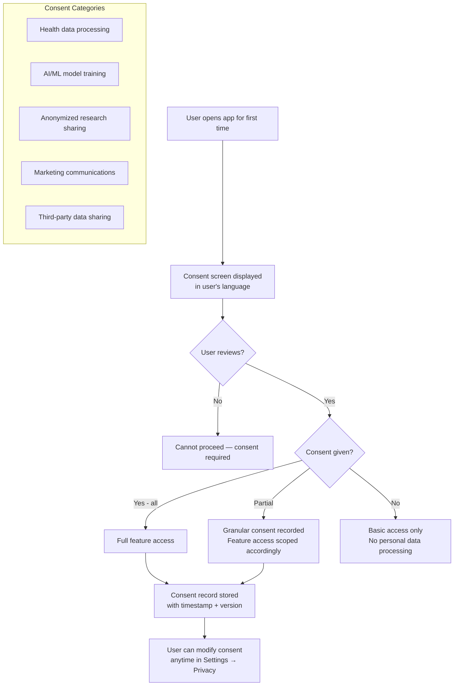
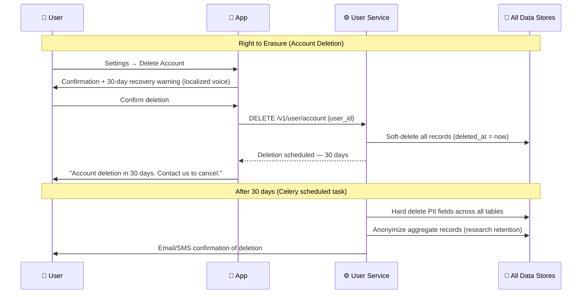
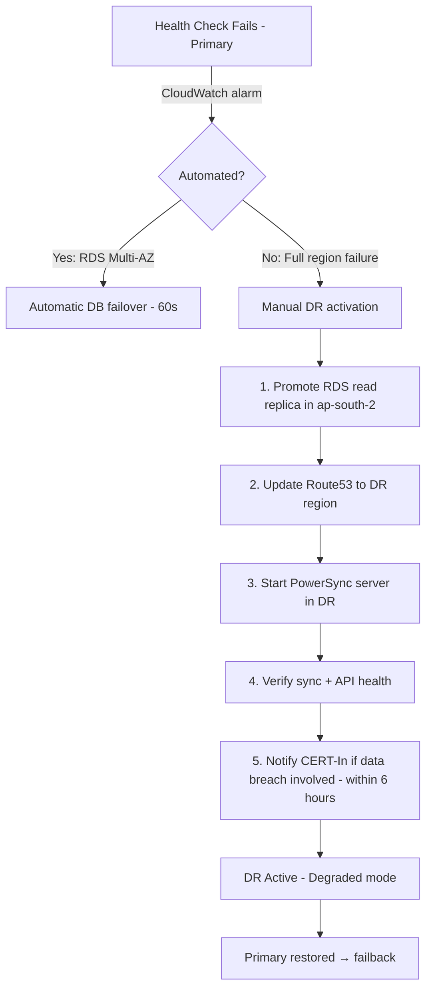

# Technology & Compliance Recommendations

> **CLAUDE-COMP-001** | Farmer-Centric Integrated Animal Husbandry ERP & Telemedicine Platform
> Version: 1.0 | Sprint Date: April 27, 2026

---

## Table of Contents

1. [Compliance Framework Overview](#1-compliance-framework-overview)
2. [DPDP Act 2023 Compliance](#2-dpdp-act-2023-compliance)
3. [ISO 27001 Alignment](#3-iso-27001-alignment)
4. [Security Architecture Recommendations](#4-security-architecture-recommendations)
5. [Data Governance](#5-data-governance)
6. [Third-Party Vendor Compliance](#6-third-party-vendor-compliance)
7. [Infrastructure Cost Estimates](#7-infrastructure-cost-estimates)
8. [Technology Decision Rationale](#8-technology-decision-rationale)
9. [Disaster Recovery & Backup Strategy](#9-disaster-recovery--backup-strategy)
10. [AI Training Data Sourcing Strategy](#10-ai-training-data-sourcing-strategy)
11. [Risk Register](#11-risk-register)
12. [Compliance Roadmap](#12-compliance-roadmap)
13. [Checklist: Sprint Deliverable Summary](#13-checklist-sprint-deliverable-summary)

---

## 1. Compliance Framework Overview

### 1.1 Applicable Regulations

| Regulation | Applicability | Priority |
|-----------|--------------|---------|
| **Digital Personal Data Protection (DPDP) Act, 2023** | Mandatory — processes personal data of Indian citizens | Critical |
| **IT Act, 2000 (amended 2008)** | Mandatory — electronic records and digital signatures | Critical |
| **Telecom Regulatory Authority (TRAI) guidelines** | Applicable for SMS/voice communication | High |
| **Reserve Bank of India (RBI) payment guidelines** | Mandatory for UPI/payment integration | Critical |
| **ISO 27001:2022** | Recommended — information security management | High |
| **WCAG 2.1 AA** | Recommended — accessibility for public-facing apps | High |
| **CERT-In Directions 2022** | Mandatory — 6-hour cyber incident reporting | Critical |
| **MeitY Cloud Empanelment** | Mandatory for govt data — cloud provider must be empaneled | High |
| **NABARD SHG Panchsutra** | Mandatory for SHG financial operations — 5 compliance principles | High |
| **NABARD / NDDB data standards** | Recommended — cooperative data sharing | Medium |

### 1.2 Compliance Posture Map

```mermaid
quadrantChart
    title Compliance Priority Matrix
    x-axis Low Effort --> High Effort
    y-axis Low Risk --> High Risk
    quadrant-1 Do First
    quadrant-2 Plan Carefully
    quadrant-3 Monitor
    quadrant-4 Delegate / Defer

    DPDP Consent Management: [0.3, 0.9]
    RBI Payment Compliance: [0.4, 0.85]
    Data Localization (Mumbai): [0.2, 0.8]
    ISO 27001 Certification: [0.8, 0.6]
    WCAG 2.1 Accessibility: [0.5, 0.5]
    TRAI SMS Compliance: [0.3, 0.4]
    NABARD Data Standards: [0.6, 0.3]
    Cookie Policy: [0.1, 0.1]
```

---

## 2. DPDP Act 2023 Compliance

### 2.1 Key Obligations Mapping

| DPDP Obligation | Requirement | Platform Implementation |
|----------------|-------------|------------------------|
| **Consent** | Explicit, informed, purpose-specific | Layered consent screen at registration; per-feature opt-in |
| **Purpose limitation** | Data used only for stated purpose | Pydantic schemas enforce data scope per API; no cross-module data sharing without consent |
| **Data minimization** | Collect only what's necessary | Each module collects only fields required; no passive tracking |
| **Accuracy** | Data must be kept accurate | User can edit records anytime; version history maintained |
| **Storage limitation** | No indefinite retention | Configurable TTL per data category (see §5.2) |
| **Right to access** | User can view all their data | GET /v1/user/data-export returns full JSON |
| **Right to correction** | User can correct inaccurate data | Edit allowed on all user-owned records |
| **Right to erasure** | User can delete account + data | DELETE /v1/user/account triggers 30-day soft-delete + purge |
| **Right to portability** | User can export data | Export as JSON/CSV from app settings |
| **Breach notification** | Notify Data Protection Board within 72h | Automated breach detection → alert pipeline → statutory filing |
| **Data localization** | Personal data of Indians stored in India | All primary storage in AWS ap-south-1 (Mumbai) |
| **Data Fiduciary registration** | Register with DPBOARD if processing sensitive data | Register before GA launch; health data qualifies as sensitive |

### 2.2 Consent Management Flow



### 2.3 Sensitive Personal Data Categories

Under DPDP Act 2023, the following data categories require heightened protection:

| Data Category | Fields | Protection Level |
|--------------|--------|-----------------|
| Health data | Symptoms, diagnoses, prescriptions, yield health metrics | Sensitive — explicit consent + field encryption |
| Financial data | Income, expenses, bank account, loan history | Sensitive — explicit consent + field encryption |
| Biometric data | Fingerprint/face unlock hash | Sensitive — stored only on-device, never transmitted |
| Location data | District-level for services; GPS optional | Standard — purpose-limited |
| Contact info | Phone number (login identifier) | Standard — encrypted in transit/at rest |

### 2.4 Data Subject Rights Implementation



---

## 3. ISO 27001 Alignment

### 3.1 Control Domains Coverage

| ISO 27001:2022 Domain | Controls | Platform Coverage |
|----------------------|---------|-----------------|
| **A.5 Organizational controls** | Policies, roles, responsibilities | RBAC; documented security policy; CISO designated |
| **A.6 People controls** | Background checks, awareness training | Vendor vetting; quarterly security training for team |
| **A.7 Physical controls** | Physical access, clear desk | Cloud-hosted — AWS physical controls inherited |
| **A.8 Technological controls** | Access control, crypto, logging, malware | ✅ JWT + RBAC; AES-256; ELK audit logs; OWASP ZAP |

### 3.2 Key Controls Implementation

| Control | Requirement | Implementation | Status |
|---------|-------------|---------------|--------|
| **A.8.2** Asset management | Maintain inventory of information assets | CMDB via Terraform state + AWS Config | Planned |
| **A.8.3** Acceptable use | Policy for use of information assets | Documented in CLAUDE.md + onboarding | Done (design) |
| **A.8.5** Secure authentication | MFA for privileged access | Admin accounts: OTP + hardware key | Planned |
| **A.8.7** Protection against malware | Anti-malware on all endpoints | OWASP ZAP in CI/CD; Snyk for dependencies | Planned |
| **A.8.15** Logging | Activity logs for security events | ELK Stack; OpenTelemetry traces | Planned |
| **A.8.16** Monitoring | Continuous monitoring + anomaly detection | Prometheus + Grafana; CloudWatch alarms | Planned |
| **A.8.24** Use of cryptography | Cryptography policy + key management | AES-256, TLS 1.3, RS256 JWT, AWS KMS | Planned |
| **A.8.28** Secure coding | Secure development lifecycle | SAST in CI; peer review; OWASP guidelines | Planned |

---

## 4. Security Architecture Recommendations

### 4.1 Defense-in-Depth Model

```
┌──────────────────────────────────────────────────┐
│  LAYER 1: User / Device                          │
│  • Biometric app lock                            │
│  • Certificate pinning (prevents MITM)           │
│  • SQLCipher (encrypted local DB)                │
├──────────────────────────────────────────────────┤
│  LAYER 2: Network / Transport                    │
│  • TLS 1.3 (enforced, no downgrade)              │
│  • HSTS preloading                               │
│  • VPC with private subnets for internal comms   │
├──────────────────────────────────────────────────┤
│  LAYER 3: API Gateway                            │
│  • Rate limiting (100 req/min/user)              │
│  • JWT RS256 validation on every request         │
│  • Input sanitization + WAF rules                │
├──────────────────────────────────────────────────┤
│  LAYER 4: Application                            │
│  • RBAC (role-based access control)              │
│  • Pydantic input validation                     │
│  • Parameterized queries (no SQL injection)      │
│  • OWASP Top 10 mitigations built-in             │
├──────────────────────────────────────────────────┤
│  LAYER 5: Data                                   │
│  • AES-256 encryption at rest                    │
│  • Field-level encryption for PII                │
│  • DB audit log (append-only)                    │
│  • Automated backups (hourly + cross-region)     │
└──────────────────────────────────────────────────┘
```

### 4.2 STRIDE Threat Model (Full)

**CLAUDE-SEC-002**

| Threat | Asset at Risk | Attack Scenario | Mitigation | Residual Risk |
|--------|--------------|----------------|------------|---------------|
| **Spoofing** | User identity | Attacker uses stolen phone to log in | Biometric lock + OTP re-auth on new device | Low |
| **Spoofing** | Vet identity | Fake vet provides incorrect prescription | License number verification against state vet directory | Medium |
| **Tampering** | Health records | Trader modifies farmer's quality certification | RBAC: only farmer + vet can write health data; audit log | Low |
| **Tampering** | Sync payload | MITM attack modifies CRDT changeset in transit | TLS 1.3 + payload HMAC signature | Low |
| **Repudiation** | Financial transaction | Farmer denies making a sale | Immutable audit log with timestamp + UPI reference | Low |
| **Repudiation** | Prescription | Vet denies issuing prescription | Signed PDF + audit log entry | Low |
| **Info Disclosure** | Health data | DB breach exposes medical records | AES-256 at rest; field encryption for PII | Medium |
| **Info Disclosure** | Financial data | API returns another user's data | RBAC + user_id enforcement in all queries | Low |
| **DoS** | API Gateway | Bot floods sync endpoint | Rate limiting + CAPTCHA on suspicious patterns | Low |
| **DoS** | ML service | Burst of prediction requests | Queue-based prediction with backpressure | Medium |
| **Elevation** | Admin panel | Farmer attempts to access admin routes | Strict RBAC; separate admin auth flow; JWT claims | Low |
| **Elevation** | Bank API | Unauthorized loan application for another user | User-scoped tokens; bank API validates Aadhaar match | Low |

### 4.3 Authentication Security Recommendations

| Recommendation | Priority | Implementation |
|---------------|---------|---------------|
| Use RS256 (asymmetric) for JWT — **not HS256** | Critical | Private key signs; public key verifies; store private in AWS KMS |
| Access token expiry: 15 minutes | Critical | Short-lived; refresh token used for session continuity |
| Refresh token rotation | High | Issue new refresh token on each use; invalidate old |
| OTP rate limiting: max 5 attempts/hour | Critical | Redis-backed counter; Twilio Verify with lockout |
| Suspicious login detection | High | New device / location → re-auth required |
| Key rotation: every 90 days | High | AWS KMS automatic rotation; zero-downtime via key alias |

### 4.4 API Security Checklist

- [ ] All endpoints require `Authorization: Bearer <JWT>` except `/v1/auth/*`
- [ ] JWT claims include `user_id`, `role`, `issued_at`, `expires_at`
- [ ] All user-scoped queries filter by `user_id` from JWT (never from request body)
- [ ] Input validation via Pydantic on all request bodies
- [ ] SQL queries use parameterized statements (SQLAlchemy ORM)
- [ ] File uploads: validated MIME type + size limit (10MB) + virus scan
- [ ] CORS restricted to mobile app bundle ID (not `*`)
- [ ] Rate limiting: 100/min for standard, 10/min for auth endpoints
- [ ] Sensitive responses exclude PII in logs (log request IDs only)
- [ ] OWASP ZAP scan in CI/CD pipeline — fail on high severity findings

---

## 5. Data Governance

### 5.1 Data Classification

| Classification | Examples | Handling |
|---------------|---------|---------|
| **Public** | Fodder prices, vet directories, disease calendar | No access control; cacheable |
| **Internal** | Anonymized aggregates, platform metrics | Internal access only; no PII |
| **Confidential** | Farmer profiles, financial records, health logs | Authenticated access; encrypted; DPDP compliant |
| **Restricted** | Biometric hashes, Aadhaar references, bank details | On-device only or field-encrypted; minimum access |

### 5.2 Data Retention Policy

| Data Category | Retention Period | After Expiry |
|--------------|-----------------|-------------|
| Health events | 7 years (medical record standard) | Anonymize → move to research archive |
| Financial transactions | 7 years (IT Act compliance) | Archive to cold storage (S3 Glacier) |
| Telemedicine sessions | 3 years (with consent) | Delete recording; keep prescription metadata |
| Yield logs | 5 years | Anonymize for aggregate analytics |
| Audit logs | 3 years | Archive to cold storage |
| Deleted accounts (PII) | 30-day grace period | Hard delete all PII fields |
| Session tokens | 15 minutes (access) / 30 days (refresh) | Auto-expire |
| OTP codes | 10 minutes | Auto-expire |

### 5.3 Data Residency

```
Primary Storage:   AWS ap-south-1 (Mumbai)       ← DPDP compliance
Backup / DR:       AWS ap-south-2 (Hyderabad)     ← same territory
ML Training Data:  AWS ap-south-1 only            ← no cross-border transfer
Third-party APIs:  Twilio (US), Razorpay (India)  ← DPA required with Twilio
Logs / Analytics:  AWS ap-south-1 OpenSearch      ← no export without consent
```

**Policy**: Personal data of Indian citizens must not leave Indian territory without explicit consent and a valid legal basis under DPDP Act 2023. All third-party services must sign a Data Processing Agreement (DPA).

---

## 6. Third-Party Vendor Compliance

### 6.1 Vendor Risk Assessment

| Vendor | Service | Data Shared | Risk Level | Requirements |
|--------|---------|-------------|------------|-------------|
| **Twilio** | SMS, Video | Phone number, session metadata | High | DPA required; data processed in Twilio US infra — audit transfer basis |
| **Razorpay** | Payments | Name, UPI ID, amount | High | RBI-compliant; PCI-DSS certified; existing DPA via ToS |
| **Sarvam AI** | TTS/STT | Voice audio, transcripts | High | Indian company; DPA required; opt-in consent for audio processing |
| **OpenWeatherMap** | Weather data | GPS coordinates (district-level only) | Low | No PII shared; standard ToS sufficient |
| **AWS** | Cloud infrastructure | All data (infrastructure) | Critical | AWS DPA covers DPDP; ISO 27001 certified; Mumbai region |
| **ICAR/NDDB** (target) | Training datasets | Anonymized health/yield data | Medium | MoU required; data sharing agreement; anonymization verified |

### 6.2 Vendor DPA Requirements

All vendors processing personal data must agree to:

1. Process data only for contracted purposes
2. Implement appropriate technical and organizational measures
3. Notify data fiduciary (RDO/platform) within 24h of a breach
4. Delete data upon contract termination
5. Not sub-process without prior written consent
6. Allow audit rights

---

## 7. Infrastructure Cost Estimates

### 7.1 Phase 1 MVP (1,000 users — Karnataka pilot)

| Resource | Specification | Monthly Cost (INR) |
|----------|-------------|-------------------|
| EKS Cluster | 3x t3.medium nodes | ₹12,000 |
| RDS PostgreSQL | db.t3.medium, Multi-AZ | ₹8,000 |
| ElastiCache Redis | cache.t3.micro | ₹2,500 |
| S3 Storage | 100GB media + exports | ₹1,000 |
| CloudFront CDN | 50GB transfer | ₹500 |
| SES / SNS | Notifications | ₹500 |
| Twilio (SMS) | 5,000 SMS/month | ₹3,500 |
| Razorpay | 1% transaction fee | Variable |
| Sarvam AI | ~10K API calls/month | ₹2,000 |
| OpenWeatherMap | Free tier | ₹0 |
| **Total Monthly** | | **~₹30,000/month** |
| **Annual** | | **~₹3.6L/year** |

### 7.2 Phase 2 Growth (10,000 users)

| Resource | Specification | Monthly Cost (INR) |
|----------|-------------|-------------------|
| EKS Cluster | 6x t3.large nodes + HPA | ₹35,000 |
| RDS PostgreSQL | db.r6g.large, Multi-AZ, read replica | ₹25,000 |
| DocumentDB (MongoDB) | db.r6g.medium | ₹12,000 |
| ElastiCache Redis | cache.r6g.medium cluster | ₹8,000 |
| S3 Storage | 1TB | ₹4,000 |
| CloudFront CDN | 500GB transfer | ₹2,500 |
| Twilio (Video + SMS) | ~50K SMS + video minutes | ₹25,000 |
| Sarvam AI | ~100K API calls/month | ₹15,000 |
| **Total Monthly** | | **~₹1,30,000/month** |
| **Annual** | | **~₹15.6L/year** |

### 7.3 Phase 3 Scale (100,000 users)

| Resource | Specification | Monthly Cost (INR) |
|----------|-------------|-------------------|
| EKS Cluster | Auto-scaling, spot instances | ₹1,20,000 |
| RDS PostgreSQL | db.r6g.2xlarge, Multi-AZ + 2 replicas | ₹80,000 |
| DocumentDB | r6g.xlarge cluster | ₹40,000 |
| ElastiCache Redis | r6g.large cluster mode | ₹25,000 |
| S3 Storage | 10TB | ₹35,000 |
| CDN + Transfer | 5TB | ₹15,000 |
| Twilio | Volume pricing | ₹80,000 |
| Other services | Monitoring, logging, AI | ₹50,000 |
| **Total Monthly** | | **~₹4,45,000/month** |
| **Annual** | | **~₹53L/year** |

### 7.4 Cost Optimization Recommendations

| Strategy | Estimated Saving | Implementation |
|----------|-----------------|---------------|
| EC2 Spot Instances for non-critical workloads | 60-70% compute | Celery workers, ML training on spot |
| S3 Intelligent-Tiering for old media | 40-50% storage | Lifecycle policy after 90 days |
| RDS reserved instances (1-year) | 35-40% DB cost | Commit after Phase 2 stable |
| CloudFront caching for static assets | 30% transfer | Cache-Control headers on all static content |
| Sarvam AI caching (common phrases) | 20-30% API calls | Redis cache for repeated TTS strings |
| Lambda for infrequent tasks | Variable | Reports, exports, scheduled notifications |

---

## 8. Technology Decision Rationale

### 8.1 Frontend: React Native vs. Alternatives

| Option | Pros | Cons | Verdict |
|--------|------|------|---------|
| **React Native** ✅ | Single codebase for Android+iOS; large ecosystem; good offline libs | Performance vs native; larger APK | **Selected** |
| Flutter | Excellent performance; great UI | Dart learning curve; smaller ecosystem | Good alternative |
| Native (Kotlin/Swift) | Best performance | Two codebases; higher cost | Overkill for MVP |
| PWA | Cheapest to build | Poor offline support; no biometric; no FCM | Not viable |

**Decision**: React Native with WatermelonDB for offline sync. Estimated 40% faster delivery vs. native.

### 8.2 Backend: FastAPI vs. Alternatives

| Option | Pros | Cons | Verdict |
|--------|------|------|---------|
| **FastAPI** ✅ | Async; auto OpenAPI docs; Pydantic validation; Python AI ecosystem | Newer than Django; smaller community | **Selected** |
| Django REST | Mature; large community; admin panel built-in | Sync by default; heavier | Good for admin panel |
| Node.js/Express | Fast; JavaScript ecosystem | Weaker AI/ML integration | Not ideal |
| Go | Extremely fast | Team skill mismatch; weaker AI libs | Defer |

**Decision**: FastAPI for main microservices. Django for admin panel (leverages built-in admin).

### 8.3 Database: PostgreSQL + MongoDB vs. Alternatives

| Decision | Rationale |
|----------|-----------|
| PostgreSQL for structured data | ACID compliance for financial data; excellent JSONB support; proven at scale |
| MongoDB for unstructured data | Vet consultation notes, forum posts, IoT payloads vary in schema |
| Redis for caching | Sub-millisecond reads for hot paths (vet availability, market prices) |
| SQLite on-device | WatermelonDB integration; proven offline-first pattern |

### 8.4 Offline Sync: PowerSync vs. Alternatives

| Option | Pros | Cons | Verdict |
|--------|------|------|---------|
| **PowerSync** ✅ | Rust-based performance; bidirectional PostgreSQL sync; self-hosted Open Edition; official React Native SDK; 10+ years in offline field apps | Smaller community than Firebase | **Selected** |
| WatermelonDB | Popular OSS | Broken with RN 0.76+ JSI (GitHub #1851); UI freezes on budget Android | Rejected — incompatible |
| ElectricSQL | Postgres-native | Alpha maturity; no production offline sync yet | Rejected — too early |
| Replicache | Strong consistency | $500/month; no self-hosted option | Rejected — budget |
| Last-write-wins | Simple | Data loss in shared-device households | Rejected — unacceptable for health data |

**Decision**: PowerSync with domain-aware merge rules per entity type (see architecture.md §8). Shared-device use (family members) is a primary scenario — data loss is not acceptable. Append-only event log provides audit compliance for DPDP Act.

### 8.5 AI/ML: Why Sarvam AI for Indic Languages

| Requirement | Justification |
|-------------|--------------|
| Kannada STT/TTS | Google/AWS don't support rural Kannada dialects well |
| On-premise option | Sarvam offers on-premise deployment for data sovereignty |
| Indian company | Simplifies DPA and data residency compliance |
| Accuracy | Benchmarked at 92% WER for Indian languages vs. 78% for generic models |

---

## 9. Disaster Recovery & Backup Strategy

**CLAUDE-COMP-009**

### 9.1 DR Strategy: Phased Approach

| Phase | Strategy | When | Monthly Cost (INR) | RTO | RPO |
|-------|----------|------|-------------------|-----|-----|
| **Pilot** (0-1K users) | Backup & Restore | Months 1-6 | ₹13,000-24,000 | 4 hours | 1 hour |
| **Growth** (1K-10K users) | Pilot Light | Months 7-12 | ₹45,000-65,000 | 30 min | 5 min |
| **Scale** (10K+ users) | Warm Standby | Year 2+ | ₹1,20,000+ | 5 min | Near-zero |

**Rationale**: Full multi-region active-active is unnecessary for a 500-farmer pilot. Backup & Restore at ₹1.6-2.9L/year is affordable within the ₹50-75L budget while meeting CERT-In and DPDP requirements. Graduate to Pilot Light when user count justifies the cost.

### 9.2 Primary & DR Regions

```
Primary:  AWS ap-south-1 (Mumbai)     ← DPDP data residency compliance
DR:       AWS ap-south-2 (Hyderabad)  ← Same country, different seismic zone
                                         ~500km separation
```

**Why Hyderabad**: Same Indian territory (DPDP compliant), different availability zone, low-latency cross-region replication, Karnataka pilot geography benefit.

### 9.3 Backup Architecture

#### PostgreSQL (Structured Data)

| Component | Configuration |
|-----------|-------------|
| Tool | **pgBackRest** (proven at scale, parallel backup/restore) |
| Full backup | Weekly (Sunday 02:00 IST) |
| Incremental | Daily (02:00 IST) |
| WAL archiving | Continuous streaming to S3 (ap-south-2) |
| Retention | 30 days full + 90 days incremental + 1 year monthly |
| Encryption | AES-256 at rest (S3 SSE-KMS) + TLS in transit |
| Testing | Monthly restore drill to staging environment |

```bash
# pgBackRest configuration (pilot phase)
[global]
repo1-type=s3
repo1-s3-bucket=pashuraksha-pgbackrest-dr
repo1-s3-region=ap-south-2
repo1-s3-endpoint=s3.ap-south-2.amazonaws.com
repo1-cipher-type=aes-256-cbc
repo1-retention-full=4
repo1-retention-diff=30

[pashuraksha]
pg1-path=/var/lib/postgresql/16/main
```

#### MongoDB (Unstructured Data — media, documents)

| Component | Configuration |
|-----------|-------------|
| Tool | **MongoDB Atlas Continuous Backup** (if Atlas) or **mongodump** (self-hosted) |
| Point-in-time recovery | Continuous (Atlas) or 6-hourly snapshots (self-hosted) |
| Cross-region replica | Automatic read replica in ap-south-2 |
| Media files (S3) | Cross-region replication to ap-south-2 bucket |
| Retention | 30 days continuous + 1 year monthly snapshots |

#### Redis (Cache)

- **No backup required** — cache is ephemeral and rebuilt on startup
- DR region has its own Redis instance (cold, starts on failover)

#### PowerSync Sync Server

- Stateless — no backup needed; state lives in PostgreSQL
- DR: PowerSync server deployed in ap-south-2 (stopped, starts on failover)

### 9.4 Failover Procedure



### 9.5 Regulatory Compliance Matrix

| Regulation | Requirement | How We Comply |
|-----------|-------------|---------------|
| **DPDP Act 2023** | Data must remain in Indian territory | Both regions in India (Mumbai + Hyderabad) |
| **DPDP Act 2023** | Breach notification to Board | Automated alert pipeline → CERT-In within 6 hours |
| **CERT-In 2022** | Report cyber incidents within 6 hours | PagerDuty → incident commander → CERT-In portal |
| **RBI (payments)** | Payment data stored only in India | Razorpay handles compliance; our payment records in ap-south-1/2 |
| **MeitY Cloud Policy** | Govt data on empaneled cloud | AWS is MeitY-empaneled; ap-south-1 & ap-south-2 both approved |
| **NABARD** | SHG financial data integrity | WAL archiving + cross-region replication; RPO < 5 min at scale |

### 9.6 Backup Testing & Validation

| Test | Frequency | Acceptance Criteria |
|------|-----------|-------------------|
| PostgreSQL restore to staging | Monthly | Full restore < RTO; data integrity check passes |
| MongoDB point-in-time recovery | Monthly | Recover to specific timestamp; media files accessible |
| Full DR failover drill | Quarterly | All services operational in DR within RTO; sync resumes |
| Backup encryption verification | Monthly | Encrypted backups decrypt correctly with KMS key |
| WAL archive continuity check | Weekly (automated) | No gaps in WAL sequence; alert if gap > 5 min |

---

## 10. AI Training Data Sourcing Strategy

**CLAUDE-COMP-010**

### 10.1 Challenge

AI/ML models for livestock disease prediction, yield forecasting, and fodder planning require labeled datasets that don't exist for Indian smallholder farming contexts. Commercial datasets are unavailable. Government datasets exist but require partnerships.

### 10.2 Data Sourcing Phases

#### Phase 0: Public Open Data (Available immediately, no partnerships needed)

| Source | Data Type | Access | Quality |
|--------|----------|--------|---------|
| **Kaggle: cattle-disease-prediction** | 3,500+ cases, 26 disease classes | Open, CC license | Good — needs India-specific validation |
| **Kaggle: BRD-detection** | Bovine respiratory disease clinical records | Open | Moderate — US-centric |
| **FAO EMPRES-i+** (fao.org/empres-i) | Global disease outbreak reports | Open API | High — global coverage |
| **NADRS 2.0** (nadrs.gov.in) | India district-level outbreak reports | Public reports (PDFs) | High — India-specific |
| **data.gov.in** | Livestock census, breed distribution, state statistics | Open API | High — official government |
| **IMD** (mausam.imd.gov.in) | Historical weather data for disease-weather correlation | Open | High |
| **ICAR-IVRI publications** | Veterinary clinical manuals, disease decision trees | Published PDFs | High — authoritative |

**Use case**: Bootstrap rule-based expert system (architecture.md §9.4 Phase 0) + seed initial ML training set.

#### Phase 1: Data Collection by Design (Months 1+, built into app)

Every farmer-vet interaction generates labeled training data:

```
Farmer logs symptoms → Vet provides diagnosis → (features, label) training pair
Treatment prescribed → Outcome tracked at 7d/30d → Treatment efficacy signal
Milk yield recorded daily → Seasonal patterns → Yield prediction features
```

**Privacy compliance (DPDP Act)**:
- All training data is **anonymized** before model training
- Farmer consent includes explicit opt-in for "data used to improve AI predictions"
- Consent is granular: health data, financial data, and location data are separate opt-ins
- Data can be withdrawn (right to erasure) — model retrained without withdrawn data
- On-device inference never sends raw data to server

**Target**: 10,000 labeled records within 6 months (500 pilot farmers × ~20 events each).

#### Phase 2: Government Data Partnerships (Months 6-12)

| Partner | Location | Dataset Value | Access Strategy |
|---------|----------|-------------|-----------------|
| **NDDB / INAPH** | Anand, Gujarat | 34.5M bovine profiles, vaccination records, breeding data — richest Indian livestock dataset | MoU via NDDB; Pashu Aadhaar integration gives natural data exchange hook |
| **ICAR-NIVEDI** | **Bengaluru** (same city as RDO!) | National disease surveillance, outbreak prediction models, epidemiological data | Research collaboration; RDO arranges in-person meetings; academic MoU |
| **ICAR-IVRI** | Bareilly, UP | Veterinary research datasets, breed-specific disease susceptibility | Academic partnership via Karnataka Veterinary University link |
| **Karnataka AH Dept** | Bengaluru | State vaccination campaigns, cattle census, vet clinic records | Existing RDO-state govt relationship; data sharing under state animal husbandry policy |
| **KMF / Nandini** | Bengaluru | Milk collection records, breed performance data, cooperative farmer data | Pilot partnership — KMF benefits from our analytics |

**Why partnerships take time**: Government MoUs require departmental approvals (3-6 months minimum). The platform must demonstrate pilot value first. ICAR-NIVEDI being in Bengaluru is a strategic advantage.

### 10.3 Data Quality & Governance

| Principle | Implementation |
|-----------|---------------|
| **Anonymization** | k-anonymity (k≥5) on all training datasets; remove name, phone, Aadhaar before training |
| **Bias monitoring** | Track model accuracy by breed, region, and farmer gender; alert if accuracy variance > 10% |
| **Provenance tracking** | Every training record tagged with source (app-collected, NDDB, Kaggle, etc.) |
| **Version control** | DVC (Data Version Control) for dataset versioning; reproducible training runs |
| **Consent compliance** | Training data registry maps every record to consent ID; bulk withdrawal supported |
| **Cross-border prohibition** | Training data never leaves AWS ap-south-1; no cloud ML services that transfer data abroad |

### 10.4 ML Transition Criteria

The platform starts with rule-based expert systems and transitions to ML models when data quality thresholds are met:

| Metric | Rule-Based Phase | ML Switchover Threshold |
|--------|-----------------|----------------------|
| Labeled disease records | 0 (using published guidelines) | >10,000 from app + partnerships |
| Unique disease classes | Top 10 common diseases | >20 classes with >100 samples each |
| Vet-confirmed diagnoses | N/A | >500 (ground truth for evaluation) |
| Geographic coverage | Karnataka only | >3 states represented |
| False positive rate | High (conservative, by design) | <15% on held-out test set |
| Model accuracy | ~60% (heuristic) | >80% precision + recall |

---

## 11. Risk Register

### 9.1 Technical Risks

| Risk | Likelihood | Impact | Mitigation | Owner |
|------|-----------|--------|------------|-------|
| Offline sync conflicts cause data corruption | Medium | High | PowerSync + domain-aware merge rules + automated conflict resolution tests | Backend Lead |
| AI model misdiagnoses with high confidence | Medium | Critical | Vet override mechanism; precision/recall monitoring; disclaimer UI | AI Lead |
| Razorpay API rate limits during harvest season | Low | High | Queue-based payment processing; exponential backoff | Backend Lead |
| Sarvam AI dialect coverage gaps (rural Kannada) | High | Medium | Fallback to icon/text input; dialect feedback loop for retraining | ML Lead |
| Device storage exhaustion on low-end phones | Medium | Medium | PowerSync bucket pruning of synced records; offline storage cap (500MB) | Mobile Lead |

### 9.2 Compliance Risks

| Risk | Likelihood | Impact | Mitigation |
|------|-----------|--------|------------|
| DPDP Board audit finds consent mechanism inadequate | Medium | Critical | Legal review of consent flow before beta; Data Protection Officer engaged |
| Third-party breach (Twilio / Sarvam) exposes user data | Low | High | DPAs in place; minimal data sharing; breach notification SLA in contracts |
| RBI flags UPI integration as non-compliant | Low | Critical | Use Razorpay as intermediary (RBI-licensed PA); avoid direct UPI integration |
| Health data classified as clinical record requiring MCI compliance | Low | High | Consult medical-legal counsel; add disclaimer: "not a substitute for clinical care" |

### 9.3 Business Risks

| Risk | Likelihood | Impact | Mitigation |
|------|-----------|--------|------------|
| Low adoption in low-tech areas | High | High | NGO-led onboarding; freemium model; offline-first reduces barrier |
| Free govt app (e-Gopala) expands and competes | Medium | Medium | Focus on integrated ERP + telemedicine — not just one module |
| Budget overrun on ₹50-75L estimate | Medium | High | Phased delivery; MVP is health + finance only; defer IoT/AI to Phase 3 |
| ICAR/NDDB data partnership falls through | High | Medium | Cold-start with rule-based heuristics; transition to ML once 10K records |

---

## 12. Compliance Roadmap

### Phase 1: MVP (Months 1-3)

- [ ] Register as Data Fiduciary with DPDP Board (if processing begins)
- [ ] Implement consent management with granular opt-ins (health, financial, location separate)
- [ ] Deploy in AWS ap-south-1 (Mumbai) only
- [ ] Sign DPA with Twilio and Sarvam AI
- [ ] Implement data retention + deletion APIs
- [ ] Complete OWASP ZAP baseline scan — zero high severity
- [ ] Privacy Policy + Terms of Service reviewed by legal counsel
- [ ] Accessibility audit: WCAG 2.1 AA on all MVP screens
- [ ] **DR**: Configure pgBackRest with WAL archiving to S3 (ap-south-2)
- [ ] **DR**: Set up cross-region S3 replication for media files
- [ ] **DR**: Monthly backup restore drill to staging
- [ ] **AI Data**: Deploy rule-based expert system (ICAR-IVRI guidelines)
- [ ] **AI Data**: Integrate Kaggle cattle-disease dataset for initial model evaluation
- [ ] **AI Data**: Implement training data collection pipeline in app (symptom→diagnosis pairs)

### Phase 2: Growth (Months 4-6)

- [ ] Penetration test by external security firm
- [ ] ISO 27001 gap assessment
- [ ] RBI compliance review of payment flows (via Razorpay)
- [ ] Incident response plan documented and tested (tabletop exercise)
- [ ] DPDP breach notification workflow tested end-to-end (CERT-In 6-hour SLA)
- [ ] Third-party vendor audit (Twilio, Razorpay, Sarvam AI)
- [ ] **DR**: Upgrade to Pilot Light — RDS read replica in ap-south-2
- [ ] **DR**: Quarterly full DR failover drill
- [ ] **AI Data**: Evaluate ML switchover criteria (>10K labeled records?)
- [ ] **AI Data**: Initiate ICAR-NIVEDI research collaboration (Bengaluru meetings)
- [ ] **AI Data**: Initiate NDDB/INAPH MoU for Pashu Aadhaar data exchange

### Phase 3: Scale (Months 7-12)

- [ ] ISO 27001:2022 formal certification (if B2G partnerships require)
- [ ] SOC 2 Type II assessment (for NGO/enterprise sales)
- [ ] AI model audit — bias testing across language/region/gender demographics
- [ ] NABARD data sharing standard compliance (for cooperative integrations)
- [ ] Annual penetration test + vulnerability disclosure program
- [ ] **DR**: Evaluate Warm Standby if user count > 10K
- [ ] **AI Data**: Formalize govt data partnerships (NDDB, ICAR-NIVEDI, Karnataka AH Dept)
- [ ] **AI Data**: Transition disease prediction from rules to ML (if threshold met)
- [ ] **AI Data**: DVC dataset versioning and reproducible training pipeline

---

## 13. Checklist: Sprint Deliverable Summary

### Deliverable 1: Architecture Specification ✅
- [x] System architecture diagram (microservices + data flows)
- [x] Module decomposition with responsibilities
- [x] Technology stack with version specifications and rationale
- [x] API endpoint specifications (CLAUDE-API-001 through CLAUDE-API-013)
- [x] Data models and ERD (25 entities with Pashu Aadhaar, govt schemes, insurance, breeding)
- [x] Offline-first architecture with PowerSync + domain-aware merge + event log
- [x] AI/ML pipeline with cold-start strategy (rule-based → ML transition)
- [x] Sarvam AI integration for Indic language STT/TTS
- [x] Security architecture (STRIDE threat model)
- [x] Infrastructure specification (K8s, CI/CD, monitoring)
- [x] Admin panel specification (Refine framework, GIS map, NABARD reporting)
- [x] User onboarding flow (4-phase progressive + 3-tier buddy system)
- [x] Phased rollout plan with post-sprint AI implementation roadmap

### Deliverable 2: Process & Data Flow Diagrams ✅
- [x] Core user journey map (farmer daily activity)
- [x] Health logging flow (nominal + photo detection)
- [x] Telemedicine consultation sequence
- [x] Market transaction flow + state machine
- [x] Financial planning + govt scheme integration
- [x] PowerSync offline sync sequence + domain-aware merge resolution
- [x] AI prediction pipeline
- [x] Notification routing architecture
- [x] User onboarding step-by-step flow (4-phase progressive)
- [x] IoT data ingestion pipeline
- [x] Admin reporting flow
- [x] Data state transition diagrams (health events, payments)

### Deliverable 3: Technology & Compliance Recommendations ✅
- [x] Compliance framework overview (DPDP, ISO 27001, RBI, TRAI, CERT-In, NABARD)
- [x] DPDP Act 2023 full obligations mapping + implementation
- [x] Consent management flow
- [x] ISO 27001:2022 control alignment
- [x] Defense-in-depth security model
- [x] Complete STRIDE threat model
- [x] API security checklist
- [x] Data governance: classification, retention, residency
- [x] Third-party vendor risk assessment + DPA requirements
- [x] Infrastructure cost estimates (3 phases)
- [x] Technology decision rationale (PowerSync, Refine, Sarvam AI)
- [x] Disaster recovery & backup strategy (phased: Backup & Restore → Pilot Light)
- [x] AI training data sourcing strategy (open data → app collection → govt partnerships)
- [x] Risk register (technical + compliance + business)
- [x] Compliance roadmap (3 phases)

---

> **Previous document**: [Data Flow Diagrams](./data-flow.md)
> **Back to**: [Architecture Specification](./architecture.md) | [README](../README.md)
