# Process & Data Flow Diagrams

> **CLAUDE-DIAG-002** | Farmer-Centric Integrated Animal Husbandry ERP & Telemedicine Platform
> Version: 1.0 | Sprint Date: April 27, 2026

---

## Table of Contents

1. [Core User Journeys](#1-core-user-journeys)
2. [Daily Health Logging Flow](#2-daily-health-logging-flow)
3. [Telemedicine Consultation Flow](#3-telemedicine-consultation-flow)
4. [Market Transaction Flow](#4-market-transaction-flow)
5. [Financial Planning Flow](#5-financial-planning-flow)
6. [Offline Sync Flow (PowerSync + Domain-Aware Merge)](#6-offline-sync-flow-powersync--domain-aware-merge)
7. [AI Prediction Pipeline](#7-ai-prediction-pipeline)
8. [Notification & Alert Flow](#8-notification--alert-flow)
9. [User Onboarding Flow (4-Phase Progressive Model)](#9-user-onboarding-flow-4-phase-progressive-model)
10. [IoT Data Ingestion Flow](#10-iot-data-ingestion-flow)
11. [Admin & Reporting Flow](#11-admin--reporting-flow)
12. [Data State Transitions](#12-data-state-transitions)
13. [Disaster Recovery Failover Flow](#13-disaster-recovery-failover-flow)
14. [Herd Tracking Flow](#14-herd-tracking-flow)
15. [Disease Hotspot Flow](#15-disease-hotspot-flow)
16. [Hatchery Monitoring Flow](#16-hatchery-monitoring-flow)
17. [Credit Profile Flow](#17-credit-profile-flow)

---

## 1. Core User Journeys

### 1.1 Farmer Daily Activity Map

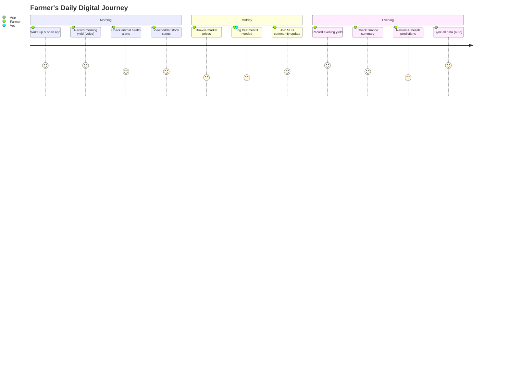
```mermaid
journey
    title Farmer's Daily Digital Journey
    section Morning
      Wake up & open app: 5: Farmer
      Record morning yield (voice): 5: Farmer
      Check animal health alerts: 4: Farmer
      View fodder stock status: 4: Farmer
    section Midday
      Browse market prices: 3: Farmer
      Log treatment if needed: 3: Farmer, Vet
      Join SHG community update: 4: Farmer
    section Evening
      Record evening yield: 5: Farmer
      Check finance summary: 4: Farmer
      Review AI health predictions: 3: Farmer
      Sync all data (auto): 5: App
```

### 1.2 End-to-End Platform Data Flow

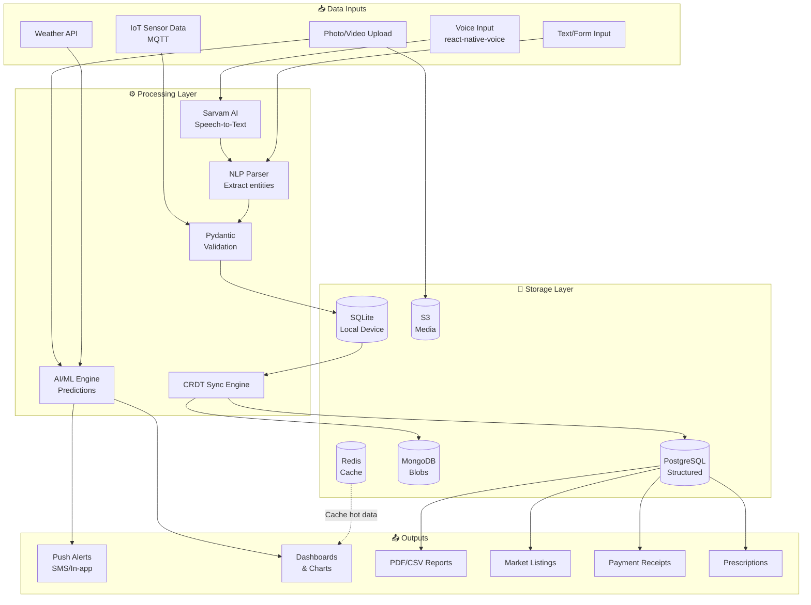
```mermaid
graph TD
    subgraph Input["📥 Data Inputs"]
        VOICE[Voice Input<br/>react-native-voice]
        TEXT[Text/Form Input]
        PHOTO[Photo/Video Upload]
        IOT_IN[IoT Sensor Data<br/>MQTT]
        WEATHER_IN[Weather API]
    end

    subgraph Processing["⚙️ Processing Layer"]
        STT[Sarvam AI<br/>Speech-to-Text]
        PARSE[NLP Parser<br/>Extract entities]
        VALIDATE[Pydantic<br/>Validation]
        AI_PROC[AI/ML Engine<br/>Predictions]
        SYNC_PROC[CRDT Sync Engine]
    end

    subgraph Storage["💾 Storage Layer"]
        LOCAL[(SQLite<br/>Local Device)]
        PG[(PostgreSQL<br/>Structured)]
        MONGO[(MongoDB<br/>Blobs)]
        S3[(S3<br/>Media)]
        REDIS[(Redis<br/>Cache)]
    end

    subgraph Output["📤 Outputs"]
        ALERTS[Push Alerts<br/>SMS/In-app]
        DASHBOARDS[Dashboards<br/>& Charts]
        REPORTS[PDF/CSV Reports]
        MARKET[Market Listings]
        PAYMENTS[Payment Receipts]
        PRESCRIPTIONS[Prescriptions]
    end

    VOICE --> STT --> PARSE
    TEXT --> PARSE
    PHOTO --> AI_PROC
    IOT_IN --> VALIDATE
    WEATHER_IN --> AI_PROC

    PARSE --> VALIDATE
    VALIDATE --> LOCAL
    LOCAL --> SYNC_PROC
    SYNC_PROC --> PG
    SYNC_PROC --> MONGO

    AI_PROC --> ALERTS
    AI_PROC --> DASHBOARDS
    PG --> REPORTS
    PG --> MARKET
    PG --> PAYMENTS
    PG --> PRESCRIPTIONS
    PHOTO --> S3
    REDIS -.->|Cache hot data| DASHBOARDS
```

---

## 2. Daily Health Logging Flow

### 2.1 Nominal Flow — Voice-Driven Health Log

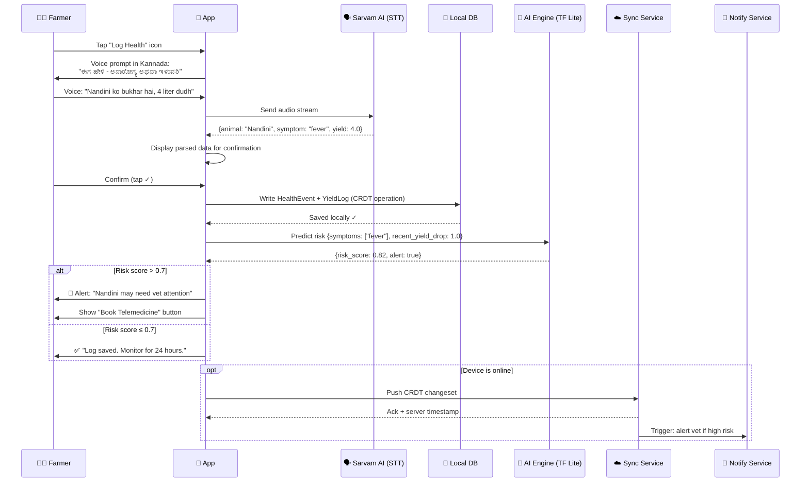
```mermaid
sequenceDiagram
    participant F as 👩‍🌾 Farmer
    participant APP as 📱 App
    participant STT as 🗣️ Sarvam AI (STT)
    participant LOCAL as 💾 Local DB
    participant AI as 🧠 AI Engine (TF Lite)
    participant SYNC as ☁️ Sync Service
    participant NOTIFY as 🔔 Notify Service

    F->>APP: Tap "Log Health" icon
    APP->>F: Voice prompt in Kannada:<br/>"ಈಗ ಹೇಳಿ - ಅನಾರೋಗ್ಯ ಅಥವಾ ಇಳುವರಿ"
    F->>APP: Voice: "Nandini ko bukhar hai, 4 liter dudh"
    APP->>STT: Send audio stream
    STT-->>APP: {animal: "Nandini", symptom: "fever", yield: 4.0}
    APP->>APP: Display parsed data for confirmation
    F->>APP: Confirm (tap ✓)
    APP->>LOCAL: Write HealthEvent + YieldLog (CRDT operation)
    LOCAL-->>APP: Saved locally ✓
    APP->>AI: Predict risk {symptoms: ["fever"], recent_yield_drop: 1.0}
    AI-->>APP: {risk_score: 0.82, alert: true}

    alt Risk score > 0.7
        APP->>F: 🔴 Alert: "Nandini may need vet attention"
        APP->>F: Show "Book Telemedicine" button
    else Risk score ≤ 0.7
        APP->>F: ✅ "Log saved. Monitor for 24 hours."
    end

    opt Device is online
        APP->>SYNC: Push CRDT changeset
        SYNC-->>APP: Ack + server timestamp
        SYNC->>NOTIFY: Trigger: alert vet if high risk
    end
```

### 2.2 Photo-Based Disease Detection Flow

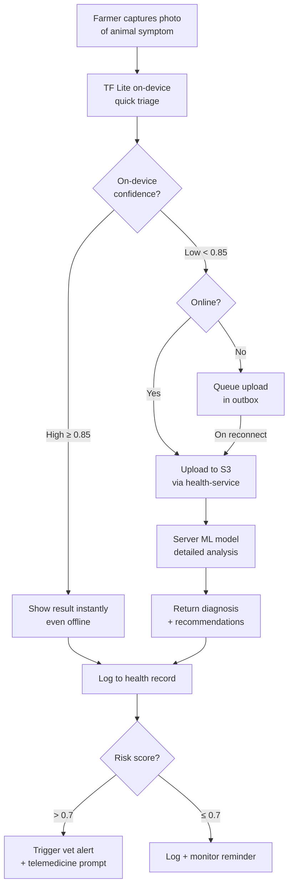
```mermaid
flowchart TD
    A[Farmer captures photo<br/>of animal symptom] --> B[TF Lite on-device<br/>quick triage]
    B --> C{On-device<br/>confidence?}
    C -->|High ≥ 0.85| D[Show result instantly<br/>even offline]
    C -->|Low < 0.85| E{Online?}
    E -->|Yes| F[Upload to S3<br/>via health-service]
    E -->|No| G[Queue upload<br/>in outbox]
    F --> H[Server ML model<br/>detailed analysis]
    H --> I[Return diagnosis<br/>+ recommendations]
    G -->|On reconnect| F
    D --> J[Log to health record]
    I --> J
    J --> K{Risk score?}
    K -->|> 0.7| L[Trigger vet alert<br/>+ telemedicine prompt]
    K -->|≤ 0.7| M[Log + monitor reminder]
```

---

## 3. Telemedicine Consultation Flow

### 3.1 Full Consultation Sequence

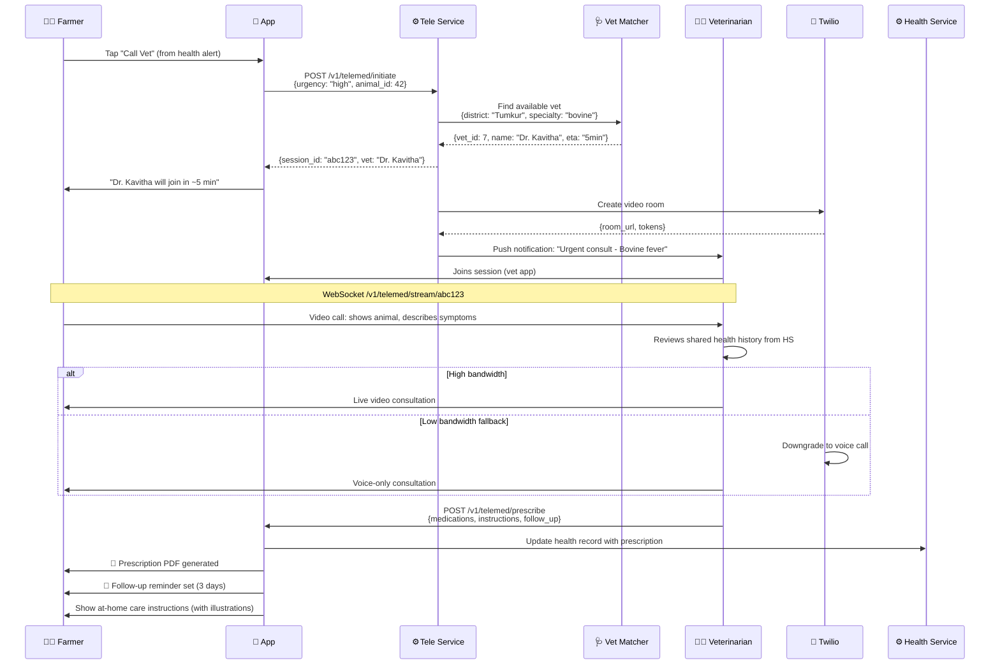
```mermaid
sequenceDiagram
    participant F as 👩‍🌾 Farmer
    participant APP as 📱 App
    participant TS as ⚙️ Tele Service
    participant VM as 🩺 Vet Matcher
    participant VET as 👨‍⚕️ Veterinarian
    participant TW as 📡 Twilio
    participant HS as ⚙️ Health Service

    F->>APP: Tap "Call Vet" (from health alert)
    APP->>TS: POST /v1/telemed/initiate<br/>{urgency: "high", animal_id: 42}
    TS->>VM: Find available vet<br/>{district: "Tumkur", specialty: "bovine"}
    VM-->>TS: {vet_id: 7, name: "Dr. Kavitha", eta: "5min"}
    TS-->>APP: {session_id: "abc123", vet: "Dr. Kavitha"}
    APP->>F: "Dr. Kavitha will join in ~5 min"

    TS->>TW: Create video room
    TW-->>TS: {room_url, tokens}
    TS->>VET: Push notification: "Urgent consult - Bovine fever"
    VET->>APP: Joins session (vet app)

    Note over F,VET: WebSocket /v1/telemed/stream/abc123

    F->>VET: Video call: shows animal, describes symptoms
    VET->>VET: Reviews shared health history from HS

    alt High bandwidth
        VET->>F: Live video consultation
    else Low bandwidth fallback
        TW->>TW: Downgrade to voice call
        VET->>F: Voice-only consultation
    end

    VET->>APP: POST /v1/telemed/prescribe<br/>{medications, instructions, follow_up}
    APP->>HS: Update health record with prescription
    APP->>F: 📄 Prescription PDF generated
    APP->>F: 📅 Follow-up reminder set (3 days)
    APP->>F: Show at-home care instructions (with illustrations)
```

### 3.2 Vet Triage Decision Tree

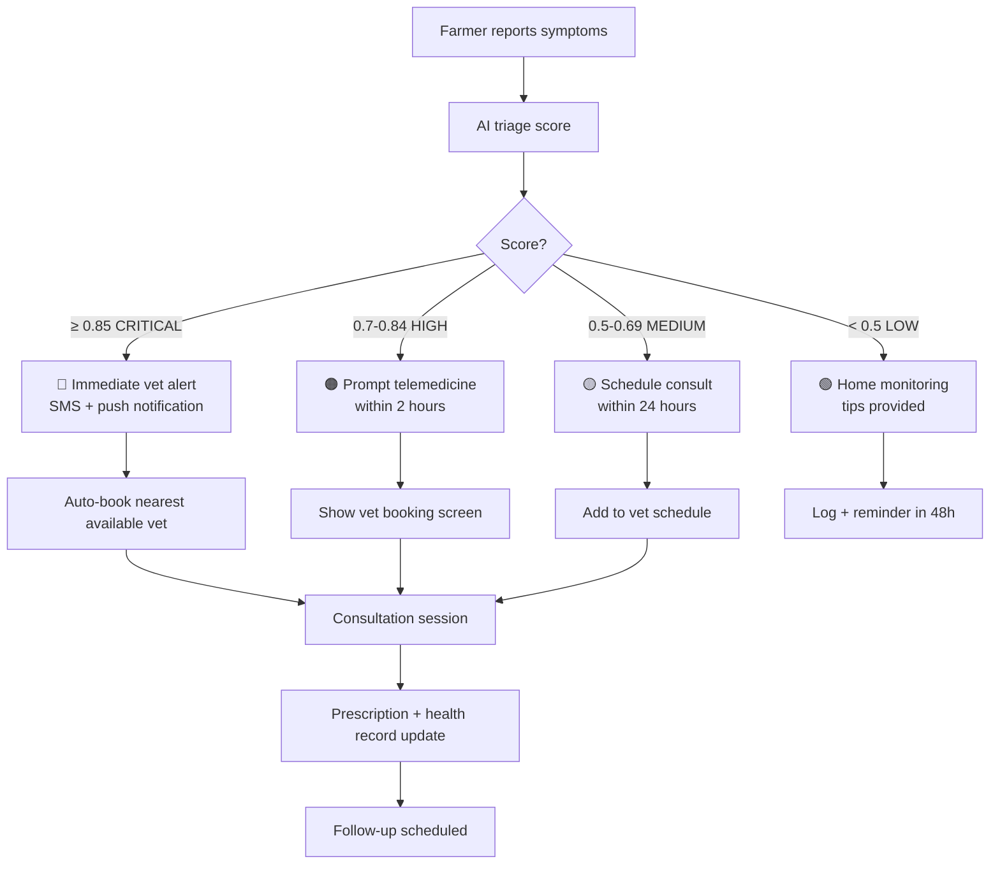
```mermaid
flowchart TD
    A[Farmer reports symptoms] --> B[AI triage score]
    B --> C{Score?}
    C -->|≥ 0.85 CRITICAL| D[🔴 Immediate vet alert<br/>SMS + push notification]
    C -->|0.7-0.84 HIGH| E[🟠 Prompt telemedicine<br/>within 2 hours]
    C -->|0.5-0.69 MEDIUM| F[🟡 Schedule consult<br/>within 24 hours]
    C -->|< 0.5 LOW| G[🟢 Home monitoring<br/>tips provided]
    D --> H[Auto-book nearest available vet]
    E --> I[Show vet booking screen]
    F --> J[Add to vet schedule]
    G --> K[Log + reminder in 48h]
    H --> L[Consultation session]
    I --> L
    J --> L
    L --> M[Prescription + health record update]
    M --> N[Follow-up scheduled]
```

---

## 4. Market Transaction Flow

### 4.1 Milk Sale End-to-End

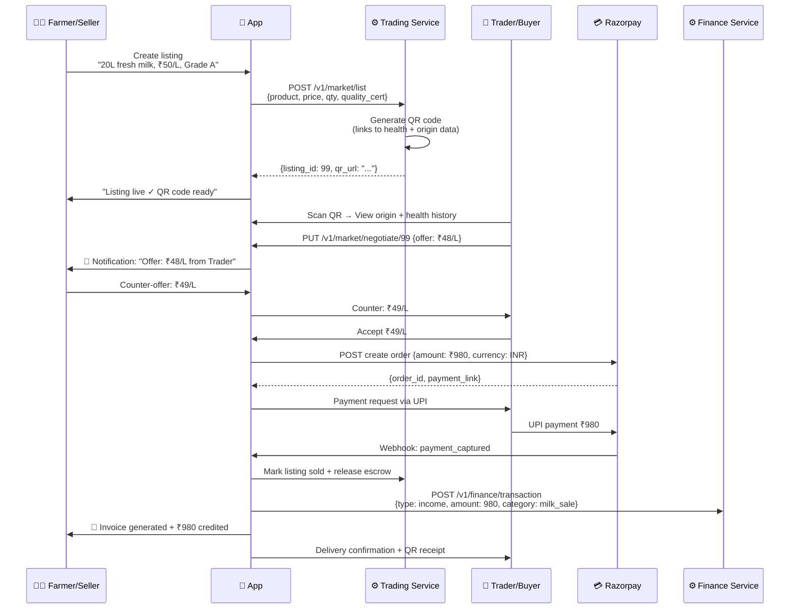
```mermaid
sequenceDiagram
    participant F as 👩‍🌾 Farmer/Seller
    participant APP as 📱 App
    participant TRADE as ⚙️ Trading Service
    participant T as 🏪 Trader/Buyer
    participant RP as 💳 Razorpay
    participant FIN as ⚙️ Finance Service

    F->>APP: Create listing<br/>"20L fresh milk, ₹50/L, Grade A"
    APP->>TRADE: POST /v1/market/list<br/>{product, price, qty, quality_cert}
    TRADE->>TRADE: Generate QR code<br/>(links to health + origin data)
    TRADE-->>APP: {listing_id: 99, qr_url: "..."}
    APP->>F: "Listing live ✓ QR code ready"

    T->>APP: Scan QR → View origin + health history
    T->>APP: PUT /v1/market/negotiate/99 {offer: ₹48/L}
    APP->>F: 🔔 Notification: "Offer: ₹48/L from Trader"
    F->>APP: Counter-offer: ₹49/L
    APP->>T: Counter: ₹49/L
    T->>APP: Accept ₹49/L

    APP->>RP: POST create order {amount: ₹980, currency: INR}
    RP-->>APP: {order_id, payment_link}
    APP->>T: Payment request via UPI
    T->>RP: UPI payment ₹980
    RP->>APP: Webhook: payment_captured
    APP->>TRADE: Mark listing sold + release escrow
    APP->>FIN: POST /v1/finance/transaction<br/>{type: income, amount: 980, category: milk_sale}
    APP->>F: 📄 Invoice generated + ₹980 credited
    APP->>T: Delivery confirmation + QR receipt
```

### 4.2 Transaction State Machine

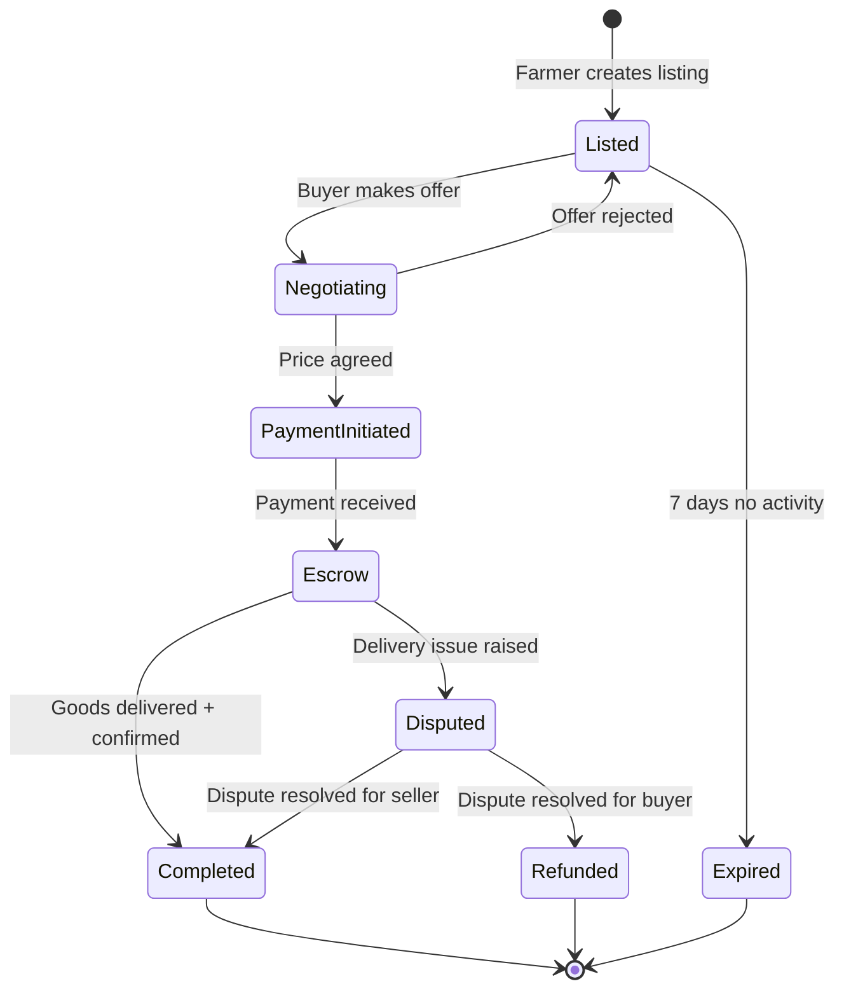
```mermaid
stateDiagram-v2
    [*] --> Listed : Farmer creates listing
    Listed --> Negotiating : Buyer makes offer
    Negotiating --> Listed : Offer rejected
    Negotiating --> PaymentInitiated : Price agreed
    PaymentInitiated --> Escrow : Payment received
    Escrow --> Completed : Goods delivered + confirmed
    Escrow --> Disputed : Delivery issue raised
    Disputed --> Refunded : Dispute resolved for buyer
    Disputed --> Completed : Dispute resolved for seller
    Listed --> Expired : 7 days no activity
    Completed --> [*]
    Refunded --> [*]
    Expired --> [*]
```

---

## 5. Financial Planning Flow

### 5.1 Loan Eligibility & Application

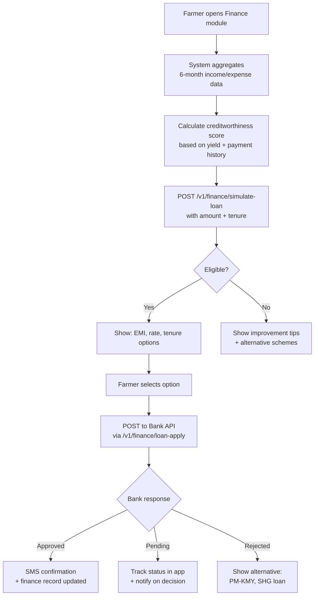
```mermaid
flowchart TD
    A[Farmer opens Finance module] --> B[System aggregates<br/>6-month income/expense data]
    B --> C[Calculate creditworthiness score<br/>based on yield + payment history]
    C --> D[POST /v1/finance/simulate-loan<br/>with amount + tenure]
    D --> E{Eligible?}
    E -->|Yes| F[Show: EMI, rate, tenure options]
    E -->|No| G[Show improvement tips<br/>+ alternative schemes]
    F --> H[Farmer selects option]
    H --> I[POST to Bank API<br/>via /v1/finance/loan-apply]
    I --> J{Bank response}
    J -->|Approved| K[SMS confirmation<br/>+ finance record updated]
    J -->|Pending| L[Track status in app<br/>+ notify on decision]
    J -->|Rejected| M[Show alternative:<br/>PM-KMY, SHG loan]
```

### 5.2 Government Scheme Integration Flow

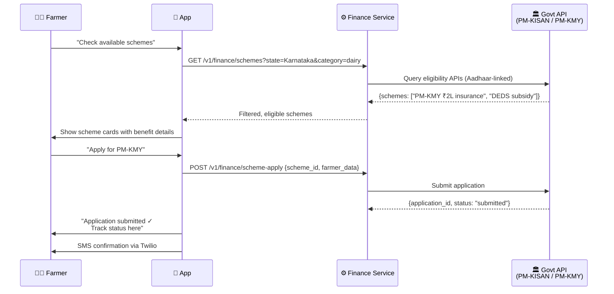
```mermaid
sequenceDiagram
    participant F as 👩‍🌾 Farmer
    participant APP as 📱 App
    participant FIN as ⚙️ Finance Service
    participant GOVT as 🏛️ Govt API<br/>(PM-KISAN / PM-KMY)

    F->>APP: "Check available schemes"
    APP->>FIN: GET /v1/finance/schemes?state=Karnataka&category=dairy
    FIN->>GOVT: Query eligibility APIs (Aadhaar-linked)
    GOVT-->>FIN: {schemes: ["PM-KMY ₹2L insurance", "DEDS subsidy"]}
    FIN-->>APP: Filtered, eligible schemes
    APP->>F: Show scheme cards with benefit details

    F->>APP: "Apply for PM-KMY"
    APP->>FIN: POST /v1/finance/scheme-apply {scheme_id, farmer_data}
    FIN->>GOVT: Submit application
    GOVT-->>FIN: {application_id, status: "submitted"}
    APP->>F: "Application submitted ✓<br/>Track status here"
    APP->>F: SMS confirmation via Twilio
```

---

## 6. Offline Sync Flow (PowerSync + Domain-Aware Merge)

### 6.1 PowerSync Bidirectional Sync Sequence

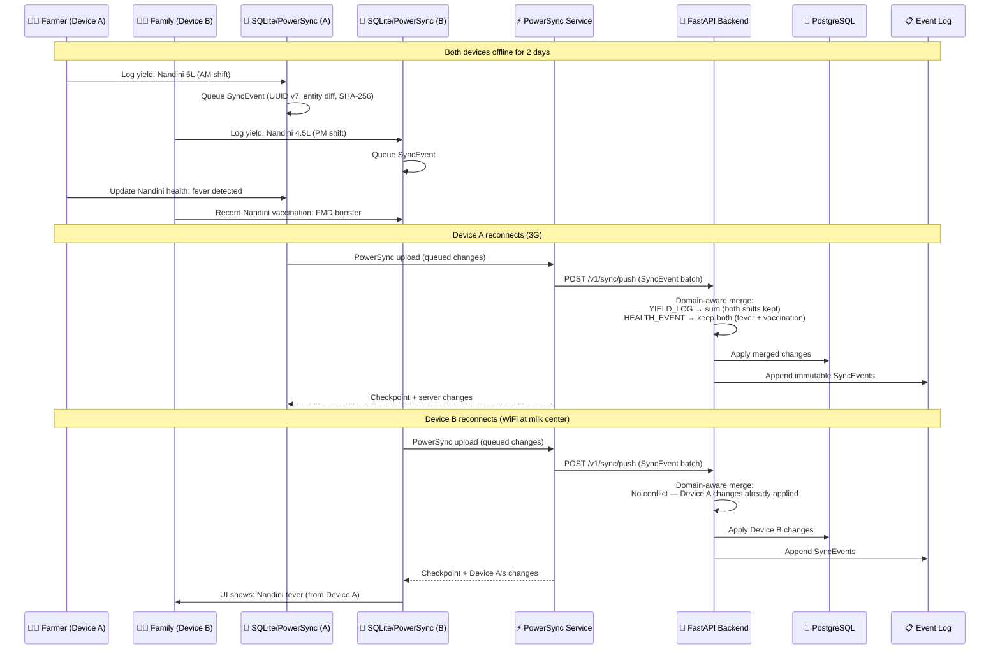
```mermaid
sequenceDiagram
    participant F as 👩‍🌾 Farmer (Device A)
    participant F2 as 👨‍🌾 Family (Device B)
    participant SA as 💾 SQLite/PowerSync (A)
    participant SB as 💾 SQLite/PowerSync (B)
    participant PS as ⚡ PowerSync Service
    participant API as 🔧 FastAPI Backend
    participant DB as 💾 PostgreSQL
    participant LOG as 📋 Event Log

    Note over F,LOG: Both devices offline for 2 days

    F->>SA: Log yield: Nandini 5L (AM shift)
    SA->>SA: Queue SyncEvent (UUID v7, entity diff, SHA-256)
    F2->>SB: Log yield: Nandini 4.5L (PM shift)
    SB->>SB: Queue SyncEvent

    F->>SA: Update Nandini health: fever detected
    F2->>SB: Record Nandini vaccination: FMD booster

    Note over F,LOG: Device A reconnects (3G)

    SA->>PS: PowerSync upload (queued changes)
    PS->>API: POST /v1/sync/push (SyncEvent batch)
    API->>API: Domain-aware merge:<br/>YIELD_LOG → sum (both shifts kept)<br/>HEALTH_EVENT → keep-both (fever + vaccination)
    API->>DB: Apply merged changes
    API->>LOG: Append immutable SyncEvents
    PS-->>SA: Checkpoint + server changes

    Note over F,LOG: Device B reconnects (WiFi at milk center)

    SB->>PS: PowerSync upload (queued changes)
    PS->>API: POST /v1/sync/push (SyncEvent batch)
    API->>API: Domain-aware merge:<br/>No conflict — Device A changes already applied
    API->>DB: Apply Device B changes
    API->>LOG: Append SyncEvents
    PS-->>SB: Checkpoint + Device A's changes
    SB->>F2: UI shows: Nandini fever (from Device A)
```

### 6.2 Telemetry Replay on Reconnect

When a device with buffered IoT telemetry (e.g., GPS collar pings, hatchery sensor readings) comes back online, the sync engine replays all buffered `DEVICE_TELEMETRY` events to the server in chronological order. This ensures no sensor data is lost during connectivity gaps, and downstream aggregations (herd sessions, hatch rate calculations, disease hotspot feeds) receive the complete time-series.

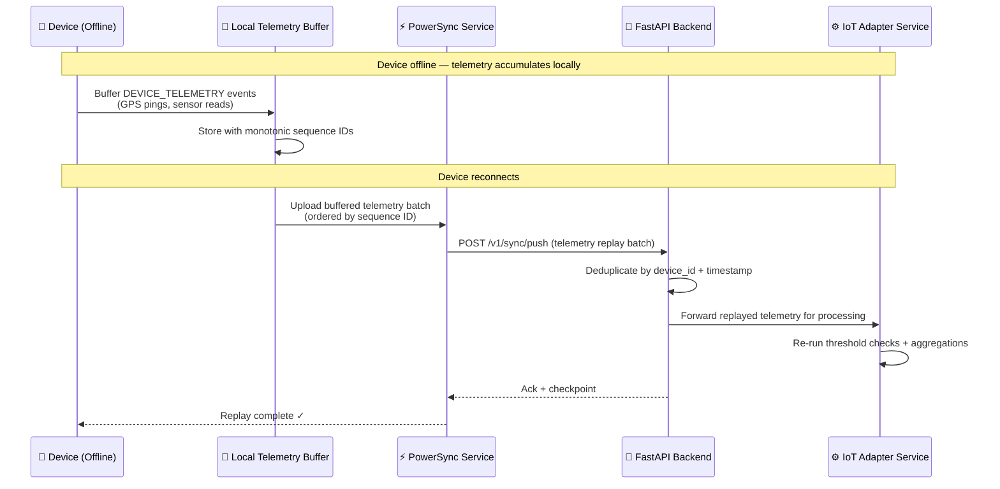
```mermaid
sequenceDiagram
    participant DEV as 📱 Device (Offline)
    participant BUF as 💾 Local Telemetry Buffer
    participant PS as ⚡ PowerSync Service
    participant API as 🔧 FastAPI Backend
    participant IOT as ⚙️ IoT Adapter Service

    Note over DEV,IOT: Device offline — telemetry accumulates locally

    DEV->>BUF: Buffer DEVICE_TELEMETRY events<br/>(GPS pings, sensor reads)
    BUF->>BUF: Store with monotonic sequence IDs

    Note over DEV,IOT: Device reconnects

    BUF->>PS: Upload buffered telemetry batch<br/>(ordered by sequence ID)
    PS->>API: POST /v1/sync/push (telemetry replay batch)
    API->>API: Deduplicate by device_id + timestamp
    API->>IOT: Forward replayed telemetry for processing
    IOT->>IOT: Re-run threshold checks + aggregations
    API-->>PS: Ack + checkpoint
    PS-->>DEV: Replay complete ✓
```

### 6.3 Domain-Aware Merge Rules

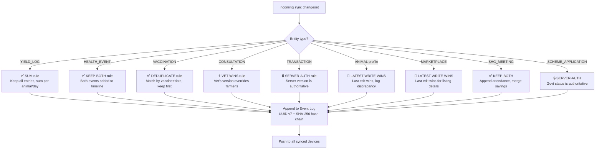
```mermaid
flowchart TD
    A[Incoming sync changeset] --> B{Entity type?}

    B -->|YIELD_LOG| C[✅ SUM rule<br/>Keep all entries, sum per animal/day]
    B -->|HEALTH_EVENT| D[✅ KEEP-BOTH rule<br/>Both events added to timeline]
    B -->|VACCINATION| E[✅ DEDUPLICATE rule<br/>Match by vaccine+date, keep first]
    B -->|CONSULTATION| F[⚕️ VET-WINS rule<br/>Vet's version overrides farmer's]
    B -->|TRANSACTION| G[🔒 SERVER-AUTH rule<br/>Server version is authoritative]
    B -->|ANIMAL profile| H[📝 LATEST-WRITE-WINS<br/>Last edit wins, log discrepancy]
    B -->|MARKETPLACE| I[📝 LATEST-WRITE-WINS<br/>Last edit wins for listing details]
    B -->|SHG_MEETING| J[✅ KEEP-BOTH<br/>Append attendance, merge savings]
    B -->|SCHEME_APPLICATION| K[🔒 SERVER-AUTH<br/>Govt status is authoritative]

    C & D & E & F & G & H & I & J & K --> L[Append to Event Log<br/>UUID v7 + SHA-256 hash chain]
    L --> M[Push to all synced devices]
```

### 6.4 Shared Device Sync (Family Members)

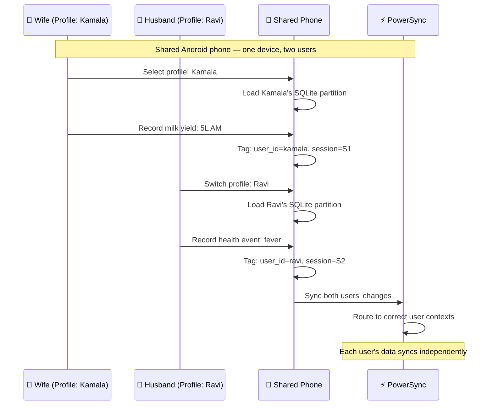
```mermaid
sequenceDiagram
    participant W as 👩 Wife (Profile: Kamala)
    participant H as 👨 Husband (Profile: Ravi)
    participant DEV as 📱 Shared Phone
    participant PS as ⚡ PowerSync

    Note over W,PS: Shared Android phone — one device, two users

    W->>DEV: Select profile: Kamala
    DEV->>DEV: Load Kamala's SQLite partition
    W->>DEV: Record milk yield: 5L AM
    DEV->>DEV: Tag: user_id=kamala, session=S1

    H->>DEV: Switch profile: Ravi
    DEV->>DEV: Load Ravi's SQLite partition
    H->>DEV: Record health event: fever
    DEV->>DEV: Tag: user_id=ravi, session=S2

    DEV->>PS: Sync both users' changes
    PS->>PS: Route to correct user contexts
    Note over PS: Each user's data syncs independently
```

### 6.5 Sync Health Dashboard (for Admins)

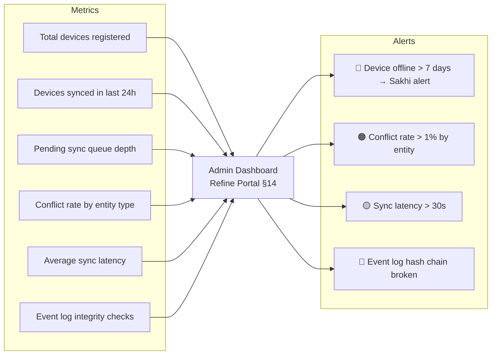
```mermaid
flowchart LR
    subgraph Metrics
        A[Total devices registered]
        B[Devices synced in last 24h]
        C[Pending sync queue depth]
        D[Conflict rate by entity type]
        E[Average sync latency]
        F2[Event log integrity checks]
    end

    subgraph Alerts
        F[🔴 Device offline > 7 days → Sakhi alert]
        G[🟠 Conflict rate > 1% by entity]
        H[🟡 Sync latency > 30s]
        I[🔴 Event log hash chain broken]
    end

    A & B & C & D & E & F2 --> DASH[Admin Dashboard<br/>Refine Portal §14]
    DASH --> F & G & H & I
```

---

## 7. AI Prediction Pipeline

### 7.1 Disease Prediction Pipeline

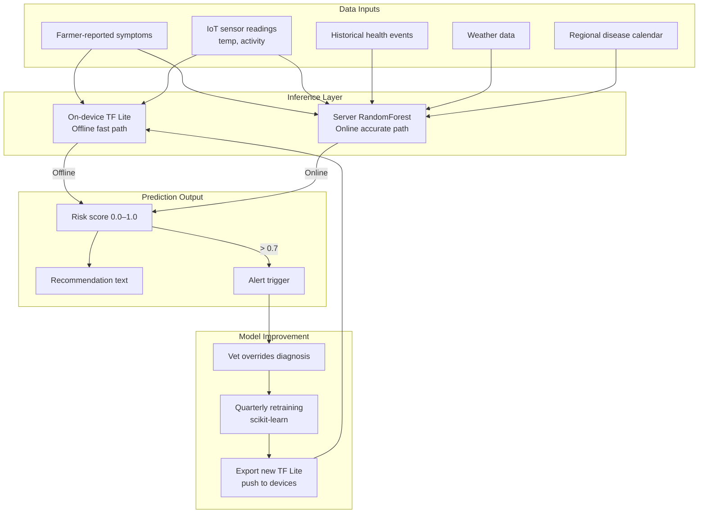
```mermaid
flowchart TD
    subgraph Input["Data Inputs"]
        S1[Farmer-reported symptoms]
        S2[IoT sensor readings<br/>temp, activity]
        S3[Historical health events]
        S4[Weather data]
        S5[Regional disease calendar]
    end

    subgraph Inference["Inference Layer"]
        TFLITE[On-device TF Lite<br/>Offline fast path]
        SERVER[Server RandomForest<br/>Online accurate path]
    end

    subgraph Output["Prediction Output"]
        SCORE[Risk score 0.0–1.0]
        RECO[Recommendation text]
        ALERT_OUT[Alert trigger]
    end

    S1 & S2 --> TFLITE
    S1 & S2 & S3 & S4 & S5 --> SERVER

    TFLITE -->|Offline| SCORE
    SERVER -->|Online| SCORE

    SCORE --> RECO
    SCORE -->|> 0.7| ALERT_OUT

    subgraph Feedback["Model Improvement"]
        VET_OVERRIDE[Vet overrides diagnosis]
        RETRAIN[Quarterly retraining<br/>scikit-learn]
        EXPORT[Export new TF Lite<br/>push to devices]
    end

    ALERT_OUT --> VET_OVERRIDE
    VET_OVERRIDE --> RETRAIN
    RETRAIN --> EXPORT
    EXPORT --> TFLITE
```

### 7.2 Fodder Demand Forecast Pipeline

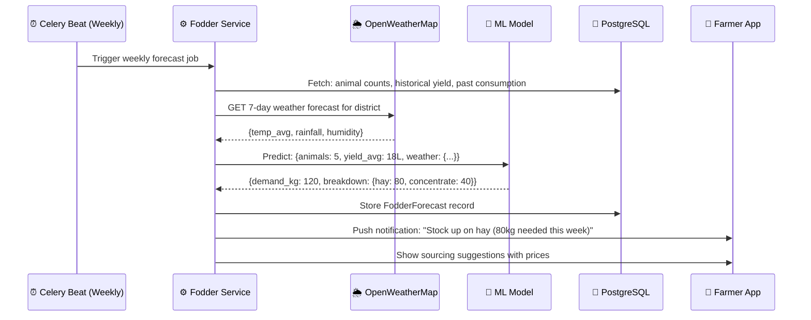
```mermaid
sequenceDiagram
    participant CRON as ⏰ Celery Beat (Weekly)
    participant FS as ⚙️ Fodder Service
    participant OW as 🌦️ OpenWeatherMap
    participant ML as 🧠 ML Model
    participant DB as 💾 PostgreSQL
    participant APP as 📱 Farmer App

    CRON->>FS: Trigger weekly forecast job
    FS->>DB: Fetch: animal counts, historical yield, past consumption
    FS->>OW: GET 7-day weather forecast for district
    OW-->>FS: {temp_avg, rainfall, humidity}
    FS->>ML: Predict: {animals: 5, yield_avg: 18L, weather: {...}}
    ML-->>FS: {demand_kg: 120, breakdown: {hay: 80, concentrate: 40}}
    FS->>DB: Store FodderForecast record
    FS->>APP: Push notification: "Stock up on hay (80kg needed this week)"
    FS->>APP: Show sourcing suggestions with prices
```

---

## 8. Notification & Alert Flow

### 8.1 Alert Routing Architecture

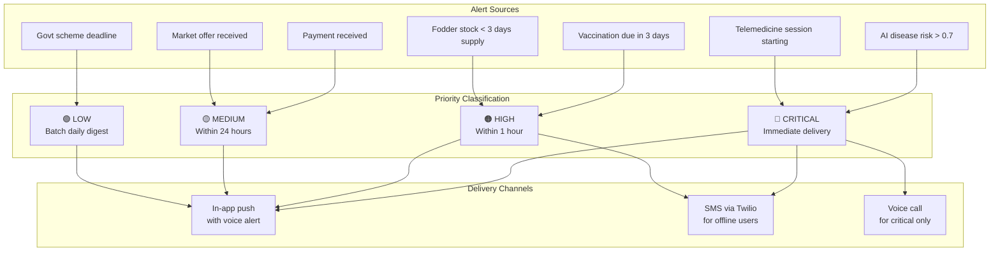
```mermaid
flowchart TD
    subgraph Sources["Alert Sources"]
        A[AI disease risk > 0.7]
        B[Vaccination due in 3 days]
        C[Fodder stock < 3 days supply]
        D[Payment received]
        E[Telemedicine session starting]
        F[Govt scheme deadline]
        G[Market offer received]
    end

    subgraph Classify["Priority Classification"]
        CRITICAL[🔴 CRITICAL<br/>Immediate delivery]
        HIGH[🟠 HIGH<br/>Within 1 hour]
        MEDIUM[🟡 MEDIUM<br/>Within 24 hours]
        LOW[🟢 LOW<br/>Batch daily digest]
    end

    subgraph Deliver["Delivery Channels"]
        PUSH[In-app push<br/>with voice alert]
        SMS[SMS via Twilio<br/>for offline users]
        CALL[Voice call<br/>for critical only]
    end

    A --> CRITICAL
    E --> CRITICAL
    B --> HIGH
    C --> HIGH
    D --> MEDIUM
    G --> MEDIUM
    F --> LOW

    CRITICAL --> PUSH
    CRITICAL --> SMS
    CRITICAL --> CALL
    HIGH --> PUSH
    HIGH --> SMS
    MEDIUM --> PUSH
    LOW --> PUSH
```

### 8.2 Notification Delivery Sequence

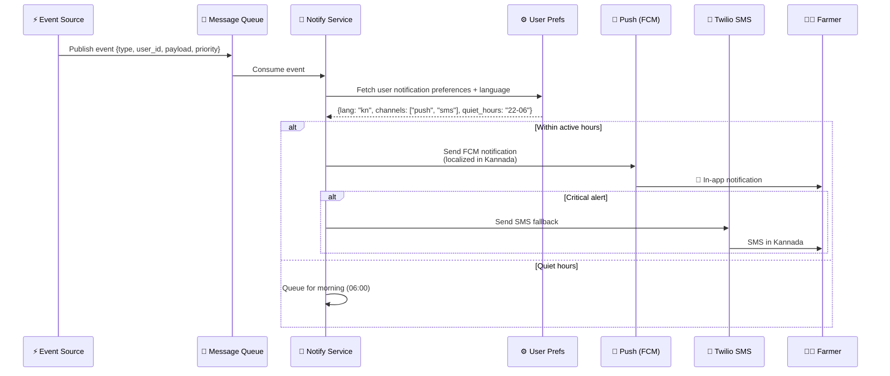
```mermaid
sequenceDiagram
    participant TRIGGER as ⚡ Event Source
    participant MQ as 📨 Message Queue
    participant NS as 🔔 Notify Service
    participant PREF as ⚙️ User Prefs
    participant PUSH as 📱 Push (FCM)
    participant TW as 📡 Twilio SMS
    participant F as 👩‍🌾 Farmer

    TRIGGER->>MQ: Publish event {type, user_id, payload, priority}
    MQ->>NS: Consume event
    NS->>PREF: Fetch user notification preferences + language
    PREF-->>NS: {lang: "kn", channels: ["push", "sms"], quiet_hours: "22-06"}

    alt Within active hours
        NS->>PUSH: Send FCM notification<br/>(localized in Kannada)
        PUSH->>F: 🔔 In-app notification

        alt Critical alert
            NS->>TW: Send SMS fallback
            TW->>F: SMS in Kannada
        end
    else Quiet hours
        NS->>NS: Queue for morning (06:00)
    end
```

---

## 9. User Onboarding Flow (4-Phase Progressive Model)

### 9.1 Phase 1: Day 1 Registration (< 5 minutes)

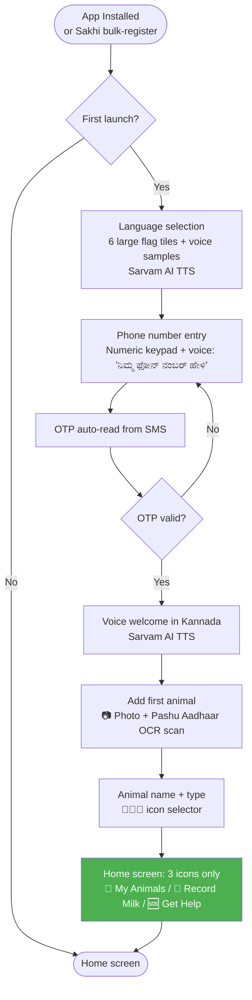
```mermaid
flowchart TD
    A([App Installed<br/>or Sakhi bulk-register]) --> B{First launch?}
    B -->|No| Z([Home screen])
    B -->|Yes| C[Language selection<br/>6 large flag tiles + voice samples<br/>Sarvam AI TTS]

    C --> D[Phone number entry<br/>Numeric keypad + voice: 'ನಿಮ್ಮ ಫೋನ್ ನಂಬರ್ ಹೇಳಿ']
    D --> E[OTP auto-read from SMS]
    E --> F{OTP valid?}
    F -->|No| D
    F -->|Yes| G[Voice welcome in Kannada<br/>Sarvam AI TTS]

    G --> H[Add first animal<br/>📷 Photo + Pashu Aadhaar OCR scan]
    H --> I[Animal name + type<br/>🐄🐃🐐 icon selector]
    I --> J[Home screen: 3 icons only<br/>🐄 My Animals / 🥛 Record Milk / 🆘 Get Help]

    J --> Z

    style J fill:#4CAF50,color:#fff
```

### 9.2 Phase 2: Week 1 Guided Core (Daily Nudges)

```mermaid
flowchart LR
    subgraph "Day 1"
        A["📱 Push: Record today's milk<br/>Voice: 'ಇಂದಿನ ಹಾಲು ದಾಖಲಿಸಿ'"]
    end

    subgraph "Day 3"
        B["📱 Push: Is your animal healthy?<br/>→ First health event entry"]
    end

    subgraph "Day 5"
        C["📱 Push: See your milk chart<br/>→ Simple bar chart viewed"]
    end

    subgraph "Day 7"
        D["📱 Push: Join your SHG group<br/>→ SHG features unlock"]
    end

    A --> B --> C --> D

    subgraph "Dropout Detection"
        E["⚠️ No app open 2 days<br/>→ SMS nudge + Sakhi alert"]
    end
```

### 9.3 Phase 3-4: Contextual Feature Unlock

```mermaid
flowchart TD
    subgraph "Phase 3: Weeks 2-4 — Contextual"
        A[First sale intent] -->|"Tab appears"| B[🏪 Trading module]
        C[Monsoon starts] -->|"Push notification"| D[🌾 Fodder planning]
        E[Sick animal logged] -->|"'Talk to vet?' button"| F[🩺 Telemedicine]
        G[Scheme auto-match] -->|"Push: 'Eligible for ₹X'"| H[📋 Govt Schemes]
    end

    subgraph "Phase 4: Month 2+ — Full Access"
        I[All modules visible]
        J[📊 Advanced analytics]
        K[💬 Community forums]
        L[📋 Insurance + breeding]
    end

    B & D & F & H --> I
```

### 9.4 Three-Tier Buddy System Flow

```mermaid
flowchart TD
    subgraph "Tier 1: Village Sakhi (1:15 farmers)"
        S[👩 SHG Leader<br/>Sakhi]
        S --> S1[Onboard farmers at SHG meetings]
        S --> S2[Daily nudge follow-ups]
        S --> S3[Basic app troubleshooting]
        S --> S4[Record SHG meeting attendance]
    end

    subgraph "Tier 2: Block Coordinator (1:10 Sakhis)"
        B2[👨‍💼 NGO Field Staff<br/>Block Coordinator]
        B2 --> B21[Train & support Sakhis]
        B2 --> B22[Resolve escalated issues]
        B2 --> B23[Organize vet camps]
        B2 --> B24[Govt scheme liaison]
    end

    subgraph "Tier 3: District Champion (1:5 Block Coords)"
        D[🏛️ RDO Staff / TR Volunteer<br/>District Champion]
        D --> D1[Platform health monitoring]
        D --> D2[Data quality audits]
        D --> D3[Partnership management]
    end

    S -->|"Can't resolve<br/>→ escalate"| B2
    B2 -->|"System issue<br/>→ escalate"| D

    style S fill:#4CAF50,color:#fff
    style B2 fill:#2196F3,color:#fff
    style D fill:#9C27B0,color:#fff
```

---

## 10. IoT Data Ingestion Flow

### 10.1 Sensor Data Pipeline

```mermaid
sequenceDiagram
    participant SENSOR as 📡 IoT Sensor<br/>(Ear tag / Collar)
    participant MQTT as 🔄 MQTT Broker<br/>(Mosquitto)
    participant IOT_SVC as ⚙️ IoT Adapter Service
    participant HS as ⚙️ Health Service
    participant AI as 🧠 AI Engine
    participant APP as 📱 Farmer App

    SENSOR->>MQTT: Publish {animal_id, temp, activity, timestamp}
    MQTT->>IOT_SVC: Subscribe topic: livestock/+/telemetry
    IOT_SVC->>IOT_SVC: Validate + normalize payload
    IOT_SVC->>HS: POST /v1/health/log<br/>{source: "iot", animal_id, event_type: "telemetry", data}
    HS->>AI: Enrich with latest readings + weather
    AI-->>HS: {risk_score, anomalies}

    alt Anomaly detected (e.g., temp > 39.5°C)
        HS->>APP: Trigger health alert
    else Normal
        HS->>HS: Update rolling health baseline
    end
```

---

## 11. Admin & Reporting Flow

### 11.1 Cooperative Admin Dashboard Flow

```mermaid
flowchart TD
    A[Admin logs in<br/>web dashboard] --> B[Select view: District / Cooperative / All]
    B --> C[Aggregated analytics loaded<br/>from analytics-service]
    C --> D{Admin action?}

    D -->|View farmers| E[List with health/yield status]
    D -->|Generate report| F[Select parameters: date range, metrics]
    D -->|Manage schemes| G[Configure scheme eligibility rules]
    D -->|Send alert| H[Compose regional alert<br/>e.g. disease outbreak warning]
    D -->|Moderate content| I[Review flagged community posts]

    F --> J[Background job: aggregate data]
    J --> K[Generate PDF/CSV via S3]
    K --> L[Download link sent to admin email]

    H --> M[Broadcast via Notify Service<br/>to all farmers in district]
```

### 11.2 Report Generation Pipeline

```mermaid
sequenceDiagram
    participant ADM as 🏢 Admin
    participant API as ⚙️ Admin Service
    participant CELERY as ⏰ Celery Worker
    participant PG as 💾 PostgreSQL
    participant S3 as 🗄️ S3
    participant EMAIL as 📧 Email

    ADM->>API: POST /v1/admin/report<br/>{type: "monthly_yield", district: "Tumkur", period: "2026-01"}
    API->>CELERY: Enqueue report generation task
    API-->>ADM: {task_id: "xyz", status: "queued"}

    CELERY->>PG: Query: yield + health + finance aggregates
    PG-->>CELERY: Raw data
    CELERY->>CELERY: Transform + format (pandas)
    CELERY->>S3: Upload report.pdf + report.csv
    CELERY->>API: Update task status: completed + S3 URL

    API->>EMAIL: Send download link to admin
    ADM->>API: GET /v1/admin/report/xyz
    API-->>ADM: {status: completed, pdf_url, csv_url}
```

---

## 12. Data State Transitions

### 12.1 Health Event Lifecycle

```mermaid
stateDiagram-v2
    [*] --> Logged : Farmer/IoT logs event
    Logged --> Synced : Device reconnects
    Logged --> PendingSync : Device offline
    PendingSync --> Synced : Auto-sync on reconnect
    Synced --> Reviewed : Vet reviews record
    Synced --> AlertTriggered : AI score > 0.7
    AlertTriggered --> ConsultationScheduled : Farmer books vet
    AlertTriggered --> Dismissed : Farmer dismisses
    ConsultationScheduled --> ConsultationCompleted : Call ends
    ConsultationCompleted --> PrescriptionIssued : Vet prescribes
    PrescriptionIssued --> FollowUpScheduled : Auto-schedule
    FollowUpScheduled --> Resolved : Follow-up completed
    Dismissed --> Monitored : System continues tracking
    Reviewed --> Resolved : No action needed
    Resolved --> [*]
```

### 12.2 Payment Lifecycle

```mermaid
stateDiagram-v2
    [*] --> Initiated : Buyer confirms price
    Initiated --> Pending : Payment request sent via UPI
    Pending --> Escrow : Payment received by Razorpay
    Pending --> Failed : Timeout / declined
    Failed --> Initiated : Retry
    Escrow --> Released : Goods delivered + confirmed
    Escrow --> Disputed : Issue raised within 48h
    Disputed --> Released : Dispute resolved for seller
    Disputed --> Refunded : Dispute resolved for buyer
    Released --> [*]
    Refunded --> [*]
```

---

## 13. Disaster Recovery Failover Flow

### 13.1 Automated vs. Manual Failover

```mermaid
flowchart TD
    A[CloudWatch health check fails<br/>Primary region ap-south-1 Mumbai] --> B{Failure scope?}

    B -->|Single AZ / RDS failure| C[✅ Automatic RDS Multi-AZ failover<br/>~60 seconds, no intervention]
    B -->|Full region outage| D[🔴 Manual DR activation<br/>Incident commander decides]

    D --> E[1. Promote RDS read replica<br/>in ap-south-2 Hyderabad]
    E --> F[2. Route53 weighted routing<br/>→ DR region endpoints]
    F --> G[3. Start PowerSync server<br/>in DR region]
    G --> H[4. Start remaining services<br/>FastAPI, Celery, Redis]
    H --> I[5. Verify: API health + sync resume]

    I --> J{Data breach involved?}
    J -->|Yes| K[Report to CERT-In<br/>within 6 hours]
    J -->|No| L[Monitor DR region stability]

    K --> L
    L --> M{Primary restored?}
    M -->|Yes| N[Failback procedure<br/>Reverse replication → switch Route53]
    M -->|No| O[Continue on DR<br/>Notify stakeholders]

    C --> P[✅ Service restored<br/>No farmer impact]
    N --> P

    style C fill:#4CAF50,color:#fff
    style D fill:#f44336,color:#fff
    style K fill:#FF9800,color:#fff
```

### 13.2 Backup & Restore Timeline

```mermaid
gantt
    title Daily Backup Schedule (IST)
    dateFormat HH:mm
    axisFormat %H:%M

    section PostgreSQL
    WAL streaming (continuous)          :active, wal, 00:00, 24h
    Incremental backup                  :crit, inc, 02:00, 1h
    Full backup (Sundays only)          :crit, full, 02:00, 2h

    section MongoDB
    Continuous backup (Atlas)           :active, mongo, 00:00, 24h
    Snapshot (self-hosted)              :snap, 03:00, 30m

    section S3 Media
    Cross-region replication             :active, s3, 00:00, 24h

    section Verification
    Backup integrity check (automated)  :verify, 04:00, 30m
    Monthly restore drill (manual)      :milestone, drill, 10:00, 0h
```

---

## 14. Herd Tracking Flow

GPS-enabled collars transmit periodic location pings that are ingested as `ANIMAL_LOCATION_PING` events. Each ping is checked against the farmer's configured `GEOFENCE` boundaries. When an animal moves outside the geofence, an alert is dispatched immediately. All pings are aggregated into a `HERD_SESSION` that tracks grazing patterns, distance traveled, and time spent per zone.

### 14.1 GPS Collar Ping to Geofence Alert Sequence

```mermaid
sequenceDiagram
    participant COL as 📡 GPS Collar
    participant MQTT as 🔄 MQTT Broker
    participant IOT as ⚙️ IoT Adapter Service
    participant GEO as 🗺️ Geofence Engine
    participant DB as 💾 PostgreSQL
    participant NS as 🔔 Notify Service
    participant APP as 📱 Farmer App

    COL->>MQTT: Publish {animal_id, lat, lng, timestamp, battery}
    MQTT->>IOT: Topic: livestock/+/gps
    IOT->>IOT: Validate + normalize coordinates
    IOT->>DB: INSERT ANIMAL_LOCATION_PING

    IOT->>GEO: Check point-in-polygon {lat, lng, farmer_id}
    GEO->>DB: Fetch GEOFENCE boundaries for farmer
    DB-->>GEO: {geofences: [{id, polygon, name}]}

    alt Animal inside geofence
        GEO-->>IOT: {inside: true, zone: "grazing_area_1"}
        IOT->>DB: Update HERD_SESSION (add waypoint)
    else Animal outside all geofences
        GEO-->>IOT: {inside: false, nearest_fence: "grazing_area_1", distance_m: 340}
        IOT->>DB: Update HERD_SESSION (mark breach)
        IOT->>NS: CRITICAL alert: animal outside boundary
        NS->>APP: Push: "Nandini is 340m outside grazing area"
        NS->>APP: SMS fallback if offline
    end

    Note over IOT,DB: Every 15 min — aggregate into HERD_SESSION
    IOT->>DB: UPDATE HERD_SESSION<br/>{distance_km, zones_visited, grazing_minutes}
```

**Key entities:** `ANIMAL_LOCATION_PING`, `GEOFENCE`, `HERD_SESSION` (push notification via Notify Service)

---

## 15. Disease Hotspot Flow

When health events with high AI risk scores are logged across multiple animals in a geographic cluster, the system creates an `OUTBREAK_REPORT` and runs spatial clustering to identify `DISEASE_HOTSPOT` regions. Admin users see hotspot overlays on the GIS map, and farmers within the affected radius receive SMS alerts with preventive guidance.

### 15.1 Outbreak Detection and Hotspot Aggregation

```mermaid
flowchart TD
    subgraph Inputs["Health Event Sources"]
        HE[HEALTH_EVENT logged<br/>risk_score > 0.7]
        IOT_ALERT[IoT anomaly<br/>temp > 39.5C]
        VET_REPORT[Vet consultation<br/>confirmed diagnosis]
    end

    HE & IOT_ALERT & VET_REPORT --> ENRICH[Enrich with location<br/>animal GPS + farmer village]

    ENRICH --> CLUSTER[Spatial clustering<br/>DBSCAN: eps=5km, min_samples=3]

    CLUSTER --> CHECK{Cluster found<br/>within 7-day window?}

    CHECK -->|No| LOG[Log individual event<br/>continue monitoring]
    CHECK -->|Yes| OUTBREAK[Create OUTBREAK_REPORT<br/>cluster_id, center_lat_lng, radius_km,<br/>affected_animals, disease_hypothesis]

    OUTBREAK --> HOTSPOT[Upsert DISEASE_HOTSPOT<br/>severity, affected_count, trend]

    HOTSPOT --> GIS[Admin GIS map overlay<br/>color-coded by severity]
    HOTSPOT --> SMS_ALERT[SMS alerts to farmers<br/>within hotspot radius + 10km buffer]
    HOTSPOT --> VET_DISPATCH[Auto-suggest veterinary camp recommendation<br/>at hotspot center via OUTBREAK_REPORT.recommended_action]

    SMS_ALERT --> SARVAM[Localize via Sarvam AI<br/>Kannada / Hindi / Telugu]
    SARVAM --> TWILIO[Deliver via Twilio SMS]

    GIS --> ADMIN_ACTION{Admin action?}
    ADMIN_ACTION -->|Confirm outbreak| GOVT_NOTIFY[Report to Dept. of<br/>Animal Husbandry]
    ADMIN_ACTION -->|Dismiss false positive| CLOSE[Close OUTBREAK_REPORT<br/>update model feedback]
```

**Key entities:** `HEALTH_EVENT`, `OUTBREAK_REPORT`, `DISEASE_HOTSPOT` (push notification via Notify Service)

---

## 16. Hatchery Monitoring Flow

Hatchery sensors continuously report temperature and humidity readings as `DEVICE_TELEMETRY` events via MQTT. Threshold violations trigger immediate alerts for the hatchery operator. Each egg batch is tracked as a `HATCHERY_BATCH` with lifecycle status updates, and the system calculates hatch rate upon batch completion.

### 16.1 Sensor Ingestion to Batch Status Sequence

```mermaid
sequenceDiagram
    participant SENSOR as 🌡️ Hatchery Sensor<br/>(Temp + Humidity)
    participant MQTT as 🔄 MQTT Broker
    participant IOT as ⚙️ IoT Adapter Service
    participant DB as 💾 PostgreSQL
    participant NS as 🔔 Notify Service
    participant APP as 📱 Operator App
    participant BATCH as ⚙️ Batch Service

    SENSOR->>MQTT: Publish {hatchery_id, temp_c, humidity_pct, timestamp}
    MQTT->>IOT: Topic: hatchery/+/telemetry
    IOT->>IOT: Validate range (temp: 20-45C, humidity: 0-100%)
    IOT->>DB: INSERT DEVICE_TELEMETRY

    IOT->>IOT: Check thresholds for active HATCHERY_BATCH

    alt Temperature out of range (< 37.2C or > 38.0C)
        IOT->>NS: CRITICAL alert: temperature deviation
        NS->>APP: Push: "Hatchery 3 temp 38.6C — above safe range"
        NS->>APP: SMS fallback
        IOT->>DB: UPDATE HATCHERY_BATCH set status = 'ALERT'
    else Humidity out of range (< 55% or > 65%)
        IOT->>NS: HIGH alert: humidity deviation
        NS->>APP: Push: "Hatchery 3 humidity 48% — below safe range"
        IOT->>DB: UPDATE HATCHERY_BATCH set status = 'ALERT'
    else All readings normal
        IOT->>DB: UPDATE HATCHERY_BATCH set status = 'INCUBATING'
    end

    Note over BATCH,DB: On batch completion (day 21 for chicken)

    BATCH->>DB: Fetch HATCHERY_BATCH + all DEVICE_TELEMETRY
    BATCH->>BATCH: Calculate hatch_rate =<br/>hatched_count / total_eggs * 100
    BATCH->>DB: UPDATE HATCHERY_BATCH<br/>{status: 'COMPLETED', hatch_rate, avg_temp, avg_humidity}
    BATCH->>APP: Summary: "Batch #42: 87% hatch rate (174/200)"
```

**Key entities:** `DEVICE_TELEMETRY`, `HATCHERY_BATCH` (push notification via Notify Service)

---

## 17. Credit Profile Flow

The platform periodically aggregates a farmer's financial and social data to compute a `CREDIT_PROFILE` score. This score combines milk income, animal sale income, SHG membership status, active insurance policies, and government scheme participation. The resulting profile is displayed in the mobile app as a loan eligibility indicator and can be exported in NABARD/bank-compatible format for formal credit applications.

### 17.1 Credit Profile Aggregation and Export

```mermaid
flowchart TD
    subgraph DataSources["Periodic Data Aggregation (Weekly)"]
        MILK[YIELD_LOG records<br/>→ total milk income (6 months)]
        SALES[TRANSACTION records<br/>→ animal sale income]
        SHG[SHG_GROUP<br/>→ attendance rate, savings balance]
        INS[INSURANCE_POLICY<br/>→ active policies count]
        SCHEME[SCHEME_APPLICATION<br/>→ approved schemes count]
    end

    MILK & SALES & SHG & INS & SCHEME --> AGG[Aggregation Job<br/>Celery Beat — weekly]

    AGG --> SCORE[Credit Score Calculation<br/>weighted formula]

    subgraph Weights["Score Components (0-100)"]
        W1["Milk income consistency: 30%"]
        W2["Sale income history: 20%"]
        W3["SHG participation: 20%"]
        W4["Insurance coverage: 15%"]
        W5["Scheme utilization: 15%"]
    end

    SCORE --> PROFILE[Upsert CREDIT_PROFILE<br/>score, breakdown, tier, updated_at]

    PROFILE --> MOBILE[Mobile App Display<br/>score gauge + eligibility tier]
    PROFILE --> EXPORT[Export Module]

    MOBILE --> ELIGIBLE{Tier?}
    ELIGIBLE -->|A: score >= 75| LOAN_READY["Eligible for formal bank loan<br/>Show 'Apply Now' button"]
    ELIGIBLE -->|B: score 50-74| SHG_LOAN["Eligible for SHG micro-loan<br/>Show SHG lending options"]
    ELIGIBLE -->|C: score < 50| IMPROVE["Show improvement tips<br/>+ scheme recommendations"]

    EXPORT --> NABARD[NABARD format export<br/>JSON / CSV]
    EXPORT --> BANK[Partner bank API push<br/>with farmer consent]

    LOAN_READY --> APPLY[POST /v1/finance/loan-apply<br/>attach CREDIT_PROFILE snapshot]
```

**Key entities:** `CREDIT_PROFILE`, `YIELD_LOG`, `TRANSACTION`, `SHG_GROUP`, `INSURANCE_POLICY`, `SCHEME_APPLICATION`

---

> **Previous document**: [Architecture Specification](./architecture.md)
> **Next document**: [Technology & Compliance Recommendations](./compliance.md)
