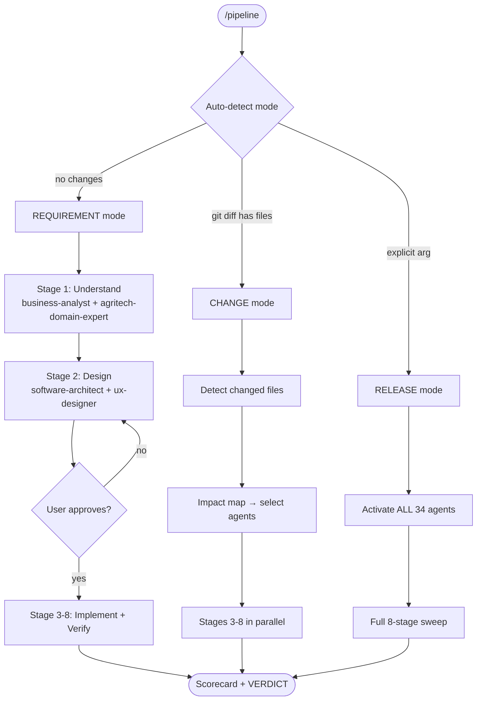
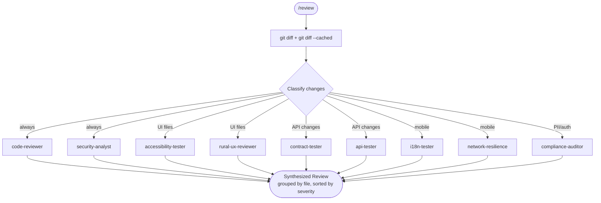
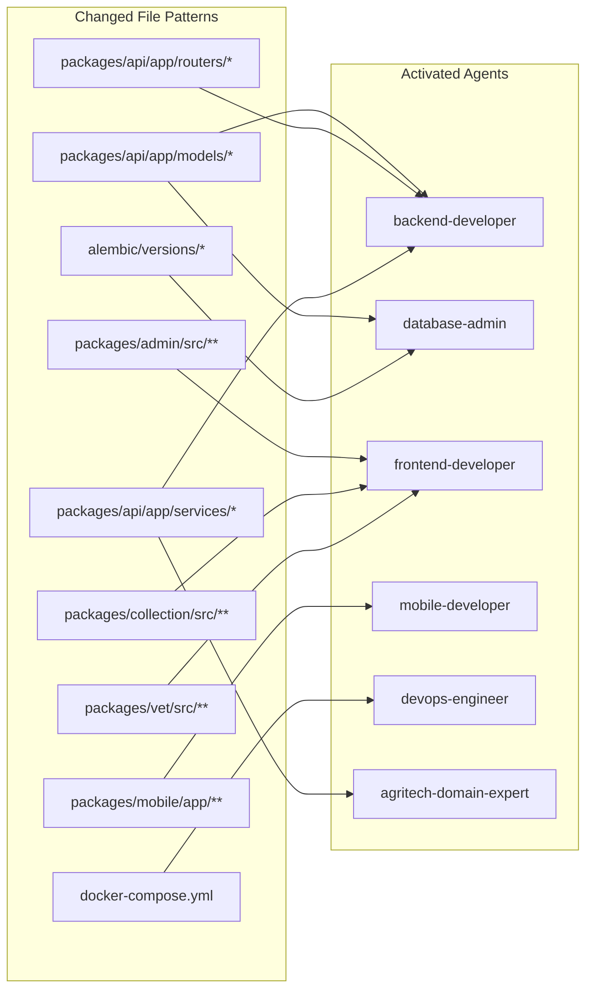

# SDLC Agent Pipeline — Flow Diagrams

## Pipeline Orchestrator — 3 Modes

## Stage Execution — Parallel with Gates

```mermaid
flowchart LR
    subgraph S3["Stage 3: Fast Checks"]
        direction TB
        LINT["ruff check"]
        TYPE["tsc --noEmit"]
        FMT["prettier"]
    end

    subgraph S4["Stage 4: Build"]
        direction TB
        API_B["uvicorn import check"]
        ADMIN_B["next build"]
        COLL_B["vite build"]
        VET_B["vite build"]
    end

    subgraph S5["Stage 5: Functional Tests"]
        direction TB
        UNIT["unit-tester"]
        INTG["integration-tester"]
        API_T["api-tester"]
        CTR["contract-tester"]
    end

    subgraph S6["Stage 6: UI Tests"]
        direction TB
        BRW["browser-ui-tester"]
        A11Y["accessibility-tester"]
        RUX["rural-ux-reviewer"]
        VIS["visual-regression-tester"]
    end

    subgraph S7["Stage 7: Non-Functional"]
        direction TB
        PERF["performance-tester"]
        LOAD["load-tester"]
        NET["network-resilience"]
        CHAOS["chaos-tester"]
    end

    subgraph S8["Stage 8: Security"]
        direction TB
        SEC_A["security-analyst"]
        SEC_T["security-tester"]
        COMP["compliance-auditor"]
    end

    S3 -->|GATE: 0 errors| S4
    S4 -->|GATE: all build| S5
    S5 -->|GATE: tests pass| S6
    S6 -->|GATE: no CRITICAL| S7
    S7 -->|GATE: no BLOCK| S8
    S8 --> DONE(["VERDICT"])
```

## /review Command — Multi-Perspective Dispatch

## Impact Map — File Pattern to Agent Routing

