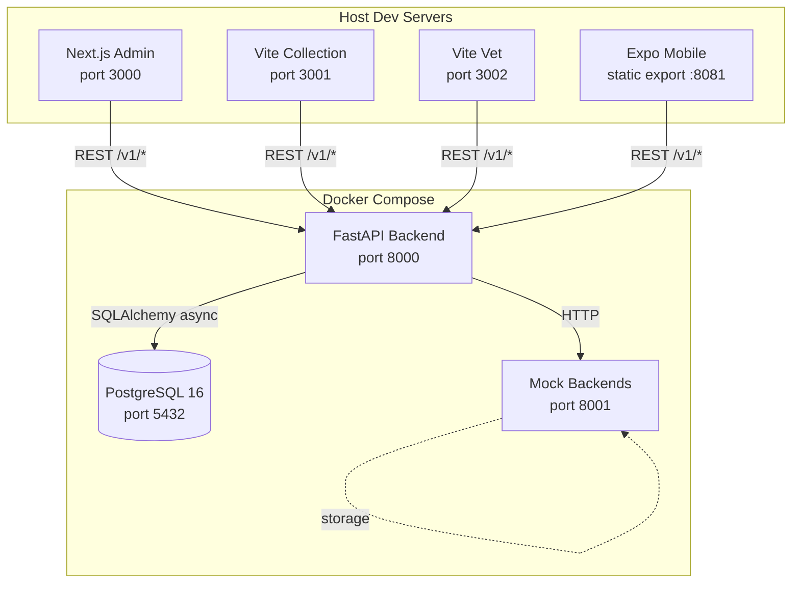
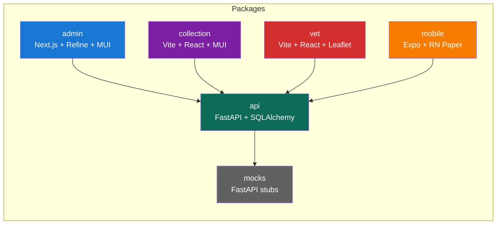
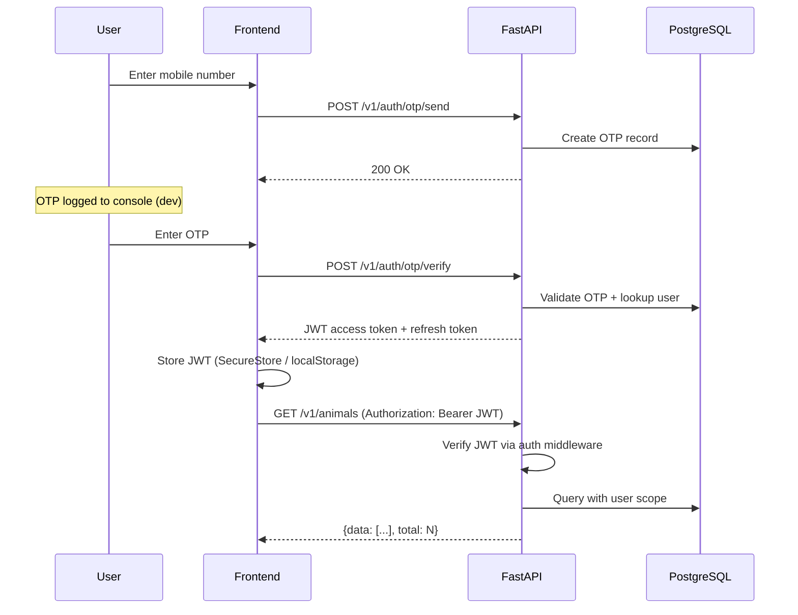
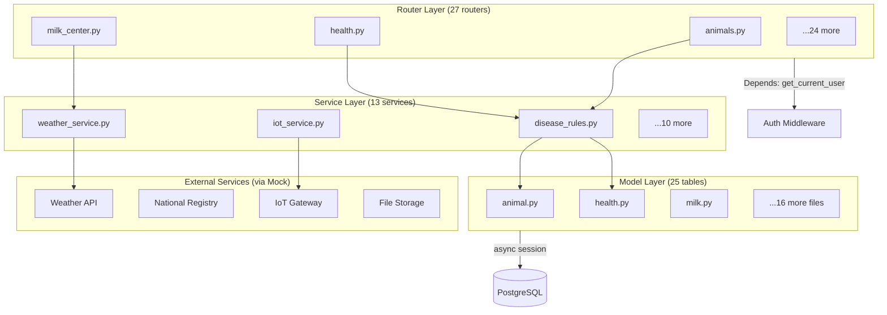
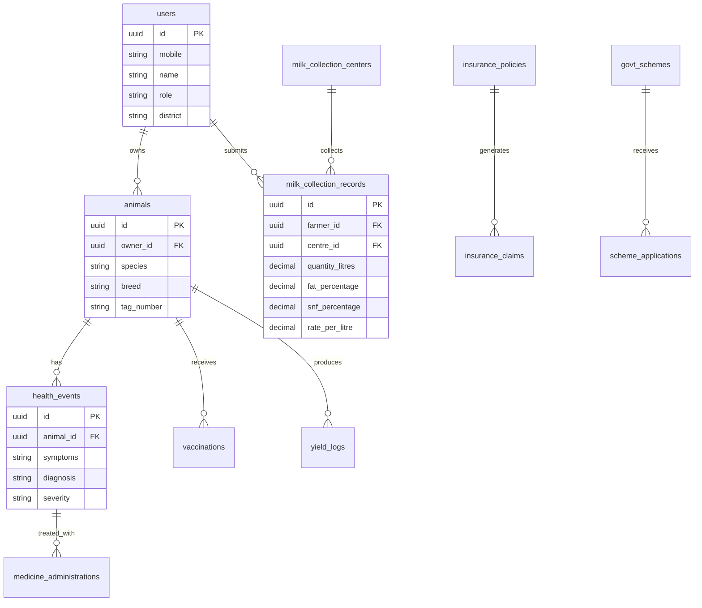

# System Architecture — Current Prototype

## Service Topology

```mermaid
graph TB
    subgraph Docker["Docker Compose"]
        PG[(PostgreSQL 16<br/>port 5432)]
        API["FastAPI Backend<br/>port 8000"]
        MOCK["Mock Backends<br/>port 8001"]
    end

    subgraph Host["Host Dev Servers"]
        ADMIN["Next.js Admin<br/>port 3000"]
        COLL["Vite Collection<br/>port 3001"]
        VET["Vite Vet<br/>port 3002"]
        MOBILE["Expo Mobile<br/>static export :8081"]
    end

    ADMIN -->|REST /v1/*| API
    COLL -->|REST /v1/*| API
    VET -->|REST /v1/*| API
    MOBILE -->|REST /v1/*| API

    API -->|SQLAlchemy async| PG
    API -->|HTTP| MOCK

    MOCK -.->|weather| MOCK
    MOCK -.->|registry| MOCK
    MOCK -.->|iot| MOCK
    MOCK -.->|storage| MOCK
```

## Package Dependency Map

```mermaid
graph LR
    subgraph Packages
        API["api<br/>FastAPI + SQLAlchemy"]
        ADMIN["admin<br/>Next.js + Refine + MUI"]
        COLL["collection<br/>Vite + React + MUI"]
        VET["vet<br/>Vite + React + Leaflet"]
        MOBILE["mobile<br/>Expo + RN Paper"]
        MOCKS["mocks<br/>FastAPI stubs"]
    end

    ADMIN --> API
    COLL --> API
    VET --> API
    MOBILE --> API
    API --> MOCKS

    style API fill:#0d6b58,color:#fff
    style ADMIN fill:#1976d2,color:#fff
    style COLL fill:#7b1fa2,color:#fff
    style VET fill:#d32f2f,color:#fff
    style MOBILE fill:#f57c00,color:#fff
    style MOCKS fill:#616161,color:#fff
```

## Authentication Flow

```mermaid
sequenceDiagram
    participant U as User
    participant FE as Frontend
    participant API as FastAPI
    participant DB as PostgreSQL

    U->>FE: Enter mobile number
    FE->>API: POST /v1/auth/otp/send
    API->>DB: Create OTP record
    API-->>FE: 200 OK
    Note over U: OTP logged to console (dev)
    U->>FE: Enter OTP
    FE->>API: POST /v1/auth/otp/verify
    API->>DB: Validate OTP + lookup user
    API-->>FE: JWT access token + refresh token
    FE->>FE: Store JWT (SecureStore / localStorage)
    FE->>API: GET /v1/animals (Authorization: Bearer JWT)
    API->>API: Verify JWT via auth middleware
    API->>DB: Query with user scope
    API-->>FE: {data: [...], total: N}
```

## Backend Layering

```mermaid
graph TB
    subgraph Router["Router Layer (27 routers)"]
        R1["animals.py"]
        R2["health.py"]
        R3["milk_center.py"]
        RN["...24 more"]
    end

    subgraph Service["Service Layer (13 services)"]
        S1["disease_rules.py"]
        S2["weather_service.py"]
        S3["iot_service.py"]
        SN["...10 more"]
    end

    subgraph Model["Model Layer (25 tables)"]
        M1["animal.py"]
        M2["health.py"]
        M3["milk.py"]
        MN["...16 more files"]
    end

    subgraph External["External Services (via Mock)"]
        E1["Weather API"]
        E2["National Registry"]
        E3["IoT Gateway"]
        E4["File Storage"]
    end

    R1 --> S1
    R2 --> S1
    R3 --> S2
    S1 --> M1
    S1 --> M2
    S2 --> E1
    S3 --> E3

    Router -->|Depends: get_current_user| Auth["Auth Middleware"]
    Model -->|async session| DB[(PostgreSQL)]
```

## Data Model — Core Relations

```mermaid
erDiagram
    users ||--o{ animals : owns
    users ||--o{ milk_collection_records : submits
    users {
        uuid id PK
        string mobile
        string name
        string role
        string district
    }

    animals ||--o{ health_events : has
    animals ||--o{ vaccinations : receives
    animals ||--o{ yield_logs : produces
    animals {
        uuid id PK
        uuid owner_id FK
        string species
        string breed
        string tag_number
    }

    health_events ||--o{ medicine_administrations : treated_with
    health_events {
        uuid id PK
        uuid animal_id FK
        string symptoms
        string diagnosis
        string severity
    }

    milk_collection_centers ||--o{ milk_collection_records : collects
    milk_collection_records {
        uuid id PK
        uuid farmer_id FK
        uuid centre_id FK
        decimal quantity_litres
        decimal fat_percentage
        decimal snf_percentage
        decimal rate_per_litre
    }

    insurance_policies ||--o{ insurance_claims : generates
    govt_schemes ||--o{ scheme_applications : receives
```
